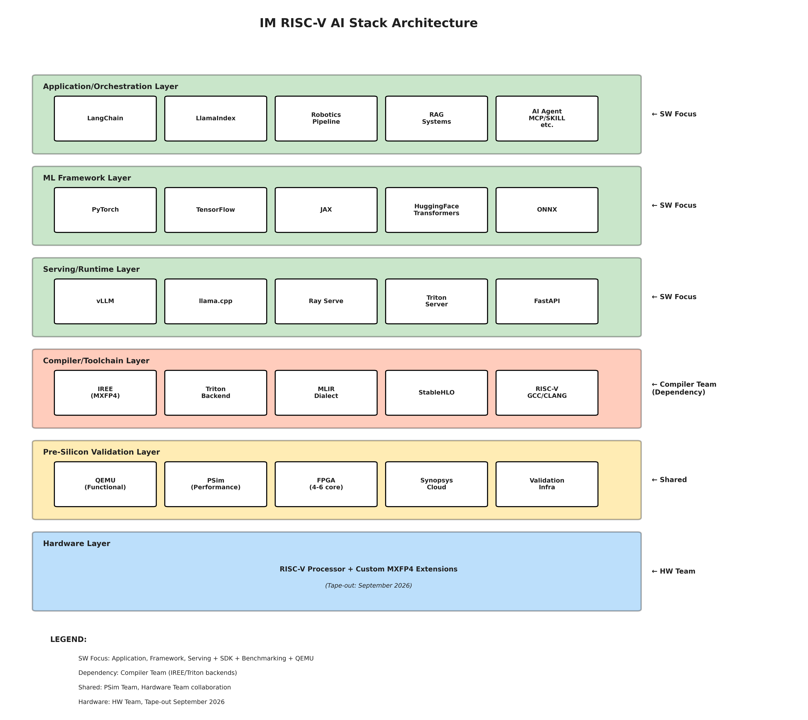

# URGENT: VP Meeting Slides - Ready to Use
**Meeting:** VP Sergey 1:1 (in 1 hour)  
**Purpose:** Status and 2026 Plans  
**Format:** 2-3 slides (copy content below directly)

---

## SLIDE 1: Tech Stack Overview - Software Stack Scope

### Complete AI Stack Architecture



**DIAGRAM FILES:**
- **PNG (High-Res):** `stack_architecture_diagram.png` (for PowerPoint/Google Slides)
- **PDF (Vector):** `stack_architecture_diagram.pdf` (for printing/publications)

**KEY INSIGHTS FROM DIAGRAM:**
- **6 distinct layers** from applications down to hardware
- **Top 3 layers (Green) = SW Focus (Your Direct Ownership)**
  - Application orchestration (LangChain, LlamaIndex)
  - ML frameworks (PyTorch, TensorFlow, JAX)
  - Serving engines (vLLM, llama.cpp, Ray)
- **Layer 4 (Red) = Critical Dependency** (Compiler Team)
- **Layer 5 (Amber) = Shared Scope** (Validation platforms)
- **Layer 6 (Blue) = HW Team** (Sept 2026 tape-out)

### SW Stack Ownership

**PRIMARY OWNERSHIP (SW Focus):**
- 🟢 **Framework Integration:** LangChain, LlamaIndex, PyTorch/TF wrappers
- 🟢 **Serving Layer:** vLLM plugin, llama.cpp, Ray Serve, FastAPI
- 🟢 **Benchmarking:** MLPerf integration, NVIDIA comparisons
- 🟢 **SDK Integration:** Documentation, migration guides
- 🟢 **System Integration:** Multi-core, multi-node, robotics

**CRITICAL DEPENDENCIES:**
- 🔴 **Compiler Team:** IREE backend, Triton backend (blocks 80% of work)
- ⚠️ **PSim Team:** Performance validation infrastructure
- ⚠️ **HW Team:** ISA specs, FPGA access

---

## SLIDE 2: Status & 2026 Plans

### 🚀 Phase 1: Foundation & Validation (Q4 2025 – Q1 2026)
**Status: 80% COMPLETE** | **Key Achievement: Delivered CEO "Fast-Track" path**

| Status | Deliverables | Details |
|--------|--------------|---------|
| ✅ **COMPLETED** | **llama.cpp Integration** | • Multi-core & multi-thread support<br>• User mode on QEMU<br>• System mode on QEMU |
| ✅ **COMPLETED** | **Framework Wrappers (User Mode)** | • LangChain, LlamaIndex, Ray Serve<br>• Deployed on QEMU user mode |
| ✅ **COMPLETED** | **Functional Validation** | • FastAPI HTTP server<br>• End-to-end stack validation |
| ⚠️ **IN PROGRESS** | **Framework Wrappers (System Mode)** | • LangChain, LlamaIndex, Ray Serve<br>• Deploying on QEMU system mode |
| ⚠️ **IN PROGRESS** | **Multi-Modality Model** | • GLM model on PSim<br>• Debugging with PSim team |

---

### ⚙️ Phase 2: Platform Validation & Production Planning (Q1 2026)
**Status: PLANNED** | **Focus: FPGA validation + vLLM/evaluation planning for production readiness**

| Category | Deliverables |
|----------|--------------|
| **Hardware Readiness** | • Multi-core support (4-6 cores)<br>• Native RISC-V binaries (eliminating QEMU overhead)<br>• FPGA deployment pipeline<br>• Simulator integration |
| **vLLM Preparation** | • vLLM architecture design for Triton + IREE<br>• Platform plugin specification<br>• Memory manager planning<br>• Dependency: Compiler Team roadmap |
| **Evaluation Framework** | • Define evaluation criteria for CEO's 3 tracks:<br>  - Track 1: Fast-Track (llama.cpp)<br>  - Track 2: Production Pipeline (vLLM + IREE)<br>  - Track 3: Cost-Optimizer (Ray + Disaggregation)<br>• Performance metrics & benchmarking plan<br>• Resource allocation strategy |

---

### 📈 Phase 3: Scale, Ecosystem & Benchmarking (Q2 – Q3 2026)
**Status: PLANNED** | **Dependency: Requires Compiler & PSim Teams**

| Category | Deliverables |
|----------|--------------|
| **Frameworks** | • Deep integration with PyTorch & TensorFlow<br>• Developer migration guides<br>• Example code & tutorials |
| **Runtime** | • vLLM platform plugin for enterprise-scale<br>• Ray multi-node orchestration<br>• Robotics pipeline components |
| **Validation** | • MLPerf benchmarking<br>• NVIDIA competitive analysis<br>• Diversity benchmarks (CNN/ViT/VLM)<br>• All 5 customer questions |

**KEY MILESTONE:** All deliverables complete by Q3 (before September 30 tape-out)

---

## SLIDE 3: Execution Readiness & Critical Path

### ✅ Software Stack Readiness

**We are ready to execute Phase 3 (Q2-Q3 2026) deliverables:**
- Architecture & design complete for vLLM integration
- Framework integration plans defined (PyTorch/TensorFlow)
- Benchmarking strategy ready (MLPerf, NVIDIA comparison)
- Mock interfaces available for parallel development
- Team trained and prepared

**Key Message: SW Stack is NOT blocked—we're in "ready-to-execute" state**

---

### 🎯 Critical Path Dependencies

| Team | What We Need | Timeline | Impact on SW Stack | Status |
|------|-------------|----------|-------------------|--------|
| **🔴 Compiler Team** | • IREE backend (MXFP4)<br>• Triton backend<br>• CUDA-equivalent SDK | Q2-Q3 2026<br>(Not started) | **BLOCKS 80%:**<br>• vLLM integration<br>• PyTorch/TF<br>• 4 of 5 customer Qs<br>• MLPerf | Critical—needs confirmation |
| **⚠️ PSim Team** | • Performance infrastructure<br>• MLPerf environment<br>• NVIDIA baseline | Q2-Q3 2026 | **BLOCKS:**<br>• Performance data<br>• Benchmarking<br>• Customer Qs 1,2,5 | Need early access |
| **⚠️ HW Team** | • ISA specification<br>• FPGA (Q1)<br>• Performance targets | Q1 2026 | **BLOCKS:**<br>• Compiler Team<br>• Multi-core validation | FPGA timeline? |

---

### 🛡️ De-risking Strategy

| Risk | Mitigation Actions | Owner | Status |
|------|-------------------|-------|--------|
| **Compiler Timeline Slip** | • Define API contracts NOW (2-week deadline)<br>• Build mock interfaces<br>• Parallel development path<br>• Weekly sync established | SW Stack + Compiler | This week |
| **Performance Data Delay** | • Early PSim access requested<br>• Incremental validation approach<br>• Use CEO targets as goals, not claims | SW Stack + PSim | Q1 planning |
| **Cross-Team Coordination** | • Weekly Compiler sync<br>• Bi-weekly PSim sync<br>• Risk reviews at each checkpoint | SW Stack lead | Ongoing |
| **Customer Expectations** | • NO fabricated performance numbers<br>• All claims backed by measurements<br>• Transparent communication | SW Stack | Policy set |

---

### 🤝 VP Support Needed

**Immediate Decisions:**
1. **Compiler Team Coordination:** Authority to schedule weekly syncs & define API contracts?
2. **FPGA Timeline Confirmation:** Q1 delivery confidence level? (Backup: Synopsys cloud)
3. **Customer Questions Ownership:** SW Stack single point or cross-team effort?
4. **Robotics Pipeline Scope:** Definition of "main components" needed

**Strategic Support:**
1. **VP-level escalation path** if Compiler Team timeline slips
2. **Resource clarity:** Team size, budget, hiring plan for 2026
3. **Priority guidance:** If constrained, which CEO track takes precedence?

---

## KEY TALKING POINTS FOR VP MEETING

### Opening (30 seconds)
```
"VP, Software Stack has completed Phase 1 (llama.cpp validation).
I'm ready to execute Phases 2-4 in Q2-Q3.

I have three topics:
1. Current status and Q1 progress
2. 2026 plan with critical dependencies
3. Customer questions readiness"
```

### Critical Point 1: Dependencies (1 minute)
```
"My biggest concern: 80% of my 2026 work depends on Compiler Team.

What's blocked:
- vLLM integration → needs IREE backend
- PyTorch/TensorFlow → needs IREE backend
- 4 of 5 customer questions → need Compiler or PSim

QUESTION FOR YOU:
What's the confidence level on Compiler Team's Q2-Q3 timeline?
How do we coordinate between teams?"
```

### Critical Point 2: Customer Questions (1 minute)
```
"5 customer questions from your email - all critical for sales.

Current status: 0 of 5 ready (none started yet)
Timeline: All answerable by Q3 IF dependencies deliver

IMPORTANT: I will NOT make up performance numbers.
All claims will be based on:
- Real PSim measurements (Q2-Q3)
- Actual Compiler capabilities (when delivered)
- Verified MLPerf results (after submission)

CEO's targets (3-4x, 50% TCO) are GOALS, not guarantees yet."
```

### Critical Point 3: FPGA Timeline (30 seconds)
```
"Your email says 'we should have FPGA locally in Q1.'

QUESTION: Can we confirm FPGA timeline?
This is on my Q1 critical path.

Backup: I can use Synopsys cloud if FPGA slips."
```

### Critical Point 4: Robotics Pipeline Scope (30 seconds)
```
"You mentioned 'show robotics pipeline (at least main components).'

QUESTION: Can you clarify scope?
- Real-time inference?
- Vision-language integration?
- Specific use case demo?
- All of above?

This helps me allocate Q2-Q3 resources correctly."
```

### Closing (30 seconds)
```
"Summary:
- Q1: On track (FPGA readiness)
- Q2-Q3: Ready to execute when unblocked
- Key need: Cross-team coordination established THIS WEEK

I'm ready to discuss slide content for CEO meeting next Tuesday."
```

---

## QUESTIONS TO ASK VP

### Priority Questions (Ask These)
1. **Compiler Team Timeline:**
   - "What's the confidence on Compiler Team's Q2-Q3 delivery?"
   - "How do we coordinate? Weekly syncs?"

2. **Customer Questions Ownership:**
   - "Am I the single point for all 5 questions?"
   - "Or do we answer as a team (me + Compiler + PSim)?"

3. **FPGA Confirmation:**
   - "Can we confirm FPGA availability timeline?"
   - "What's the backup if it slips?"

4. **Robotics Pipeline Scope:**
   - "What are the 'main components' you expect?"
   - "What's the priority vs other Q2-Q3 work?"

### If Time Permits
5. **CEO Meeting Content:**
   - "What should I emphasize in CEO slides?"
   - "Dependencies or capabilities?"

6. **Resource Allocation:**
   - "What team size/resources do I have?"
   - "Any contractors or additional hires planned?"

---

## FEEDBACK ON CEO'S STRATEGY (If Asked)

### Positive Alignment
✅ "CEO's three parallel paths are well-structured"
✅ "Phase 1 (llama.cpp) complete - validates approach"
✅ "MXFP4 focus aligns with IREE January 2026 release"
✅ "vLLM + IREE strategy matches industry direction"

### Concerns to Raise (Constructive)
⚠️ **Timeline Risk:**
"Phases 2-4 depend heavily on Compiler Team (IREE/Triton).
Any slip cascades to customer demos. Need tight coordination."

⚠️ **Customer Question Coverage:**
"4 of 5 customer questions require Compiler or PSim work.
Software Stack can integrate, but can't complete alone."

⚠️ **Performance Claims:**
"CEO's targets (3-4x, 50% TCO) are excellent goals.
We should measure before promising to customers."

### Recommendation
✅ "Make compiler-to-stack integration a company priority.
Weekly checkpoints between teams starting next week."

---

## TIME MANAGEMENT (3-slide version, ~10 minutes total)

**Slide 1:** 2-3 minutes
- Quick status update
- Emphasize Phase 1 complete

**Slide 2:** 4-5 minutes
- 2026 plan overview
- **Focus here:** Dependencies discussion

**Slide 3:** 2-3 minutes
- Customer questions
- Readiness timeline

**Q&A:** Remaining time
- Use your prepared questions
- Get clarity on dependencies

---

## POST-MEETING ACTION ITEMS

After VP meeting, immediately:
- [ ] Update CEO slides based on VP feedback
- [ ] Schedule Compiler Team meeting (if VP approved)
- [ ] Schedule PSim Team meeting (if VP approved)
- [ ] Confirm FPGA timeline with Hardware Team
- [ ] Document any commitments made

---

## BACKUP: If VP Asks Tough Questions

### "Why aren't you further along?"
```
"Phase 1 was the priority (completed successfully).
Phases 2-4 require Compiler Team's IREE/Triton backends,
which are scheduled for Q2-Q3. I'm ready to start as soon
as dependencies are available."
```

### "Can you commit to specific performance numbers?"
```
"I cannot commit to specific numbers until measured by PSim.
CEO's targets (3-4x, 50% TCO) are our goals, but actual
performance must be validated through proper benchmarking
in Q2-Q3."
```

### "Why so many dependencies?"
```
"This is the nature of a full-stack AI solution:
- Compiler Team: Builds the backend (IREE/Triton)
- Software Stack: Integrates frameworks and serves models
- PSim Team: Validates performance

We need all three working together. I can't deliver
customer-ready answers without the other teams."
```

### "What if Compiler Team slips?"
```
"That's my biggest risk. Mitigation strategies:
1. Start weekly coordination NOW (not wait for Q2)
2. Define API contracts early (within 2 weeks)
3. Build mock interfaces for parallel development
4. Maintain transparency with customers on timeline"
```

---

## FINAL CHECKLIST (Before Meeting)

- [ ] Print or have these slides ready on screen
- [ ] Review your 3 slides (1 minute each)
- [ ] Review key talking points
- [ ] Review questions to ask VP
- [ ] Have CEO strategy doc nearby (reference if needed)
- [ ] Have notebook for notes/action items
- [ ] Set timer: aim for 10-minute presentation, rest Q&A

---

**GOOD LUCK!** 

**Key Message:** You're ready to execute, but need cross-team coordination established THIS WEEK.

**Confidence Level:** High on your work, realistic about dependencies.

**VP Wants to Hear:** Honest assessment + clear plan + no BS.
