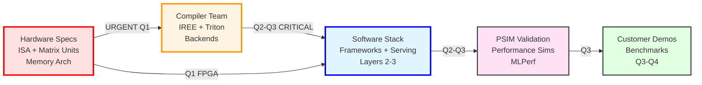

# Company Architecture - Single Slide Visual
**Purpose:** One-page architecture for VP presentation  
**Audience:** Executive level (VP Sergey, CEO Mohammad)

---

## Complete Stack: Application to Hardware

```mermaid
graph TB
    subgraph "Layer 1: APPLICATIONS (Customer-Facing)"
        APP[Enterprise LLM | Robotics/Edge | Vision-Language | R&D Custom Kernels]
    end

    subgraph "Layer 2: FRAMEWORKS (Developer Experience)"
        FW[LangChain | LlamaIndex | PyTorch | TensorFlow | Ray Serve]
    end

    subgraph "Layer 3: SERVING/RUNTIME (Inference Engines)"
        SRV[vLLM PagedAttention | llama.cpp GGML | Ray Cluster | FastAPI]
    end

    subgraph "Layer 4: COMPILER/TOOLCHAIN (The Brain)"
        COMP[IREE MXFP4 | Triton Backend | MLIR | RISC-V GCC/Clang]
    end

    subgraph "Layer 5: SDK & LIBRARIES (Developer Tools)"
        SDK[CUDA-equivalent SDK | MXFP4 Quantization | Matrix Microkernels | Runtime Libs]
    end

    subgraph "Layer 6: VALIDATION (Pre-Silicon)"
        VAL1[QEMU Functional Simulator]
        VAL2[PSIM Performance Simulator]
        VAL3[FPGA Prototype 4-6 Cores]
    end

    subgraph "Layer 7: HARDWARE (Silicon)"
        HW[RISC-V Custom Chip + MXFP4 Matrix Units + HBM/SRAM<br/>Tape-out: Sept 2026]
    end

    APP --> FW
    FW --> SRV
    SRV --> COMP
    COMP --> SDK
    SDK --> VAL1
    SDK --> VAL2
    SDK --> VAL3
    VAL1 --> HW
    VAL2 --> HW
    VAL3 --> HW

    style APP fill:#e1f5ff,stroke:#333,stroke-width:3px
    style FW fill:#fff4e1,stroke:#333,stroke-width:3px
    style SRV fill:#f0e1ff,stroke:#333,stroke-width:3px
    style COMP fill:#e1ffe1,stroke:#333,stroke-width:3px
    style SDK fill:#ffe1e1,stroke:#333,stroke-width:3px
    style VAL1 fill:#ffffe1,stroke:#333,stroke-width:2px
    style VAL2 fill:#ffffe1,stroke:#333,stroke-width:2px
    style VAL3 fill:#ffffe1,stroke:#333,stroke-width:2px
    style HW fill:#e1e1ff,stroke:#333,stroke-width:4px
```

---

## Ownership & Status Matrix

| Layer | Primary Owner | Status | Critical Path |
|-------|--------------|--------|--------------|
| **1. Applications** | Product/Business | Q3-Q4 2026 | Customer demos |
| **2. Frameworks** | **Software Stack** | ✅ 60% (LangChain/LlamaIndex done) | PyTorch/TF Q2 |
| **3. Serving** | **Software Stack** | ⚠️ 30% (llama.cpp done, vLLM needed) | **vLLM Q2-Q3** |
| **4. Compiler** | **Compiler Team** | ❌ 10% (toolchain only) | **IREE/Triton Q2-Q3** |
| **5. SDK** | **Compiler Team** (core) / **Software Stack** (integration) | ❌ 0% | **Q2-Q3** |
| **6a. QEMU** | Software Stack | ✅ Working | Functional validation |
| **6b. PSIM** | PSim Team | ⚠️ Q2-Q3 | **Performance demos** |
| **6c. FPGA** | Hardware Team | ⚠️ Q1 2026 | **Multi-core testing** |
| **7. Hardware** | Hardware Team | Sept 2026 | **Tape-out** |

---

## Critical Dependencies



**Critical Path:** Hardware Specs → Compiler Team → Software Stack → PSIM → Customers

**Your Work (Software Stack) is Blocked By:**
1. **Compiler Team** - IREE/Triton backends (Q2-Q3) - **CRITICAL BLOCKER**
2. **Hardware Team** - ISA specs, FPGA (Q1) - **URGENT**

---

## Three Parallel Execution Paths (CEO's Strategy)

| Path | Stack Components | Status | ROI |
|------|-----------------|--------|-----|
| **Path 1: Fast-Track** | llama.cpp + GGML + RVV | ✅ **DONE** | PoC in 3 days |
| **Path 2: Production** | vLLM + IREE + MXFP4 | ❌ **Q2-Q3** | 3-4x throughput |
| **Path 3: Cost-Optimizer** | Ray + Disaggregation | ⚠️ **Q3** | 50% TCO reduction |

---

## Key Message for VP

**Software Stack (Layers 2-3) is the critical integrator:**
- Own framework and serving layers (customer-facing)
- Work closely with Compiler Team (dependency)
- **Blocked by:** Compiler Team (IREE/Triton) - **CRITICAL Q2-Q3**
- **Blocked by:** Hardware specs (ISA, matrix units) - **URGENT Q1**
- Enables: Customer demos, benchmarks, tape-out validation
- Timeline: **Q2-Q3 2026 is make-or-break for production pipeline**

---

## What We Need to Succeed

### From Compiler Team (CRITICAL BLOCKER)
1. 🔴 **IREE backend for RISC-V** (for vLLM, PyTorch integration) - **Q2-Q3 2026**
2. 🔴 **Triton backend for RISC-V** (for custom kernels) - **Q2 2026**
3. 🔴 **CUDA-equivalent SDK core** (for developer experience) - **Q2-Q3 2026**

### From Hardware Team (URGENT)
1. ⚠️ **ISA specification** (for Compiler Team) - **ASAP**
2. ⚠️ **Matrix unit architecture** (for Compiler Team) - **ASAP**
3. ⚠️ **FPGA availability** (for multi-core testing) - **Q1 2026**
4. ⚠️ **Memory architecture** (for PagedAttention) - **Q1 2026**

### From PSim Team
1. Performance simulation infrastructure - **Q2 2026**
2. MLPerf integration support - **Q2-Q3 2026**

### From Executive Leadership
1. Resource allocation clarity (team size)
2. Priority guidance (three paths → which first?)
3. Timeline confirmation (tape-out Sept 2026)

---

**One-Slide Summary:**
- **7 layers** from apps to hardware
- **Software Stack owns 4 layers** (2-5)
- **3 validation paths** (QEMU, PSIM, FPGA)
- **Critical path:** Hardware specs → SW Stack → PSIM → Customers
