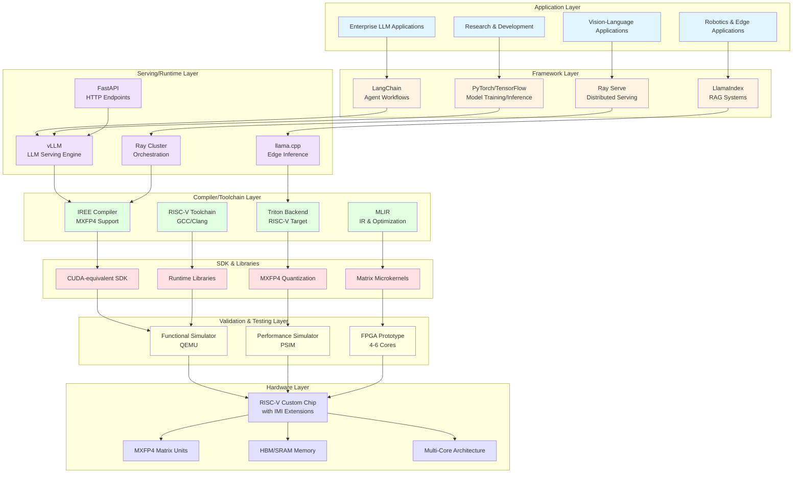
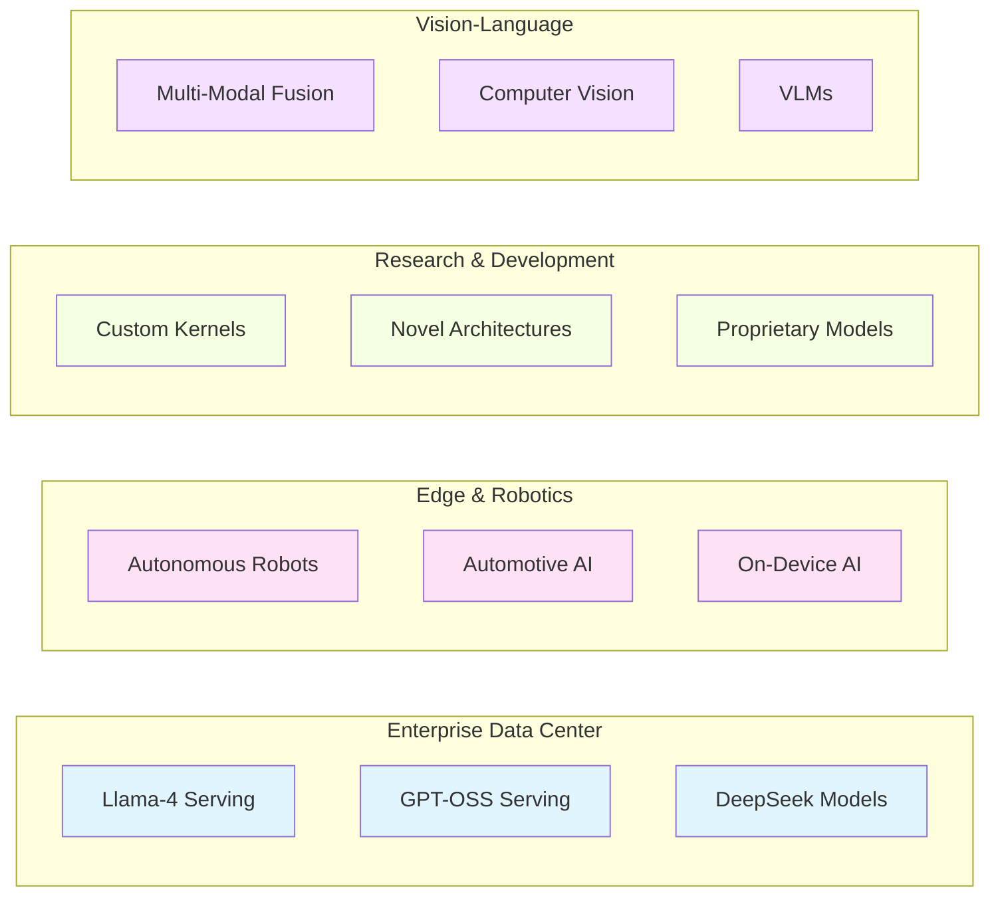
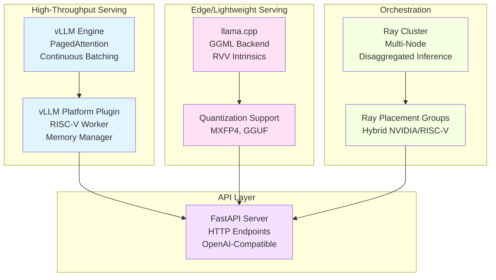
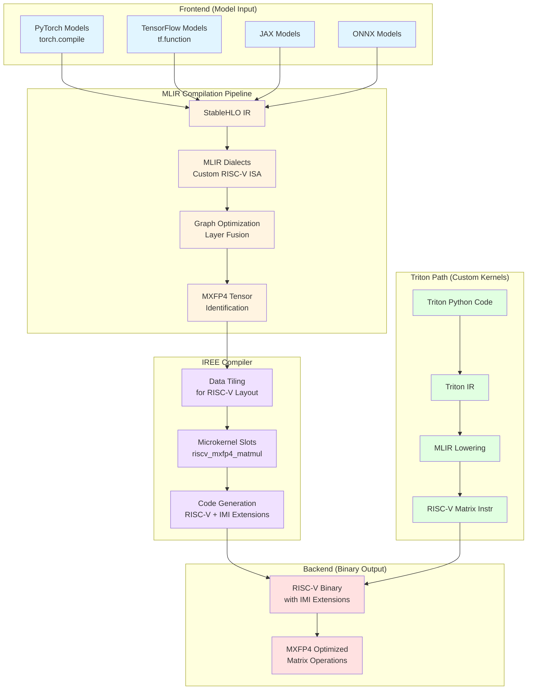
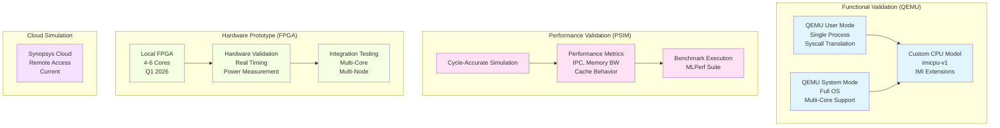
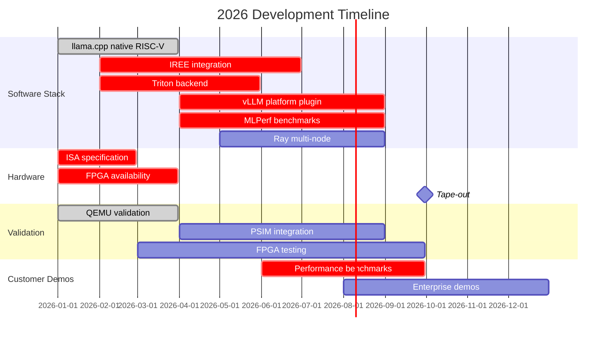
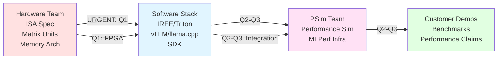

# Company Overall Architecture - Full Tech Stack
**Purpose:** High-level architecture showing complete scope from applications to hardware  
**Date:** January 2026  
**Scope:** End-to-end AI workload deployment on RISC-V with custom extensions

---

## Executive Architecture Overview

---

## Detailed Layer-by-Layer Architecture

### Layer 1: Application Layer (End User)

**Purpose:** Customer-facing AI applications and use cases

**Owner:** Product/Business teams with Software Stack support  
**Timeline:** Customer deployments start Q3-Q4 2026

---

### Layer 2: Framework Layer (Developer Experience)

**Purpose:** High-level AI/ML frameworks for application development

| Framework | Purpose | Integration Point | Status |
|-----------|---------|------------------|--------|
| **LangChain** | Agent workflows, chains, tools | RISCVRISCLLM wrapper | ✅ Phase 3 Complete |
| **LlamaIndex** | RAG, document indexing, querying | RISCVRISCLLM wrapper | ✅ Phase 5 Complete |
| **Ray Serve** | Distributed serving, scaling | RISCVRISCLLMDeployment | ✅ Phase 4 Complete |
| **PyTorch** | Model training, torch.compile | IREE backend (Compiler Team) | ❌ Q2 2026 |
| **TensorFlow** | Model training, inference | IREE backend (Compiler Team) | ❌ Q2-Q3 2026 |

**Owner:** 
- **Software Stack:** Framework integration layers, wrappers, documentation
- **Compiler Team:** IREE/Triton backends (dependency)
- **Framework vendors:** Upstream support

**Customer Question:** "How much code modification is required?"  
**Answer:** Minimal - use standard APIs, just change backend (coordinated with Compiler Team)

---

### Layer 3: Serving/Runtime Layer (Inference Engines)

**Purpose:** Production-grade inference serving for LLMs and AI models

**Owner:** Software Stack (PRIMARY)  
**Dependencies:** Compiler Team (IREE backend for vLLM integration)  
**Timeline:**
- llama.cpp: ✅ Q1 2026 (done, needs enhancement)
- vLLM: ❌ Q2-Q3 2026 (critical path, blocked by IREE)
- Ray multi-node: ⚠️ Q3 2026 (partial, needs enhancement)

---

### Layer 4: Compiler/Toolchain Layer (The "Brain")

**Purpose:** Transform high-level models into optimized RISC-V machine code

**Owner:** Compiler Team (PRIMARY) - Software Stack works closely with this team  
**Software Stack Coordination:** Ensure backends meet integration requirements  
**Timeline:** Q2-Q3 2026 (critical path)  
**Customer Question:** "Do you have a CUDA-equivalent SDK?"  
**Answer:** Yes - IREE + Triton provide CUDA-like developer experience (Compiler Team delivers)

**Key Components:**
- **IREE (Compiler Team):** Whole-graph optimization, MXFP4 native support (Jan 2026 release)
- **Triton (Compiler Team):** Custom kernel support, NVIDIA code migration path
- **MLIR (Compiler Team):** Intermediate representation, optimization passes
- **RISC-V Toolchain (Compiler Team):** Final binary generation (GCC/Clang)

---

### Layer 5: SDK & Libraries (Developer Tools)

**Purpose:** Tools and libraries for RISC-V AI development

| Component | Purpose | Owner | Status |
|-----------|---------|-------|--------|
| **CUDA-equivalent SDK Core** | CUDA-like API for RISC-V | Compiler Team | ❌ Q2-Q3 |
| **SDK Documentation & Examples** | Tutorials, migration guides | SW Stack | ❌ Q2-Q3 |
| **MXFP4 Quantization Toolkit** | Model quantization to MXFP4 | Compiler Team | ❌ Q2 |
| **Matrix Microkernels (ukernels)** | Optimized RISC-V matrix ops | Compiler Team | ❌ Q2 |
| **Runtime Libraries** | Memory management, scheduling | SW Stack | ⚠️ Q2 |
| **Model Conversion Tools** | PyTorch → MXFP4 pipeline | SW Stack | ❌ Q2 |
| **Performance Profiling Tools** | Tracing, analysis | SW Stack + PSim | ⚠️ Q2-Q3 |

**Owner:** 
- **Compiler Team:** SDK core, microkernels, quantization toolkit
- **Software Stack:** SDK documentation, examples, integration, model conversion
- **Timeline:** Q2-Q3 2026

---

### Layer 6: Validation & Testing Layer (Pre-Silicon)

**Purpose:** Validate software stack before hardware tape-out

#### QEMU (Functional Simulator)
**Purpose:** Verify functional correctness of RISC-V binaries

**Current Status:**
- ✅ QEMU user mode working (Phase 1-5 complete)
- ⚠️ QEMU system mode available (needs integration)
- ✅ Custom CPU model (imicpu-v1) supports IMI extensions

**Use Cases:**
- Rapid software development and testing
- Functional correctness validation
- Framework integration testing

**Owner:** Software Stack (usage) + Hardware team (CPU model definition)  
**Timeline:** ✅ Currently working

#### PSIM (Performance Simulator)
**Purpose:** Predict hardware performance before tape-out

**Capabilities:**
- Cycle-accurate simulation
- Memory hierarchy modeling
- Performance metrics (IPC, bandwidth, latency)
- MLPerf benchmark execution

**Use Cases:**
- Performance target validation
- Architecture exploration
- Customer performance claims

**Owner:** PSim Team (PRIMARY) + Software Stack (benchmark integration)  
**Timeline:** Q2-Q3 2026 (critical for customer demos)

#### FPGA (Hardware Prototype)
**Purpose:** Real hardware validation with actual timing

**Availability:**
- Q1 2026: Local FPGA with 4-6 cores
- Real timing, power measurements
- Multi-core integration testing

**Use Cases:**
- Hardware-in-the-loop testing
- Real performance validation
- Tape-out readiness verification

**Owner:** Hardware Team (FPGA setup) + Software Stack (SW stack deployment)  
**Timeline:** Q1 2026 (VP requirement)

#### Synopsys Cloud
**Purpose:** Remote simulation access (current)

**Current Status:** ✅ Available now  
**Use Cases:** Remote development, simulation without local setup

---

### Layer 7: Hardware Layer (Physical Chip)

**Purpose:** Custom RISC-V processor with AI extensions

```mermaid
graph TB
    subgraph "RISC-V Core"
        C1[Multi-Core Architecture<br/>4-6+ Cores]
        C2[RV64IMI ISA<br/>IMI Custom Extensions]
        C3[Vector Unit<br/>RVV 1.0/2.0]
    end
    
    subgraph "AI Accelerator Units"
        A1[MXFP4 Matrix Units<br/>E2M1 + E8M0 Scales]
        A2[Matrix Multiplication<br/>Custom Instructions]
        A3[Spatial Data Locality<br/>2D/3D Convolutions]
    end
    
    subgraph "Memory Hierarchy"
        M1[HBM Memory<br/>High Bandwidth]
        M2[SRAM Cache<br/>Low Latency]
        M3[Non-Contiguous<br/>KV-Cache Support]
    end
    
    subgraph "System Integration"
        S1[Multi-Node<br/>Interconnect]
        S2[PCIe/NVLink<br/>Host Interface]
        S3[Power Management]
    end

    C1 --> C2
    C2 --> C3
    A1 --> A2
    A2 --> A3
    M1 --> M2
    M2 --> M3
    S1 --> S2
    S2 --> S3

    style C1 fill:#e1f5ff
    style C2 fill:#e1f5ff
    style C3 fill:#e1f5ff
    style A1 fill:#ffe1f5
    style A2 fill:#ffe1f5
    style A3 fill:#ffe1f5
    style M1 fill:#f5ffe1
    style M2 fill:#f5ffe1
    style M3 fill:#f5ffe1
    style S1 fill:#f5e1ff
    style S2 fill:#f5e1ff
    style S3 fill:#f5e1ff
```

**Owner:** Hardware Team (PRIMARY)  
**Timeline:** Tape-out end of September 2026

**Key Features:**
- **MXFP4 Support:** Native OCP Microscaling (E2M1 + E8M0)
- **Multi-Core:** 4-6+ cores for parallel inference
- **Memory:** HBM for bandwidth, SRAM for low latency
- **Interconnect:** Multi-node support for clusters

**Software Stack Dependency:**
- ISA specification (needed ASAP for compiler development)
- Matrix unit details (needed ASAP for microkernel development)
- Memory architecture (needed Q1 for PagedAttention)

---

## Development & Deployment Timeline

---

## Ownership Matrix

| Layer | Component | Primary Owner | Secondary Owner | Status |
|-------|-----------|--------------|----------------|--------|
| **Application** | Customer apps | Product/Business | SW Stack (support) | Q3-Q4 2026 |
| **Framework** | LangChain/LlamaIndex | SW Stack | Framework vendors | ✅ Done |
| **Framework** | PyTorch/TensorFlow integration | SW Stack | Compiler Team (backends) | ❌ Q2-Q3 |
| **Serving** | vLLM plugin | SW Stack | Compiler Team (IREE) | ❌ Q2-Q3 |
| **Serving** | llama.cpp | SW Stack | - | ✅ Done (enhance Q1-Q2) |
| **Serving** | Ray Serve | SW Stack | - | ⚠️ Partial (enhance Q3) |
| **Compiler** | IREE integration | Compiler Team | SW Stack (coordination) | ❌ Q2-Q3 |
| **Compiler** | Triton backend | Compiler Team | SW Stack (coordination) | ❌ Q2 |
| **Compiler** | RISC-V toolchain | Compiler Team | Hardware team | ⚠️ Available |
| **SDK** | CUDA-equivalent core | Compiler Team | SW Stack (docs) | ❌ Q2-Q3 |
| **SDK** | Microkernels | Compiler Team | Hardware team | ❌ Q2 |
| **Validation** | QEMU | SW Stack (usage) | Hardware (CPU model) | ✅ Working |
| **Validation** | PSIM | PSim Team | SW Stack (benchmarks) | Q2-Q3 |
| **Validation** | FPGA | Hardware Team | SW Stack (SW deployment) | Q1 |
| **Hardware** | RISC-V chip | Hardware Team | - | Tape-out Sept |

---

## Critical Dependencies Flow

**Critical Path:**
1. Hardware specs (ISA, matrix units) → Software Stack (IREE/Triton) → Q1-Q2
2. Software Stack (benchmarks) → PSim (validation) → Customer demos → Q2-Q3
3. FPGA availability → Software Stack (multi-core) → Q1
4. All paths converge → Tape-out readiness → Sept 2026

---

## Technology Stack Summary

### Upper Stack (Application to Runtime)
- **Frameworks:** LangChain, LlamaIndex, PyTorch, TensorFlow
- **Serving:** vLLM, llama.cpp, Ray Serve, FastAPI
- **Owner:** Software Stack (PRIMARY)
- **Status:** 30% complete (basic done, production components needed)

### Middle Stack (Compiler to SDK)
- **Compiler:** IREE, Triton, MLIR, RISC-V toolchain
- **SDK:** CUDA-equivalent, microkernels, quantization tools
- **Owner:** Software Stack (PRIMARY)
- **Status:** 10% complete (critical path, Q2-Q3)

### Lower Stack (Validation to Hardware)
- **Validation:** QEMU (functional), PSIM (performance), FPGA (hardware)
- **Hardware:** RISC-V chip with MXFP4 matrix units
- **Owner:** Software Stack (QEMU), PSim Team (PSIM), Hardware Team (FPGA/Chip)
- **Status:** 
  - QEMU: ✅ Working
  - PSIM: ⚠️ Q2-Q3 integration
  - FPGA: ⚠️ Q1 availability
  - Hardware: Sept tape-out

---

## Key Takeaways

### Complete End-to-End Stack
- **7 layers** from applications to hardware
- **3 validation paths** (QEMU, PSIM, FPGA) before production
- **2 critical paths:**
  1. Software stack → PSIM → Customer demos
  2. Hardware specs → Software stack → Tape-out

### Software Stack is the Central Hub
- Connects applications to hardware
- Depends on hardware specs (critical blocker)
- Feeds into validation (PSIM, FPGA)
- Delivers customer-facing components (SDK, benchmarks)

### Critical Timeline
- **Q1:** FPGA ready, multi-core support, hardware specs finalized
- **Q2:** IREE/Triton/vLLM integration, MLPerf start
- **Q3:** Performance validation, customer demos, tape-out readiness
- **Sept:** Tape-out deadline

---

**Document Status:** Complete company architecture overview  
**Next Steps:** Use this for VP presentation to show overall scope and dependencies
