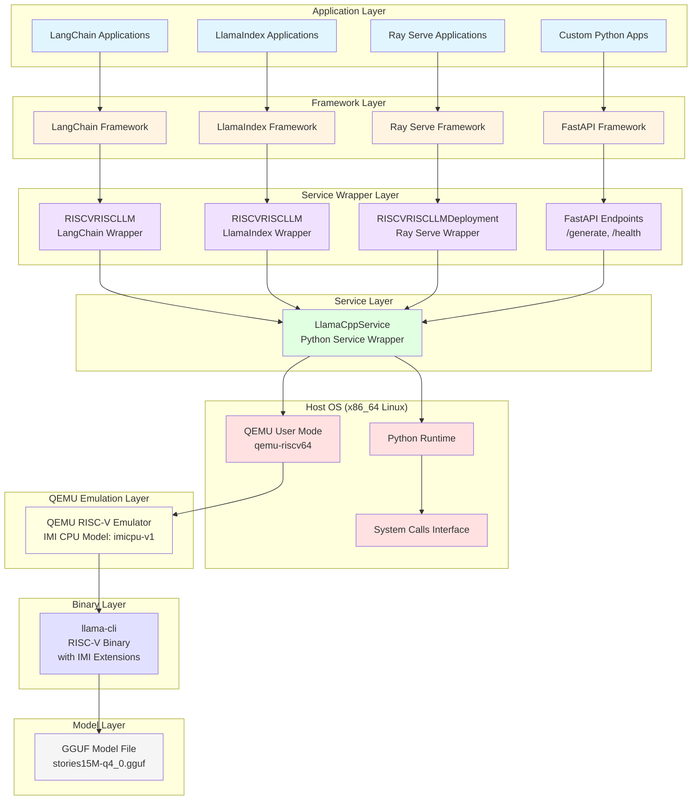
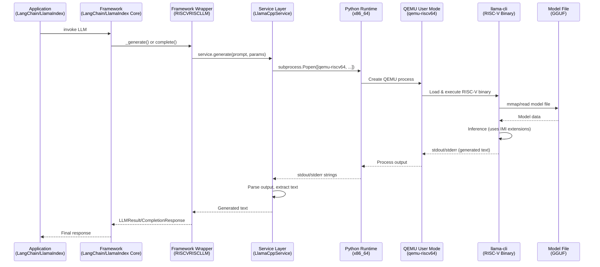

# System Architecture Diagram

**Purpose:** Visual representation of the full-stack AI/ML/Agentic System architecture from multiple viewpoints.

**Status:** Current implementation (Phase 1-5 Complete)

---

## Full Stack Architecture Overview



---

## Layered View by Component Type

### View 1: Application Perspective

```
┌─────────────────────────────────────────────────────────┐
│  APPLICATION LAYER                                      │
├─────────────────────────────────────────────────────────┤
│                                                         │
│  ┌──────────────┐  ┌──────────────┐  ┌──────────────┐ │
│  │ LangChain    │  │ LlamaIndex   │  │ Ray Serve    │ │
│  │ Application  │  │ Application  │  │ Application  │ │
│  └──────────────┘  └──────────────┘  └──────────────┘ │
│                                                         │
│  • Agent workflows  • RAG pipelines  • Model serving  │
│  • Chain execution  • Document Q&A   • Scaling        │
│  • Tool calling    • Indexing       • Load balancing │
│                                                         │
└─────────────────────────────────────────────────────────┘
                            ↓
                    Uses Framework APIs
                            ↓
┌─────────────────────────────────────────────────────────┐
│  FRAMEWORK LAYER                                        │
├─────────────────────────────────────────────────────────┤
│  • LangChain Core    • LlamaIndex Core  • Ray Serve   │
│  • FastAPI           • Pydantic         • Ray Core    │
└─────────────────────────────────────────────────────────┘
```

### View 2: Framework Perspective

```
┌─────────────────────────────────────────────────────────┐
│  FRAMEWORK LAYER                                        │
├─────────────────────────────────────────────────────────┤
│                                                         │
│  LangChain  ──┐                                        │
│               ├──>  RISCVRISCLLM Wrapper              │
│  LlamaIndex ──┤     (Framework-specific LLM adapter)  │
│               │                                        │
│  Ray Serve ───┼──>  RISCVRISCLLMDeployment            │
│               │     (Ray Serve deployment wrapper)    │
│               │                                        │
│  FastAPI  ────┘     /generate, /health endpoints     │
│                                                         │
└─────────────────────────────────────────────────────────┘
                            ↓
                    Calls Service Layer
                            ↓
┌─────────────────────────────────────────────────────────┐
│  SERVICE WRAPPER LAYER                                  │
├─────────────────────────────────────────────────────────┤
│  LlamaCppService (Python)                              │
│  • Path validation                                      │
│  • QEMU command building                                │
│  • Subprocess execution                                 │
│  • Output parsing                                       │
└─────────────────────────────────────────────────────────┘
```

### View 3: Service Perspective

```
┌─────────────────────────────────────────────────────────┐
│  SERVICE LAYER (Python)                                 │
├─────────────────────────────────────────────────────────┤
│                                                         │
│  LlamaCppService                                       │
│  ┌───────────────────────────────────────────────────┐ │
│  │ 1. Validate paths (llama-cli, model)             │ │
│  │ 2. Build QEMU command:                            │ │
│  │    qemu-riscv64 [args] llama-cli [inference args]│ │
│  │ 3. Execute subprocess (Popen)                     │ │
│  │ 4. Parse stdout/stderr                            │ │
│  │ 5. Extract generated text                         │ │
│  │ 6. Return response                                 │ │
│  └───────────────────────────────────────────────────┘ │
│                                                         │
│  Dependencies:                                          │
│  • subprocess (Python stdlib)                          │
│  • pathlib (Python stdlib)                             │
│  • logging (Python stdlib)                             │
│                                                         │
└─────────────────────────────────────────────────────────┘
                            ↓
                    Executes via Host OS
                            ↓
┌─────────────────────────────────────────────────────────┐
│  HOST OS (x86_64 Linux)                                 │
├─────────────────────────────────────────────────────────┤
│  • Python Runtime (3.x)                                 │
│  • QEMU Binary (qemu-riscv64)                           │
│  • System Call Interface                                │
└─────────────────────────────────────────────────────────┘
```

### View 4: OS Perspective

```
┌─────────────────────────────────────────────────────────┐
│  HOST OS: x86_64 Linux                                  │
├─────────────────────────────────────────────────────────┤
│                                                         │
│  ┌───────────────────────────────────────────────────┐ │
│  │  Python Process (x86_64 native)                   │ │
│  │  • LlamaCppService                                 │ │
│  │  • Framework code (LangChain, etc.)                │ │
│  │  • Application code                                │ │
│  └───────────────────────────────────────────────────┘ │
│                                                         │
│  ┌───────────────────────────────────────────────────┐ │
│  │  QEMU Process (x86_64 native, user mode)          │ │
│  │  • Translates RISC-V syscalls → x86_64 syscalls   │ │
│  │  • Executes llama-cli (RISC-V binary)             │ │
│  │  • CPU Emulation: imicpu-v1 (IMI extensions)      │ │
│  └───────────────────────────────────────────────────┘ │
│                                                         │
│  Process Communication:                                 │
│  • subprocess.Popen() creates QEMU process             │
│  • stdin/stdout/stderr pipes                           │
│  • File I/O (model files, config)                      │
│                                                         │
└─────────────────────────────────────────────────────────┘
```

### View 5: QEMU Perspective

```
┌─────────────────────────────────────────────────────────┐
│  QEMU USER MODE (x86_64 Host Process)                   │
├─────────────────────────────────────────────────────────┤
│                                                         │
│  ┌───────────────────────────────────────────────────┐ │
│  │  QEMU RISC-V Emulator                             │ │
│  │  • CPU Model: imicpu-v1 (IMI extensions)         │ │
│  │  • ISA: RV64IMI (Base + IMI custom extensions)   │ │
│  │  • System Call Translation                        │ │
│  │  • Binary Translation (TCG)                       │ │
│  └───────────────────────────────────────────────────┘ │
│                                                         │
│  ┌───────────────────────────────────────────────────┐ │
│  │  RISC-V Guest Process (inside QEMU)               │ │
│  │  • llama-cli binary (RISC-V ELF)                  │ │
│  │  • Memory: Guest virtual memory                   │ │
│  │  • Instructions: RV64IMI                          │ │
│  │  • IMI Extensions: Custom instructions executed   │ │
│  └───────────────────────────────────────────────────┘ │
│                                                         │
│  Execution Flow:                                        │
│  1. Load RISC-V binary (llama-cli)                     │
│  2. Translate RISC-V instructions → x86_64             │
│  3. Execute on host CPU (x86_64)                       │
│  4. Translate syscalls (read, write, mmap, etc.)       │
│  5. Return to QEMU wrapper                             │
│                                                         │
└─────────────────────────────────────────────────────────┘
                            ↓
                    Accesses Host File System
                            ↓
┌─────────────────────────────────────────────────────────┐
│  BINARY & MODEL LAYER                                   │
├─────────────────────────────────────────────────────────┤
│  • llama-cli (RISC-V binary, compiled with IMI)        │
│  • GGUF model file (stories15M-q4_0.gguf)              │
│  • File access via QEMU → Host OS → File System        │
└─────────────────────────────────────────────────────────┘
```

### View 6: Binary/Model Perspective

```
┌─────────────────────────────────────────────────────────┐
│  RISC-V BINARY (llama-cli)                              │
├─────────────────────────────────────────────────────────┤
│                                                         │
│  ┌───────────────────────────────────────────────────┐ │
│  │  Compiled for RISC-V with IMI extensions          │ │
│  │  • ISA: RV64IMI                                 │ │
│  │  • Instructions: Base RISC-V + IMI custom ops   │ │
│  │  • Binary type: Static or dynamic ELF           │ │
│  └───────────────────────────────────────────────────┘ │
│                                                         │
│  Execution (via QEMU):                                  │
│  • Loads GGUF model file                               │
│  • Performs inference (uses IMI instructions)          │
│  • Generates text tokens                               │
│  • Outputs to stdout                                   │
│                                                         │
└─────────────────────────────────────────────────────────┘
                            ↓
                    Reads Model File
                            ↓
┌─────────────────────────────────────────────────────────┐
│  MODEL LAYER                                            │
├─────────────────────────────────────────────────────────┤
│                                                         │
│  GGUF Format File                                       │
│  ┌───────────────────────────────────────────────────┐ │
│  │  • Model weights (quantized)                      │ │
│  │  • Metadata (vocab, config)                       │ │
│  │  • File: stories15M-q4_0.gguf                     │ │
│  │  • Location: dev_env/llama.cpp/models/            │ │
│  └───────────────────────────────────────────────────┘ │
│                                                         │
│  Access:                                                │
│  • llama-cli reads via mmap/read syscalls              │
│  • QEMU translates syscalls to host file I/O           │
│  • Model loaded into guest virtual memory              │
│                                                         │
└─────────────────────────────────────────────────────────┘
```

---

## Complete Data Flow Diagram



---

## Architecture Layers Summary

| Layer | Component | Technology | Location | Execution |
|-------|-----------|------------|----------|-----------|
| **Application** | User applications | Python | Host (x86_64) | Native |
| **Framework** | LangChain, LlamaIndex, Ray Serve | Python | Host (x86_64) | Native |
| **Service Wrapper** | RISCVRISCLLM, FastAPI endpoints | Python | Host (x86_64) | Native |
| **Service** | LlamaCppService | Python | Host (x86_64) | Native |
| **Host OS** | Linux kernel, system calls | OS | Host (x86_64) | Native |
| **QEMU** | qemu-riscv64 | C binary | Host (x86_64) | Native (emulates) |
| **Binary** | llama-cli | C++ compiled | Guest (RISC-V) | Emulated via QEMU |
| **Model** | GGUF file | Binary format | Host file system | Accessed via QEMU |

---

## Key Architectural Points

### 1. **Host-Based Orchestration (Option A)**
- All Python code runs natively on x86_64 host
- Only `llama-cli` binary runs in RISC-V emulation
- Frameworks (LangChain, etc.) execute natively

### 2. **QEMU User Mode**
- Simpler than system mode (no full OS emulation)
- Translates RISC-V syscalls to x86_64 syscalls
- Single process execution model
- Lower overhead than system mode

### 3. **IMI Extensions Verification**
- Verified at the binary execution level (via QEMU)
- `llama-cli` uses IMI instructions during inference
- QEMU CPU model (`imicpu-v1`) handles IMI extensions

### 4. **Process Communication**
- Python → QEMU: subprocess.Popen() with pipes
- QEMU → Binary: Binary execution within QEMU process
- File I/O: QEMU translates RISC-V file operations to host file system

### 5. **Scalability Points**
- **Ray Serve**: Multiple replicas, each with own QEMU process
- **FastAPI**: Can handle concurrent requests (each spawns QEMU)
- **QEMU Overhead**: Each inference spawns new QEMU process (can be optimized with persistent processes)

---

## Component Interaction Matrix

| Component | Interacts With | Communication Method |
|-----------|---------------|---------------------|
| **Application** | Framework | Python function calls |
| **Framework** | Service Wrapper | Python function calls |
| **Service Wrapper** | Service | Python function calls |
| **Service** | Host OS | subprocess.Popen() |
| **Host OS** | QEMU | Process creation, pipes |
| **QEMU** | Binary | Binary execution, syscall translation |
| **Binary** | Model | File I/O (via QEMU) |

---

## File Locations in Codebase

```
Application Code:
  scripts/test_langchain_integration.py
  scripts/test_llamaindex_integration.py
  scripts/test_ray_serve.py

Framework Wrappers:
  src/iminnt/llamacpp_langchain.py     → RISCVRISCLLM (LangChain)
  src/iminnt/llamacpp_llamaindex.py    → RISCVRISCLLM (LlamaIndex)
  src/iminnt/llamacpp_ray_serve.py     → RISCVRISCLLMDeployment
  src/iminnt/llamacpp_api.py           → FastAPI endpoints

Service Layer:
  src/iminnt/llamacpp_service.py       → LlamaCppService

Infrastructure:
  src/iminnt/constants.py              → Paths, configuration
  src/iminnt/utils.py                  → Utilities (shell, etc.)

Binaries:
  dev_env/llama.cpp/llamacpp-imi-install/bin/llama-cli  (RISC-V)
  dev_env/csqemu-v9/bin/qemu-riscv64                    (x86_64)

Models:
  dev_env/llama.cpp/models/stories15M-q4_0.gguf
```

---

## References

- **Current Implementation**: `docs/option_a_quickstart.md`
- **Framework Investigation**: `docs/framework_investigation.md`
- **Service Implementation**: `src/iminnt/llamacpp_service.py`
- **QEMU Setup**: `docs/qemu_all_in_one_guide.md`
