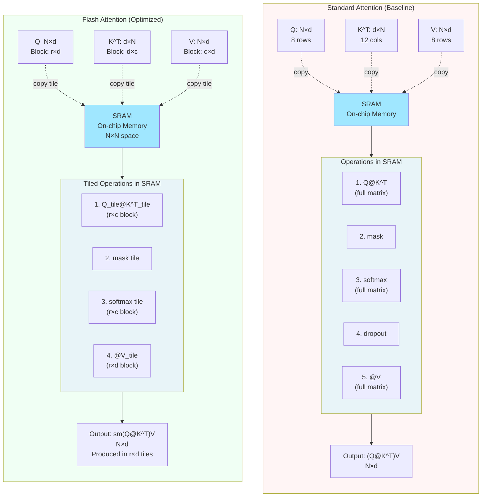
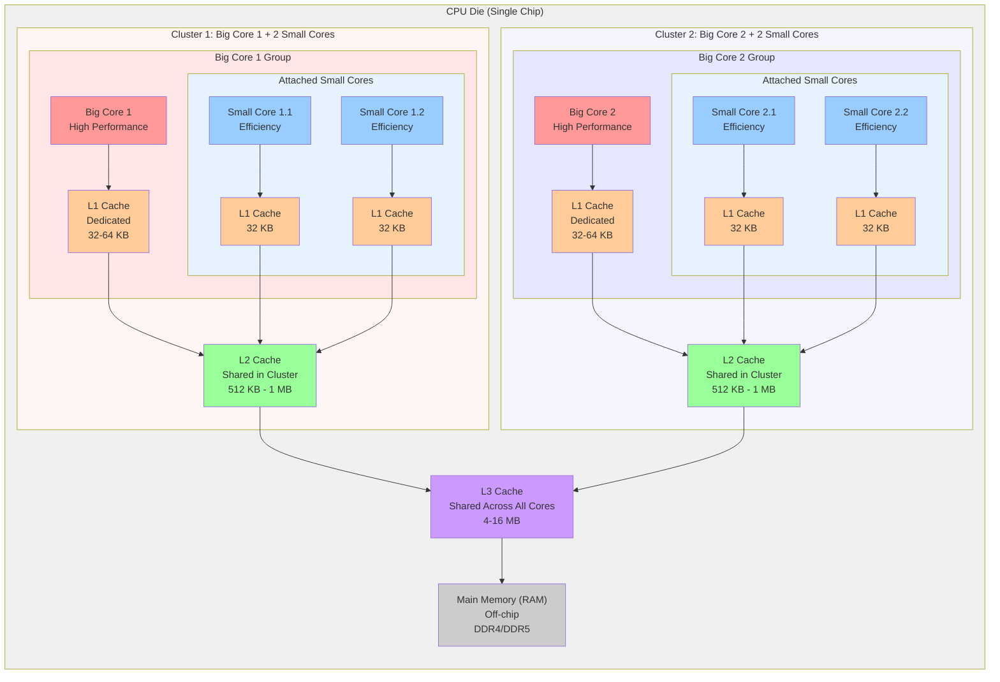
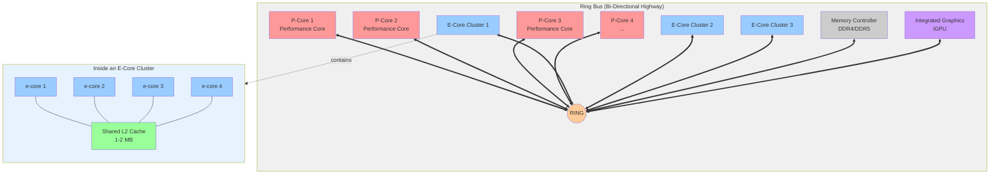

# How llama.cpp Runs GGUF Models in CPU_IMI QEMU Emulator

**Date:** December 9, 2025  
**Author:** Code Understanding Session

## Overview

This document explains the complete execution flow of how llama.cpp runs GGUF (GPT-Generated Unified Format) model files when executed through the CPU_IMI QEMU emulator in the iminn-tools framework.

---

## Table of Contents

1. [Overview](#overview)
2. [Command Execution Flow](#command-execution-flow)
3. [QEMU Invocation](#qemu-invocation)
4. [Binary Execution Inside QEMU](#binary-execution-inside-qemu)
5. [Model Loading Process](#model-loading-process)
6. [Inference Execution](#inference-execution)
7. [Pass 1: Backend Assignment (Node-to-Backend Mapping](#pass-1-backend-assignment-node-to-backend-mapping)
8. [Pass 2: Graph Splitting (Group Nodes by Backend)](#pass-2-graph-splitting-group-nodes-by-backend)
9. [Pass 3: Tensor Allocation](#pass-3-tensor-allocation)
10. [How Scheduling Works](#how-scheduling-works)
11. [Impact of Multiple CPU Cores on Allocation and Execution](#impact-of-multiple-cpu-cores-on-allocation-and-execution)
12. [Flash Attention: Overview and Optimizations](#flash-attention-overview-and-optimizations)
13. [Flash Attention: CPU vs GPU Support (Code Analysis)](#flash-attention-cpu-vs-gpu-support-code-analysis)
14. [QEMU Instruction Translation](#qemu-instruction-translation)
15. [Key Components Summary](#key-components-summary)
16. [Complete Command Breakdown](#complete-command-breakdown)
17. [Architecture Flow Diagram](#architecture-flow-diagram)
18. [Key Files Reference](#key-files-reference)
19. [Notes](#notes)
20. [Related Documentation](#related-documentation)

---

## Command Execution Flow

### Example Command

```bash
iminnt -t llama_imi run -d test_q4_0_stories
```

### Step 1: Command Resolution

The system resolves the default command to binary path and arguments:

**Configuration** (`src/iminnt/llamacpp.py:255-260`):
```python
"test_q4_0_stories": {
    "bin": f"{self.install_dir}/bin/llama-cli", 
    "args": f"-m {self.root}/models/stories15M-q4_0.gguf \
             --seed 42 \
             -t 1 -ngl 0 -n 32 \
             -no-cnv -st --no-warmup \
             --file {PROMPTS_DIR}/hello-world.txt"
}
```

**Resolved Paths:**
- **Binary**: `dev_env/llama.cpp/llamacpp-imi-install/bin/llama-cli`
- **Model**: `dev_env/llama.cpp/models/stories15M-q4_0.gguf`
- **Prompt**: `src/iminnt/resources/prompts/hello-world.txt`

---

## QEMU Invocation

### Step 2: QEMU Command Construction

The `run()` method in `src/iminnt/core.py:556-595` constructs the QEMU command:

**Key Code**:
```python
if self.use_qemu:
    qemu_bin = f"{QEMU_USER_BIN} {QEMU_ROI_ENV_FLAG} -cpu {IMI_CPU_ALIAS}"
    
    if not self.is_static_bin(str(bin_path)):
        qemu_bin = f"{qemu_bin} -L {self.env['CROSS_SYSROOT']}"
    
    qemu_cmd = f"{qemu_bin} {bin_cmd}"
    shell(qemu_cmd.split(), env=run_env)
```

### Actual QEMU Command Executed

From execution logs (`llama_imi_1t`):
```bash
/home/linhu/repo/iminn-tools/dev_env/csqemu-v9/install-local/bin/qemu-riscv64 \
  -E IMI_ROI_SIM="1" \
  -cpu imicpu-v1 \
  /home/linhu/repo/iminn-tools/dev_env/llama.cpp/llamacpp-imi-install/bin/llama-cli \
  -m /home/linhu/repo/iminn-tools/dev_env/llama.cpp/models/stories15M-q4_0.gguf \
  --seed 42 -t 1 -ngl 0 -n 32 -no-cnv -st --no-warmup \
  --file /home/linhu/repo/iminn-tools/src/iminnt/resources/prompts/hello-world.txt
```

### QEMU Parameters Explained

| Parameter | Purpose |
|-----------|---------|
| `-E IMI_ROI_SIM="1"` | Enables Region of Interest markers for focused profiling |
| `-cpu imicpu-v1` | Uses I-Machines CPU model with custom extensions |
| Binary path | RISC-V statically-linked `llama-cli` executable |

**QEMU Binary Location** (`src/iminnt/constants.py:26-27`):
```python
QEMU_USER_BIN = QEMU_USER_DIR / "bin" / "qemu-riscv64"
# Path: dev_env/csqemu-v9/install-local/bin/qemu-riscv64
```

---

## Binary Execution Inside QEMU

### Step 3: QEMU User-Mode Emulation

QEMU user-mode emulation provides:

1. **Instruction Translation**: RISC-V instructions → x86 host instructions
2. **CPU Emulation**: I-Machines CPU model (`imicpu-v1`) with custom extensions
3. **System Call Handling**: Intercepts and emulates RISC-V syscalls via host kernel
4. **Virtual Environment**: Complete RISC-V execution environment

The `llama-cli` binary (compiled for RISC-V with I-Machines extensions) starts executing inside this emulated environment.

---

## Model Loading Process

### Step 4: GGUF Model Loading

From execution logs, the model loading sequence:

```
main: llama backend init
main: load the model and apply lora adapter, if any
llama_model_loader: loaded meta data with 20 key-value pairs and 57 tensors 
  from stories15M-q4_0.gguf (version GGUF V3 (latest))
```

### 4.1 GGUF File Format Structure

**GGUF (GPT-Generated Unified Format)** is the binary format used by llama.cpp to store model weights and metadata.

**File Layout:**
```
┌─────────────────────────────────────┐
│ GGUF Header                          │
│  - Magic number: "GGUF"              │
│  - Version: V1/V2/V3                 │
│  - Metadata offset                   │
│  - Tensor data offset                │
└─────────────────────────────────────┘
┌─────────────────────────────────────┐
│ Metadata Section                     │
│  - Key-value pairs (20 for stories15M)│
│  - Architecture info                 │
│  - Hyperparameters                  │
│  - Tokenizer config                 │
└─────────────────────────────────────┘
┌─────────────────────────────────────┐
│ Tensor Data Section                  │
│  - Tensor 0: tok_embeddings (f32)   │
│  - Tensor 1: layer.0.attn_q (q4_0)   │
│  - Tensor 2: layer.0.attn_k (q4_0)   │
│  - ... (57 total tensors)            │
└─────────────────────────────────────┘
```

**Key Metadata Fields** (from stories15M):
- `general.architecture = "llama"`
- `llama.context_length = 128`
- `llama.embedding_length = 288`
- `llama.feed_forward_length = 768`
- `llama.attention.head_count = 6`
- `llama.block_count = 6`
- `tokenizer.ggml.tokens` (32,000 tokens)
- `tokenizer.ggml.scores` (BPE scores)

### Understanding GGUF Metadata Fields

These fields define the model's architecture and capabilities. Here's what each field means:

#### 1. `general.architecture = "llama"`

**Purpose**: Identifies the transformer architecture variant.

**Values**: `"llama"`, `"gpt"`, `"mamba"`, etc.

**Usage**: Determines which architecture-specific code path to use:
- Different architectures have different layer structures
- Different attention mechanisms (standard, GQA, etc.)
- Different position encodings (RoPE, learned, etc.)

**In Code**:
```cpp
// src/llama-model.cpp:load_arch()
std::string arch = ml.get_key<std::string>("general.architecture");
// Result: "llama"
// Creates: llama_arch_llama instance
```

#### 2. `llama.context_length = 128`

**Purpose**: Maximum sequence length the model was trained on.

**Meaning**: 
- The model was trained to handle sequences up to **128 tokens**
- This is the **training context window**, not the inference limit
- During inference, you can often use longer contexts (e.g., 4096), but quality may degrade

**Impact**:
- Determines KV cache size allocation
- Affects position embedding behavior
- May trigger warnings if inference context > training context

**Example**:
```
Training: 128 tokens max
Inference: Can use 4096 tokens (but model wasn't trained for this)
Warning: "n_ctx_seq (4096) > n_ctx_train (128) -- possible training context overflow"
```

**In Model Structure**:
```cpp
struct llama_hparams {
    uint32_t n_ctx_train = 128;  // From this field
    // ...
};
```

#### 3. `llama.embedding_length = 288`

**Purpose**: Dimension of token embeddings (also called `n_embd` or `d_model`).

**Meaning**: 
- Each token is represented as a **288-dimensional vector**
- This is the "width" of the model - all hidden states have this dimension
- Larger = more capacity, but also more parameters and computation

**Visual Representation**:
```
Input Token ID: 42
    ↓
Embedding Lookup
    ↓
Embedding Vector: [0.23, -0.15, 0.67, ..., 0.12]  (288 numbers)
    ↓
This vector flows through all transformer layers
```

**Tensor Shapes**:
- `tok_embeddings`: `[32000, 288]` (vocab_size × embedding_dim)
- Hidden states: `[n_tokens, 288]` throughout the model
- Attention Q/K/V: `[n_tokens, 288]` → split into heads

**In Model Structure**:
```cpp
struct llama_hparams {
    uint32_t n_embd = 288;  // From this field
    // ...
};
```

#### 4. `llama.feed_forward_length = 768`

**Purpose**: Dimension of the feed-forward network (FFN) hidden layer.

**Meaning**:
- The FFN expands from `embedding_length` (288) → `feed_forward_length` (768) → back to `embedding_length` (288)
- This is a **2.67x expansion** (768 / 288 = 2.67)
- Standard ratio: 4x for larger models, but smaller models use less

**Architecture**:
```
Input: [n_tokens, 288]
    ↓
Gate Projection: [288, 768]  ← Expands
    ↓
Up Projection:   [288, 768]  ← Expands
    ↓
SwiGLU Activation
    ↓
Down Projection: [768, 288]  ← Contracts back
    ↓
Output: [n_tokens, 288]
```

**Tensor Shapes**:
- `layer.*.ffn_gate`: `[288, 768]` (embedding_dim × feed_forward_dim)
- `layer.*.ffn_up`: `[288, 768]`
- `layer.*.ffn_down`: `[768, 288]` (feed_forward_dim × embedding_dim)

**In Model Structure**:
```cpp
struct llama_hparams {
    uint32_t n_ff = 768;  // From this field
    // ...
};
```

#### 5. `llama.attention.head_count = 6`

**Purpose**: Number of attention heads in multi-head attention.

**Meaning**:
- The model uses **6 parallel attention heads**
- Each head processes a subset of the embedding dimension
- Head dimension = `embedding_length / head_count = 288 / 6 = 48`

**Architecture**:
```
Input: [n_tokens, 288]
    ↓
Split into 6 heads: [6, n_tokens, 48]  (288 / 6 = 48 per head)
    ↓
Each head computes attention independently
    ↓
Concatenate: [n_tokens, 288]  (6 heads × 48 dims = 288)
```

**Visual Representation**:
```
Head 0: Processes dimensions [0:48]
Head 1: Processes dimensions [48:96]
Head 2: Processes dimensions [96:144]
Head 3: Processes dimensions [144:192]
Head 4: Processes dimensions [192:240]
Head 5: Processes dimensions [240:288]
```

**Tensor Shapes**:
- Q projection: `[288, 288]` → reshaped to `[6, 48]` per head
- K projection: `[288, 288]` → reshaped to `[6, 48]` per head
- V projection: `[288, 288]` → reshaped to `[6, 48]` per head

**In Model Structure**:
```cpp
struct llama_hparams {
    uint32_t n_head = 6;  // From this field
    uint32_t head_dim = n_embd / n_head;  // 288 / 6 = 48
    // ...
};
```

#### 6. `llama.block_count = 6`

**Purpose**: Number of transformer blocks (layers) in the model.

**Meaning**:
- The model has **6 transformer layers** stacked sequentially
- Each layer contains:
  - Attention mechanism (Q, K, V, O projections)
  - Feed-forward network (gate, up, down projections)
  - Layer normalization (RMSNorm)
  - Residual connections

**Architecture Flow**:
```
Input Embeddings: [n_tokens, 288]
    ↓
Transformer Block 0:
    ├─> Attention (6 heads)
    └─> Feed-Forward (288 → 768 → 288)
    ↓
Transformer Block 1:
    ├─> Attention (6 heads)
    └─> Feed-Forward (288 → 768 → 288)
    ↓
... (blocks 2-4)
    ↓
Transformer Block 5:
    ├─> Attention (6 heads)
    └─> Feed-Forward (288 → 768 → 288)
    ↓
Output: [n_tokens, 288]
```

**Tensor Count**:
- Per layer: 7 weight tensors (attn_q, attn_k, attn_v, attn_o, ffn_gate, ffn_up, ffn_down)
- Plus: 2 normalization tensors (attn_norm, ffn_norm)
- Total per layer: ~9 tensors
- 6 layers × 9 tensors = 54 layer tensors
- Plus: 3 global tensors (tok_embeddings, output_norm, output)
- **Total: ~57 tensors** (matches the file!)

**In Model Structure**:
```cpp
struct llama_hparams {
    uint32_t n_layer = 6;  // From this field
    // ...
};

// Model has:
model.layers[0] ... model.layers[5]  // 6 layers
```

#### 7. `tokenizer.ggml.tokens` (32,000 tokens)

**Purpose**: Vocabulary - the set of all possible tokens the model can understand.

**Meaning**:
- The model has a **vocabulary of 32,000 tokens**
- Each token is a string (word, subword, or special token)
- Token IDs range from 0 to 31,999

**Token Types**:
- **Regular tokens**: Words, subwords (e.g., "hello", " world", "ing")
- **Special tokens**: 
  - `<s>` (BOS - beginning of sequence)
  - `</s>` (EOS - end of sequence)
  - `<unk>` (unknown token)
  - Control tokens for chat models

**Usage**:
```cpp
// Tokenization: Text → Token IDs
"Hello world" → [9906, 1917]  // Token IDs

// Embedding lookup: Token ID → Vector
Token ID 9906 → [0.23, -0.15, ..., 0.12]  // 288-dim vector

// Detokenization: Token IDs → Text
[9906, 1917] → "Hello world"
```

**Tensor Shape**:
- `tok_embeddings`: `[32000, 288]` (vocab_size × embedding_dim)
- Size: 32,000 × 288 × 4 bytes (F32) = **36.86 MiB**

**In Model Structure**:
```cpp
struct llama_vocab {
    std::vector<std::string> id_to_token;  // 32,000 strings
    std::map<std::string, int> token_to_id;
    // ...
};
```

#### 8. `tokenizer.ggml.scores` (BPE scores)

**Purpose**: Token scores used for Byte-Pair Encoding (BPE) tokenization.

**Meaning**:
- Each token has a **score** (float) indicating its priority during BPE merging
- Higher scores = tokens merged earlier during training
- Used during tokenization to determine how to split text into tokens

**BPE Process**:
```
1. Start with character-level tokens
2. Iteratively merge most frequent pairs
3. Scores determine merge order
4. Result: Subword tokens
```

**Example**:
```
Token: "hello"
Score: 1234.5  (high score = common token, merged early)

Token: " world"
Score: 234.2   (lower score = less common, merged later)

Token: "ing"
Score: 456.7   (medium score)
```

**Usage**:
- During tokenization, scores help determine token boundaries
- Not used during inference (only during tokenization)

**In Model Structure**:
```cpp
struct llama_vocab {
    std::vector<float> token_scores;  // 32,000 scores
    // ...
};
```

### Field Relationships and Model Size

**Parameter Count Estimation**:

For stories15M model:
```
Embeddings:
  tok_embeddings: 32,000 × 288 = 9,216,000 params

Per Layer (6 layers):
  Attention:
    attn_q: 288 × 288 = 82,944
    attn_k: 288 × 288 = 82,944
    attn_v: 288 × 288 = 82,944
    attn_o: 288 × 288 = 82,944
  Feed-Forward:
    ffn_gate: 288 × 768 = 221,184
    ffn_up:   288 × 768 = 221,184
    ffn_down: 768 × 288 = 221,184
  
  Per layer: ~995,328 params
  6 layers: ~5,971,968 params

Output:
  output: 288 × 32,000 = 9,216,000 params

Total (F32): ~24,404,968 params ≈ 97.6 MiB
With Q4_0 quantization: ~24.4 MiB (4 bits per param)
Actual file size: ~17.5 MiB (includes metadata, overhead)
```

**Model Architecture Summary**:
```
┌─────────────────────────────────────────┐
│ Input: Token IDs [n_tokens]              │
└─────────────────┬───────────────────────┘
                  │
┌─────────────────▼───────────────────────┐
│ Embedding Layer                         │
│  Shape: [n_tokens, 288]                 │
│  Weights: [32000, 288]                  │
└─────────────────┬───────────────────────┘
                  │
┌─────────────────▼───────────────────────┐
│ Transformer Blocks (×6)                 │
│  ├─> Attention (6 heads, 48 dim/head)  │
│  └─> FFN (288 → 768 → 288)             │
└─────────────────┬───────────────────────┘
                  │
┌─────────────────▼───────────────────────┐
│ Output Layer                            │
│  Shape: [n_tokens, 32000]              │
│  Weights: [288, 32000]                  │
└─────────────────┬───────────────────────┘
                  │
┌─────────────────▼───────────────────────┐
│ Logits: Probability distribution        │
│  Over 32,000 vocabulary tokens         │
└─────────────────────────────────────────┘
```

### 4.2 Model Loader Initialization

**Entry Point:** `src/llama.cpp:155` → `llama_model_load_from_file_impl()`

**Function Call Chain:**
```cpp
llama_model_load_from_file("stories15M-q4_0.gguf", params)
  └─> llama_model_load(fname, splits, model, params)
      └─> llama_model_loader ml(fname, splits, use_mmap, ...)
```

**Model Loader Constructor** (`src/llama-model-loader.cpp:471`):

```cpp
llama_model_loader::llama_model_loader(
    const std::string & fname,              // "stories15M-q4_0.gguf"
    std::vector<std::string> & splits,       // Split files (empty for single file)
    bool use_mmap,                           // Memory mapping enabled
    bool check_tensors,                      // Validate tensor shapes
    const llama_model_kv_override * param_overrides_p,
    const llama_model_tensor_buft_override * param_tensor_buft_overrides_p)
```

**Loading Process:**

1. **Open GGUF File**
   ```cpp
   // Read file header
   gguf_file_header header;
   file.read(&header, sizeof(header));
   
   // Validate magic number
   if (memcmp(header.magic, "GGUF", 4) != 0) {
       throw std::runtime_error("Invalid GGUF file");
   }
   ```

2. **Parse Metadata**
   ```cpp
   // Load metadata context
   meta = gguf_init_from_file(fname);
   
   // Read key-value pairs
   int n_kv = gguf_get_n_kv(meta);
   // For stories15M: n_kv = 20
   
   // Extract architecture
   arch_name = gguf_get_val_str(meta, "general.architecture");
   // Result: "llama"
   ```

3. **Load Tensor Metadata**
   ```cpp
   // Read tensor count
   int n_tensors = gguf_get_n_tensors(meta);
   // For stories15M: n_tensors = 57
   
   // Build tensor weight map
   for (int i = 0; i < n_tensors; i++) {
       const char * name = gguf_get_tensor_name(meta, i);
       size_t offset = gguf_get_tensor_offset(meta, i);
       ggml_type type = gguf_get_tensor_type(meta, i);
       
       weights_map[name] = llama_tensor_weight{
           .idx = 0,      // File index (0 for single file)
           .offs = offset, // Byte offset in file
           .tensor = nullptr // Will be created later
       };
   }
   ```

4. **Memory Mapping** (if `use_mmap=true`)
   ```cpp
   if (use_mmap) {
       // Map file to memory
       mappings.push_back({
           .addr = mmap(NULL, file_size, PROT_READ, MAP_SHARED, fd, 0),
           .size = file_size,
           .file_idx = 0
       });
   }
   ```

### 4.3 Architecture and Hyperparameter Loading

**Function:** `src/llama-model.cpp:load_arch()` and `load_hparams()`

```cpp
// Load architecture-specific configuration
model.load_arch(ml);
// Reads: general.architecture → "llama"
// Creates: llama_arch_llama instance

// Load hyperparameters
model.load_hparams(ml);
// Reads from metadata:
//   llama.context_length = 128
//   llama.embedding_length = 288
//   llama.feed_forward_length = 768
//   llama.attention.head_count = 6
//   llama.block_count = 6
```

**Resulting Model Structure:**
```cpp
struct llama_hparams {
    uint32_t n_vocab = 32000;      // Vocabulary size
    uint32_t n_ctx_train = 128;    // Training context length
    uint32_t n_embd = 288;         // Embedding dimension
    uint32_t n_ff = 768;           // Feed-forward dimension
    uint32_t n_head = 6;           // Attention heads
    uint32_t n_head_kv = 6;        // Key-value heads
    uint32_t n_layer = 6;          // Transformer layers
    // ... other hyperparameters
};
```

### 4.4 Vocabulary Loading

**Function:** `src/llama-model.cpp:load_vocab()`

```cpp
// Load token strings
std::vector<std::string> tokens;
ml.get_arr("tokenizer.ggml.tokens", tokens);
// Result: 32,000 token strings

// Load token scores (for BPE)
std::vector<float> scores;
ml.get_arr("tokenizer.ggml.scores", scores);

// Load special tokens
int bos_id = ml.get_key<int>("tokenizer.ggml.bos_token_id");
int eos_id = ml.get_key<int>("tokenizer.ggml.eos_token_id");

// Build vocabulary map
for (size_t i = 0; i < tokens.size(); i++) {
    vocab.id_to_token[i] = tokens[i];
    vocab.token_scores[i] = scores[i];
    vocab.token_to_id[tokens[i]] = i;
}
```

### 4.5 Tensor Loading and Backend Allocation

**Function:** `src/llama-model.cpp:load_tensors()`

**Process for Each Tensor:**

#### Step 1: Create Tensor Metadata

**What is Tensor Metadata?**

Tensor metadata is a **data structure** that describes a tensor's properties **without containing the actual data**. Think of it as a "blueprint" or "header" that tells the system:
- What shape the tensor has
- What data type it uses
- What its name is
- Where it fits in the computation graph

**GGML Tensor Structure** (`ggml/include/ggml.h`):

```cpp
struct ggml_tensor {
    // Tensor properties (metadata)
    enum ggml_type    type;        // Data type (F32, Q4_0, Q8_0, etc.)
    int               n_dims;      // Number of dimensions (1D, 2D, 3D, 4D)
    int64_t           ne[4];       // Shape: [ne[0], ne[1], ne[2], ne[3]]
    size_t            nb[4];       // Strides: bytes per dimension
    enum ggml_op      op;          // Operation type (if this is a computation node)
    
    // Naming and identification
    char              name[GGML_MAX_NAME];  // Tensor name (e.g., "tok_embeddings")
    
    // Graph relationships
    struct ggml_tensor * src[GGML_MAX_SRC];  // Source tensors (for operations)
    struct ggml_tensor * view_src;           // If this is a view of another tensor
    
    // Memory (pointer to actual data - allocated separately)
    void              * data;      // Pointer to actual tensor data
    struct ggml_backend_buffer * buffer;  // Backend buffer containing the data
    
    // Flags
    uint32_t          flags;       // Tensor flags (input, output, etc.)
};
```

**Example: Creating Tensor Metadata for `tok_embeddings`**

```cpp
// Get tensor weight info from loader
const llama_tensor_weight & w = ml.require_weight("tok_embeddings");

// Create GGML tensor METADATA (no data allocated yet!)
ggml_tensor * tensor = ggml_new_tensor_2d(ctx, GGML_TYPE_F32, n_embd, n_vocab);
ggml_set_name(tensor, "tok_embeddings");

// After creation, tensor metadata contains:
//   tensor->type = GGML_TYPE_F32
//   tensor->n_dims = 2
//   tensor->ne[0] = 288      (embedding_dim)
//   tensor->ne[1] = 32000    (vocab_size)
//   tensor->ne[2] = 1
//   tensor->ne[3] = 1
//   tensor->name = "tok_embeddings"
//   tensor->data = nullptr   (no data allocated yet!)
//   tensor->buffer = nullptr (no buffer allocated yet!)
```

**Key Point**: At this stage, we've only created the **description** of the tensor. The actual data (9.2 million float values) hasn't been allocated yet!

**Visual Representation**:
```
Tensor Metadata (ggml_tensor struct):
┌─────────────────────────────────────┐
│ Name: "tok_embeddings"              │
│ Type: F32 (float32)                 │
│ Shape: [288, 32000]                 │
│ Size: 288 × 32000 × 4 bytes         │
│       = 36,864,000 bytes            │
│       = 36.86 MiB                   │
│                                     │
│ Data: nullptr  ← Not allocated yet! │
│ Buffer: nullptr ← Not allocated yet!│
└─────────────────────────────────────┘
```

#### Step 2: Determine Backend Buffer Type

**What is a Backend Buffer Type?**

A **backend buffer type** (`ggml_backend_buffer_type_t`) is a **strategy** that determines:
1. **Where** to allocate memory (CPU RAM, GPU VRAM, etc.)
2. **How** to lay out the data in memory (standard layout vs optimized layout)
3. **Which kernels** to use for operations on this data

**Important Distinction**:
- **Backend**: The compute device (CPU, CUDA, Metal, etc.)
- **Buffer Type**: A variant within a backend that uses different memory layout/kernels

**For CPU Backend, there are multiple buffer types**:

```
CPU Backend
  ├─ CPU buffer type (standard)
  │   └─> Standard memory layout
  │   └─> Standard CPU kernels
  │
  ├─ CPU_IMI buffer type (RISC-V IMI optimized)
  │   └─> IMI-optimized memory layout (repacked)
  │   └─> IMI kernels (uses RISC-V custom instructions)
  │
  ├─ CPU_AMX buffer type (x86 AMX optimized)
  │   └─> AMX-optimized layout
  │   └─> AMX kernels
  │
  └─ CPU_KLEIDIAI buffer type (ARM optimized)
      └─> ARM-optimized layout
      └─> ARM kernels
```

**Buffer Type Selection Logic**:

```cpp
// Get buffer type for tensor
ggml_backend_buffer_type_t buft = get_buffer_type(tensor);

// Decision logic:
if (self.is_imi && is_weight_tensor(tensor)) {
    // Weight tensors (Q4_0, Q8_0) → CPU_IMI buffer type
    // This enables IMI-optimized kernels and repacking
    buft = ggml_backend_cpu_buffer_type_imi();
} else {
    // Layer norms (F32) → Standard CPU buffer type
    // F32 doesn't need repacking, standard kernels are fine
    buft = ggml_backend_cpu_buffer_type();
}
```

**Why Different Buffer Types?**

1. **CPU_IMI Buffer Type**:
   - **Purpose**: Optimize for RISC-V I-Machines custom instructions
   - **Data Layout**: Repacks quantized weights into IMI-friendly format
     - Q4_0: Repacked into 4x or 8x block layout
     - Q8_0: Repacked into 4x or 8x block layout
   - **Kernels**: Uses `ggml_imi_gemv_*` and `ggml_imi_gemm_*` functions
   - **Example**: `layer.0.attn_q` (Q4_0) → CPU_IMI buffer type

2. **CPU Buffer Type**:
   - **Purpose**: Standard CPU operations
   - **Data Layout**: Standard tensor layout (no repacking)
   - **Kernels**: Uses standard `ggml_cpu_*` functions
   - **Example**: `layer.0.attn_norm` (F32) → CPU buffer type

**Buffer Type Structure**:

```cpp
struct ggml_backend_buffer_type {
    // Interface functions
    struct {
        const char * (*get_name)(ggml_backend_buffer_type_t buft);
        ggml_backend_buffer_t (*alloc_buffer)(ggml_backend_buffer_type_t buft, size_t size);
        size_t (*get_alignment)(ggml_backend_buffer_type_t buft);
        // ...
    } iface;
    
    // Device (which backend this belongs to)
    ggml_backend_dev_t device;  // Points to CPU backend device
    
    // Context (buffer type-specific data)
    void * context;  // Points to IMI-specific context (if CPU_IMI)
};
```

**Example: Buffer Type Selection for stories15M Model**

```
Tensor: tok_embeddings (F32, [32000, 288])
  → Buffer Type: CPU_IMI (if IMI enabled)
  → Reason: Embedding tensor, can benefit from IMI kernels

Tensor: layer.0.attn_q (Q4_0, [288, 288])
  → Buffer Type: CPU_IMI
  → Reason: Quantized weight tensor, will be repacked for IMI

Tensor: layer.0.attn_norm (F32, [288])
  → Buffer Type: CPU (standard)
  → Reason: Layer norm, F32, no repacking needed

Tensor: output (Q8_0, [288, 32000])
  → Buffer Type: CPU_IMI
  → Reason: Quantized weight tensor, will be repacked for IMI
```

**Key Insight**: The buffer type is chosen **before** allocating memory. It determines:
- How much memory to allocate (may need extra space for repacking)
- How to initialize the tensor (IMI repacking vs standard copy)
- Which kernels will be used later during computation

#### Step 3: Allocate Backend Buffer

```cpp
// Allocate buffer in backend
ggml_backend_buffer_t buffer = ggml_backend_buft_alloc_buffer(
    buft,                    // Buffer type (CPU_IMI or CPU)
    ggml_nbytes(tensor)       // Size in bytes
);

// Attach buffer to tensor
ggml_backend_tensor_alloc(buffer, tensor);
```

**Memory Allocation Example:**
```
Tensor: tok_embeddings
  Type: F32
  Shape: [32000, 288]
  Size: 32000 × 288 × 4 bytes = 36.86 MiB
  Buffer: CPU_IMI backend buffer
```

#### Step 4: Load Tensor Data

**If Memory-Mapped:**
```cpp
if (ml.use_mmap) {
    // Create view into memory-mapped file
    void * data = (char*)ml.mappings[0].addr + w.offs;
    
    // Direct access - no copy needed
    ggml_backend_tensor_set(tensor, data, 0, ggml_nbytes(tensor));
}
```

**If Not Memory-Mapped:**
```cpp
else {
    // Read from file
    file.seekg(w.offs);
    std::vector<uint8_t> data(ggml_nbytes(tensor));
    file.read((char*)data.data(), data.size());
    
    // Copy to backend buffer
    ggml_backend_tensor_set(tensor, data.data(), 0, data.size());
}
```

#### Step 5: Weight Repacking (IMI Format)

**Function:** `ggml_backend_cpu_set_tensor()` → `ggml_cpu_repack_*()`

For quantized weights (Q4_0, Q8_0), repack into I-Machines optimized format:

```cpp
if (buft == CPU_IMI && is_quantized(tensor->type)) {
    // Repack Q4_0 weights for IMI kernels
    // Original: Standard block layout
    // Repacked: IMI block layout (4x or 8x blocks)
    
    ggml_cpu_repack_q4_0_imi(
        tensor->data,           // Source data
        repacked_data,          // Destination
        tensor->ne[0],          // Width
        tensor->ne[1]           // Height
    );
    
    // Update tensor data pointer
    tensor->data = repacked_data;
}
```

**Tensor Loading Summary:**

From execution output:
```
- type  f32:   13 tensors  (float32 - embeddings, layer norms)
  Examples: tok_embeddings, output_norm, layer.*.attn_norm, layer.*.ffn_norm
  
- type q4_0:   43 tensors  (4-bit quantized weights)
  Examples: layer.*.attn_q, layer.*.attn_k, layer.*.attn_v, 
            layer.*.attn_o, layer.*.ffn_gate, layer.*.ffn_up, layer.*.ffn_down
  
- type q8_0:    1 tensor   (8-bit quantized output layer)
  Example: output (vocabulary projection)
```

**Total**: 57 tensors loaded from GGUF file

### 4.6 Backend Configuration

**Backend Configuration** (`src/iminnt/llamacpp.py:197-198`):
```python
if self.is_imi:
    base_args["GGML_CPU_IMI"] = "ON"
```

This enables:
- IMI buffer type allocation for weight tensors
- IMI-optimized kernel dispatch
- Weight repacking into IMI format

---

## Inference Execution

### Step 5: Forward Pass Pipeline

Once the model is loaded, inference proceeds through these stages:

#### 1. Tokenization

- Reads prompt from `hello-world.txt`
- Converts text to token IDs using vocabulary (32,000 tokens)

#### 2. Context Initialization

- Creates **KV cache** for attention mechanism
- Sets up **computation graph** using GGML

#### 3. Forward Pass (per token)

```
┌─────────────────────────────────────┐
│ Input Embedding                     │
│  (Token IDs → Embedding Vectors)    │
└──────────────┬──────────────────────┘
               │
┌──────────────▼──────────────────────┐
│ Transformer Blocks (6 layers)     │
│  ├─> Attention (Q, K, V, O)        │
│  │   └─> Multi-head (6 heads)      │
│  ├─> Feed-Forward                  │
│  │   ├─> Gate projection           │
│  │   ├─> Up projection            │
│  │   └─> Down projection           │
│  └─> Layer Norm (RMS)              │
└──────────────┬──────────────────────┘
               │
┌──────────────▼──────────────────────┐
│ Output Projection                   │
│  (Embedding → Vocabulary Logits)   │
└──────────────┬──────────────────────┘
               │
┌──────────────▼──────────────────────┐
│ Sampling                            │
│  (Top-k, Top-p, Temperature)       │
└─────────────────────────────────────┘
```

#### 4. Backend Scheduler Initialization

**Function:** `src/llama-context.cpp:llama_context_init()`

Before inference can run, the backend scheduler must be initialized:

```cpp
// Register available backends
std::vector<ggml_backend_t> backends;

// 1. Register CPU backend (always available)
ggml_backend_t backend_cpu = ggml_backend_init_by_type(
    GGML_BACKEND_DEVICE_TYPE_CPU, nullptr);
backends.push_back(backend_cpu);

// 2. Register REF backend (for validation, optional)
#ifdef GGML_USE_REF
ggml_backend_t backend_ref = ggml_backend_init_by_type(
    GGML_BACKEND_DEVICE_TYPE_REF, nullptr);
backends.push_back(backend_ref);
#endif

// 3. Create backend scheduler
sched = ggml_backend_sched_new(
    backends.data(),           // Backend array
    backend_buft.data(),        // Buffer types
    backends.size(),            // Number of backends
    max_nodes,                  // Max graph nodes (~200)
    false,                      // Pipeline parallelism (disabled for CPU-only)
    cparams.op_offload          // Operation offload config
);
```

**Backend Priority Order:**
- **Priority 0**: CPU backend (highest priority)
- **Priority 1**: REF backend (lowest priority, fallback/validation)

**Note**: CPU_IMI is **not a separate backend**. It's a **buffer type** within the CPU backend that triggers IMI-optimized kernels.

#### 5. Computation Graph Building

### Understanding Computation Graphs

**What is a Computation Graph?**

A **computation graph** is a **Directed Acyclic Graph (DAG)** that represents the sequence of operations needed to compute the model's output. Think of it as a "recipe" that describes:
- **What operations** to perform
- **In what order** to perform them
- **What data** each operation needs (dependencies)

**Key Characteristics:**
- **Directed**: Operations flow in one direction (input → output)
- **Acyclic**: No circular dependencies (no operation depends on itself)
- **Lazy Evaluation**: Graph is built first, then executed later

**Visual Example**:
```
Input Tokens [1, 2, 3]
    ↓
Node 0: GET_ROWS (embedding lookup)
    ↓
Node 1: MUL_MAT (Q projection)
    ↓
Node 2: MUL_MAT (K projection)
    ↓
Node 3: MUL_MAT (V projection)
    ↓
Node 4: ROPE (position encoding)
    ↓
Node 5: MUL_MAT (QK^T)
    ↓
Node 6: SOFT_MAX
    ↓
Node 7: MUL_MAT (attention output)
    ↓
... (more nodes)
    ↓
Output Logits [vocab_size]
```

### What is a Node?

A **node** in the computation graph represents **one operation** that transforms input tensors into output tensors.

**Node Structure** (`ggml/include/ggml.h`):

```cpp
struct ggml_tensor {
    // Node properties
    enum ggml_op op;              // Operation type (MUL_MAT, ADD, etc.)
    struct ggml_tensor * src[GGML_MAX_SRC];  // Input tensors (dependencies)
    
    // Tensor properties
    enum ggml_type type;          // Data type (F32, Q4_0, etc.)
    int64_t ne[4];                // Output shape
    void * data;                  // Output data (allocated during execution)
    
    // Graph relationships
    int flags;                    // Node flags (input, output, etc.)
    char name[GGML_MAX_NAME];     // Node name (for debugging)
};
```

**Key Insight**: In GGML, **every tensor is a node**. There are two types:
1. **Leaf nodes**: Input tensors (weights, embeddings) - no dependencies
2. **Operation nodes**: Result of operations - depend on source tensors

**Node Types** (Operation Types):

| Operation | Description | Example |
|-----------|-------------|---------|
| `GGML_OP_GET_ROWS` | Embedding lookup | `tok_embd = get_rows(embeddings, token_ids)` |
| `GGML_OP_MUL_MAT` | Matrix multiplication | `q = mul_mat(attn_q, hidden)` |
| `GGML_OP_ADD` | Element-wise addition | `hidden = add(hidden, attn_out)` |
| `GGML_OP_MUL` | Element-wise multiplication | `ffn_out = mul(gate, up)` |
| `GGML_OP_RMS_NORM` | Layer normalization | `hidden_norm = rms_norm(hidden, norm_weights)` |
| `GGML_OP_ROPE` | Rotary position embedding | `q = rope(q, positions)` |
| `GGML_OP_SOFT_MAX` | Softmax activation | `scores = soft_max(qk_scores)` |
| `GGML_OP_SILU` | SiLU activation | `gate = silu(gate)` |
| `GGML_OP_CONCAT` | Concatenate tensors | `k_all = concat(k_cache, k)` |
| `GGML_OP_SCALE` | Scale tensor | `scores = scale(scores, 1/sqrt(d))` |

### How Nodes are Created

**Function:** `src/llama-graph.cpp:graph_build()`

Nodes are created **automatically** when you call GGML operation functions. Each function call creates a new node in the graph.

**Example: Creating Nodes for Attention**

```cpp
// Each of these function calls creates a NEW NODE:

// Node 1: Q projection
auto q = ggml_mul_mat(model.layers[i].attn_q, hidden);
// Creates: Node with op=GGML_OP_MUL_MAT
//          src[0] = attn_q (weight tensor)
//          src[1] = hidden (previous layer output)
//          Output: q tensor

// Node 2: K projection  
auto k = ggml_mul_mat(model.layers[i].attn_k, hidden);
// Creates: Node with op=GGML_OP_MUL_MAT
//          src[0] = attn_k
//          src[1] = hidden
//          Output: k tensor

// Node 3: V projection
auto v = ggml_mul_mat(model.layers[i].attn_v, hidden);
// Creates: Node with op=GGML_OP_MUL_MAT
//          src[0] = attn_v
//          src[1] = hidden
//          Output: v tensor

// Node 4: Apply RoPE to Q
q = ggml_rope(q, batch.pos, n_ctx, freq_base, freq_scale);
// Creates: Node with op=GGML_OP_ROPE
//          src[0] = q (from Node 1)
//          Output: q (updated with position encoding)
```

**Key Point**: You don't explicitly "create nodes". Instead, you call GGML functions, and each function call **implicitly creates a node** in the computation graph.

### How Nodes are Determined

Nodes are determined by the **model architecture** and the **operations needed** for the forward pass. The graph builder follows a fixed pattern based on the transformer architecture.

**Graph Building Process** (`src/llama-graph.cpp:graph_build()`):

```cpp
// 1. Input embeddings
auto tok_embd = ggml_get_rows(model.tok_embeddings, batch.token);
// Creates: Node 0 (GET_ROWS)
// Shape: [n_tokens, n_embd]

// 2. For each transformer layer
for (int i = 0; i < n_layers; i++) {
    // Step 1: Layer normalization
    auto hidden_norm = ggml_rms_norm(hidden, model.layers[i].attn_norm);
    // Creates: Node (RMS_NORM)
    
    // Step 2: Attention - QKV projections
    auto q = ggml_mul_mat(model.layers[i].attn_q, hidden_norm);
    // Creates: Node (MUL_MAT for Q)
    auto k = ggml_mul_mat(model.layers[i].attn_k, hidden_norm);
    // Creates: Node (MUL_MAT for K)
    auto v = ggml_mul_mat(model.layers[i].attn_v, hidden_norm);
    // Creates: Node (MUL_MAT for V)
    
    // Step 3: Apply RoPE
    q = ggml_rope(q, batch.pos, n_ctx, freq_base, freq_scale);
    // Creates: Node (ROPE for Q)
    k = ggml_rope(k, batch.pos, n_ctx, freq_base, freq_scale);
    // Creates: Node (ROPE for K)
    
    // Step 4: Concatenate with KV cache
    auto k_all = ggml_concat(k_cache, k, /*dim=*/1);
    // Creates: Node (CONCAT)
    auto v_all = ggml_concat(v_cache, v, /*dim=*/1);
    // Creates: Node (CONCAT)
    
    // Step 5: Compute attention scores
    auto scores = ggml_mul_mat(q, k_all);
    // Creates: Node (MUL_MAT for QK^T)
    scores = ggml_scale(scores, 1.0f / sqrtf(head_dim));
    // Creates: Node (SCALE)
    scores = ggml_add(scores, causal_mask);
    // Creates: Node (ADD for mask)
    scores = ggml_soft_max(scores);
    // Creates: Node (SOFT_MAX)
    
    // Step 6: Apply attention to values
    auto attn_out = ggml_mul_mat(scores, v_all);
    // Creates: Node (MUL_MAT for attention output)
    
    // Step 7: Output projection
    attn_out = ggml_mul_mat(model.layers[i].attn_o, attn_out);
    // Creates: Node (MUL_MAT for O)
    
    // Step 8: Residual connection
    hidden = ggml_add(hidden, attn_out);
    // Creates: Node (ADD for residual)
    
    // Step 9: FFN layer norm
    hidden_norm = ggml_rms_norm(hidden, model.layers[i].ffn_norm);
    // Creates: Node (RMS_NORM)
    
    // Step 10: Feed-forward network
    auto gate = ggml_mul_mat(model.layers[i].ffn_gate, hidden_norm);
    // Creates: Node (MUL_MAT for gate)
    auto up = ggml_mul_mat(model.layers[i].ffn_up, hidden_norm);
    // Creates: Node (MUL_MAT for up)
    gate = ggml_silu(gate);
    // Creates: Node (SILU activation)
    auto ffn_out = ggml_mul(gate, up);
    // Creates: Node (MUL for SwiGLU)
    ffn_out = ggml_mul_mat(model.layers[i].ffn_down, ffn_out);
    // Creates: Node (MUL_MAT for down)
    
    // Step 11: Residual connection
    hidden = ggml_add(hidden, ffn_out);
    // Creates: Node (ADD for residual)
}

// 3. Output projection
auto logits = ggml_mul_mat(model.output, hidden);
// Creates: Node (MUL_MAT for output)
// Shape: [n_tokens, vocab_size]
```

### Node Count Per Layer

**For stories15M (6-layer model):**

**Per Transformer Layer:**
- RMSNorm: 2 nodes (attn_norm, ffn_norm)
- MUL_MAT: 7 nodes (Q, K, V, O, gate, up, down)
- ROPE: 2 nodes (Q, K)
- CONCAT: 2 nodes (K cache, V cache)
- MUL_MAT: 2 nodes (QK^T, attention output)
- SCALE: 1 node (attention scaling)
- ADD: 2 nodes (mask, residual × 2)
- SOFT_MAX: 1 node
- SILU: 1 node
- MUL: 1 node (SwiGLU)
- **Total per layer: ~21 nodes**

**Input Layer:**
- GET_ROWS: 1 node (embedding lookup)
- **Total: ~1 node**

**Output Layer:**
- RMS_NORM: 1 node
- MUL_MAT: 1 node (output projection)
- **Total: ~2 nodes**

**Grand Total:**
```
1 (input) + (6 layers × 21 nodes) + 2 (output) = 129 nodes
```

**Actual count may vary** due to:
- KV cache handling (may add/remove nodes)
- Graph optimizations (may fuse operations)
- Architecture variations

### Graph Structure Visualization

**Complete Graph for stories15M**:

```
┌─────────────────────────────────────────┐
│ Input: Token IDs [n_tokens]              │
└──────────────┬──────────────────────────┘
               │
┌──────────────▼──────────────────────────┐
│ Node 0: GET_ROWS                         │
│   Input: tok_embeddings [32000, 288]     │
│   Input: token_ids [n_tokens]            │
│   Output: hidden [n_tokens, 288]         │
└──────────────┬──────────────────────────┘
               │
┌──────────────▼──────────────────────────┐
│ Layer 0: Transformer Block              │
│   ├─> Node 1: RMS_NORM (attn_norm)      │
│   ├─> Node 2: MUL_MAT (Q projection)     │
│   ├─> Node 3: MUL_MAT (K projection)     │
│   ├─> Node 4: MUL_MAT (V projection)     │
│   ├─> Node 5: ROPE (Q)                  │
│   ├─> Node 6: ROPE (K)                  │
│   ├─> Node 7: CONCAT (K cache)          │
│   ├─> Node 8: CONCAT (V cache)          │
│   ├─> Node 9: MUL_MAT (QK^T)            │
│   ├─> Node 10: SCALE                    │
│   ├─> Node 11: ADD (mask)              │
│   ├─> Node 12: SOFT_MAX                 │
│   ├─> Node 13: MUL_MAT (attention)      │
│   ├─> Node 14: MUL_MAT (O projection)   │
│   ├─> Node 15: ADD (residual)           │
│   ├─> Node 16: RMS_NORM (ffn_norm)      │
│   ├─> Node 17: MUL_MAT (gate)           │
│   ├─> Node 18: MUL_MAT (up)             │
│   ├─> Node 19: SILU                     │
│   ├─> Node 20: MUL (SwiGLU)            │
│   ├─> Node 21: MUL_MAT (down)          │
│   └─> Node 22: ADD (residual)           │
└──────────────┬──────────────────────────┘
               │
┌──────────────▼──────────────────────────┐
│ Layer 1-5: Similar structure            │
│   (Nodes 23-142, ~21 nodes per layer)   │
└──────────────┬──────────────────────────┘
               │
┌──────────────▼──────────────────────────┐
│ Output Layer                            │
│   ├─> Node 143: RMS_NORM                │
│   └─> Node 144: MUL_MAT (output)       │
└──────────────┬──────────────────────────┘
               │
┌──────────────▼──────────────────────────┐
│ Output: Logits [n_tokens, vocab_size]   │
└─────────────────────────────────────────┘
```

### Graph Execution

**After building the graph**, it's executed:

```cpp
// 1. Build graph (creates all nodes)
auto * graph = graph_build(ubatch, LLM_GRAPH_TYPE_DECODER, mctx);
// graph->n_nodes = ~145 nodes

// 2. Allocate tensors for all nodes
ggml_backend_sched_alloc_graph(sched, graph);

// 3. Execute graph (processes nodes in topological order)
ggml_backend_sched_graph_compute_async(sched, graph);

// Execution order:
// 1. Execute Node 0 (GET_ROWS) - no dependencies
// 2. Execute Node 1 (RMS_NORM) - depends on Node 0
// 3. Execute Node 2 (MUL_MAT Q) - depends on Node 1
// 4. Execute Node 3 (MUL_MAT K) - depends on Node 1
// ... (continues in dependency order)
// 144. Execute Node 144 (MUL_MAT output) - depends on previous nodes
```

**Key Points**:
- Nodes are executed in **topological order** (dependencies first)
- Each node's output becomes input for dependent nodes
- All nodes must complete before the graph execution finishes

#### 6. Backend Scheduling and Graph Allocation

**Function:** `src/llama-context.cpp:process_ubatch()`

After the computation graph is built, it needs to be **allocated to backends** and **scheduled for execution**. This is a multi-step process.

**Overview:**
```
1. Build Graph (145 nodes)
   ↓
2. Reset Scheduler (clear previous state)
   ↓
3. Allocate Graph to Backends (three-pass algorithm)
   ├─> Pass 1: Assign each node to a backend
   ├─> Pass 2: Split graph at backend boundaries
   └─> Pass 3: Allocate tensors in backend buffers
   ↓
4. Execute Graph (process splits in order)
```

### Step 1: Build Graph

```cpp
auto * gf = graph_build(ubatch, LLM_GRAPH_TYPE_DECODER, mctx);
// gf is a ggml_cgraph with ~145 nodes
// At this point, nodes have NO backend assignment yet
```

### Step 2: Reset Scheduler

```cpp
ggml_backend_sched_reset(sched.get());
// Clear previous tensor-to-backend mappings
// Reset allocation state
// Prepare for new graph allocation
```

### Step 3: Allocate Graph to Backends

**Function:** `ggml/src/ggml-backend.cpp:ggml_backend_sched_alloc_graph()`

This is a **three-pass algorithm** that determines where each node should execute and allocates memory accordingly.

---

## Pass 1: Backend Assignment (Node-to-Backend Mapping)

**Question: One node to one backend?**

**Answer: Yes!** Each node is assigned to **exactly one backend**. The scheduler determines which backend should execute each node based on several criteria.

**Function:** `ggml_backend_sched_backend_id_from_cur()`

**Algorithm for Each Node:**

```cpp
for (int i = 0; i < graph->n_nodes; i++) {
    ggml_tensor * node = graph->nodes[i];
    
    // Determine which backend should execute this node
    int backend_id = ggml_backend_sched_backend_id_from_cur(sched, node);
    
    // Store assignment
    sched->node_backend_ids[i] = backend_id;
}
```

**Backend Selection Logic** (in priority order):

**Step 1: Check if tensor already has a buffer**
```cpp
int cur_backend_id = ggml_backend_sched_backend_from_buffer(sched, node, node);
if (cur_backend_id != -1) {
    return cur_backend_id;  // Use existing buffer's backend
}
```
**Example**: Weight tensors already allocated during model loading → use that backend

**Step 2: Handle view tensors**
```cpp
if (node->view_src != NULL) {
    // View tensors share the same backend as source tensor
    cur_backend_id = ggml_backend_sched_backend_from_buffer(
        sched, node->view_src, node);
    if (cur_backend_id != -1) {
        return cur_backend_id;
    }
}
```
**Example**: Reshaped or sliced tensors → use source tensor's backend

**Step 3: Graph inputs default to CPU**
```cpp
if (node->flags & GGML_TENSOR_FLAG_INPUT) {
    return sched->n_backends - 1;  // CPU backend (last in list)
}
```
**Example**: Input token IDs, positions → CPU backend

**Step 4: Data locality - prefer backend where weights are located**
```cpp
for (int i = 0; i < GGML_MAX_SRC; i++) {
    struct ggml_tensor * src = node->src[i];
    if (src == NULL) break;
    
    // Check if source tensor (weight) has a backend
    int src_backend_id = ggml_backend_sched_backend_from_buffer(sched, src, src);
    if (src_backend_id != -1) {
        // Prefer same backend as weight tensor
        return src_backend_id;
    }
}
```
**Example**: `MUL_MAT` node with weight tensor in CPU_IMI buffer → CPU backend

**Step 5: Default to CPU backend**
```cpp
return sched->n_backends - 1;  // CPU backend (fallback)
```

**Complete Backend Assignment Example** (for stories15M, CPU-only build):

```
Node 0: GET_ROWS (tok_embeddings lookup)
  → Step 3: Input tensor → Backend: CPU

Node 1: MUL_MAT (layer.0.attn_q projection)
  → Step 4: Weight tensor (attn_q) in CPU_IMI buffer → Backend: CPU
  → Note: CPU_IMI is a buffer type, not a backend. CPU backend handles it.

Node 2: MUL_MAT (layer.0.attn_k projection)
  → Step 4: Weight tensor (attn_k) in CPU_IMI buffer → Backend: CPU

Node 3: MUL_MAT (layer.0.attn_v projection)
  → Step 4: Weight tensor (attn_v) in CPU_IMI buffer → Backend: CPU

Node 4: ROPE (Q position encoding)
  → Step 5: Default → Backend: CPU

... (all nodes assigned to CPU for CPU-only builds)

Node 144: MUL_MAT (output projection)
  → Step 4: Weight tensor (output) in CPU_IMI buffer → Backend: CPU
```

**Result**: All 145 nodes assigned to CPU backend (for CPU-only builds)

**For Multi-Backend Builds** (e.g., with GPU):
```
Node 0: GET_ROWS
  → Backend: CPU (input)

Node 1-50: Attention layers
  → Backend: CUDA (GPU layers, weights on GPU)

Node 51-100: Feed-forward layers
  → Backend: CUDA (GPU layers)

Node 101-144: Output layer
  → Backend: CPU (fallback to CPU)
```

---

## Pass 2: Graph Splitting (Group Nodes by Backend)

**Purpose**: Group consecutive nodes that belong to the same backend into "splits" for efficient execution.

**Function:** `ggml_backend_sched_split_graph()`

**Algorithm:**

```cpp
// Initialize first split
struct ggml_backend_sched_split * cur_split = &sched->splits[0];
int cur_backend_id = sched->node_backend_ids[0];
cur_split->backend_id = cur_backend_id;
cur_split->i_start = 0;  // Start index of nodes in this split
cur_split->n_nodes = 0;
cur_split->n_inputs = 0;

// Process each node
for (int i = 0; i < graph->n_nodes; i++) {
    int node_backend_id = sched->node_backend_ids[i];
    
    // If backend changed, create new split
    if (node_backend_id != cur_backend_id) {
        // Finalize current split
        cur_split->n_nodes = i - cur_split->i_start;
        
        // Create new split
        cur_split = &sched->splits[++n_splits];
        cur_split->backend_id = node_backend_id;
        cur_split->i_start = i;
        cur_split->n_nodes = 0;
        cur_backend_id = node_backend_id;
    }
    
    // Track cross-backend dependencies (inputs from different backend)
    for (int j = 0; j < GGML_MAX_SRC; j++) {
        struct ggml_tensor * src = graph->nodes[i]->src[j];
        if (src && get_backend_id(src) != cur_backend_id) {
            // This input needs to be copied from another backend
            cur_split->inputs[cur_split->n_inputs++] = src;
        }
    }
    
    cur_split->n_nodes++;
}

// Finalize last split
cur_split->n_nodes = graph->n_nodes - cur_split->i_start;
sched->n_splits = n_splits + 1;
```

**Example: CPU-Only Build**

```
All nodes: [0, 1, 2, ..., 144] → All assigned to CPU backend

Result:
  Split 0:
    backend_id = CPU
    i_start = 0
    n_nodes = 145
    nodes = [0, 1, 2, ..., 144]
    inputs = []  (no cross-backend dependencies)
  
  n_splits = 1
```

**Example: Multi-Backend Build** (hypothetical with GPU)

```
Node assignments:
  [0-10]: CPU
  [11-100]: CUDA
  [101-144]: CPU

Result:
  Split 0:
    backend_id = CPU
    i_start = 0
    n_nodes = 11
    nodes = [0, 1, ..., 10]
    inputs = []
  
  Split 1:
    backend_id = CUDA
    i_start = 11
    n_nodes = 90
    nodes = [11, 12, ..., 100]
    inputs = [Node10_output]  ← Needs copy from CPU
  
  Split 2:
    backend_id = CPU
    i_start = 101
    n_nodes = 44
    nodes = [101, 102, ..., 144]
    inputs = [Node100_output]  ← Needs copy from CUDA
  
  n_splits = 3
```

**Key Insight**: Splits allow the scheduler to:
- Execute all nodes for a backend together (batch processing)
- Minimize cross-backend data transfers
- Enable parallel execution of independent splits

---

## Pass 3: Tensor Allocation

**Purpose**: Allocate memory for all intermediate tensors (outputs of nodes) in the appropriate backend buffers.

**Function:** `ggml_gallocr_alloc_graph()`

**Process:**

```cpp
// For each node in the graph (in topological order)
for (int i = 0; i < graph->n_nodes; i++) {
    struct ggml_tensor * node = graph->nodes[i];
    int backend_id = sched->node_backend_ids[i];
    
    // Skip if tensor already allocated (weight tensors, inputs)
    if (node->buffer != NULL) {
        continue;
    }
    
    // Determine buffer type for this backend
    ggml_backend_buffer_type_t buft = sched->bufts[backend_id];
    
    // Calculate tensor size
    size_t nbytes = ggml_nbytes(node);
    
    // Allocate buffer in backend
    ggml_backend_buffer_t buffer = ggml_backend_buft_alloc_buffer(buft, nbytes);
    
    // Attach buffer to tensor
    ggml_backend_tensor_alloc(buffer, node);
    
    // Track allocation in scheduler hash table
    ggml_backend_sched_set_tensor_backend(sched, node, backend_id);
}
```

**Allocation Strategy:**

1. **Weight Tensors**: Already allocated during model loading
   - Example: `layer.0.attn_q` → Already in CPU_IMI buffer
   - Skip allocation

2. **Input Tensors**: Allocated in CPU backend
   - Example: Token IDs, positions → CPU buffer
   - Allocated in Pass 3

3. **Intermediate Tensors**: Allocated based on node's backend assignment
   - Example: `q` tensor (output of MUL_MAT) → CPU buffer
   - Example: `scores` tensor (output of SOFT_MAX) → CPU buffer
   - Allocated in Pass 3

4. **Output Tensors**: Allocated in CPU backend (default)
   - Example: `logits` tensor → CPU buffer
   - Allocated in Pass 3

**Memory Allocation Example:**

```
Node 1: MUL_MAT (Q projection)
  Input: hidden [1, 288] (already allocated)
  Input: attn_q [288, 288] (weight, already allocated)
  Output: q [1, 288] → Allocate in CPU buffer (1 × 288 × 4 bytes = 1.125 KiB)

Node 2: MUL_MAT (K projection)
  Input: hidden [1, 288] (already allocated)
  Input: attn_k [288, 288] (weight, already allocated)
  Output: k [1, 288] → Allocate in CPU buffer (1.125 KiB)

... (continue for all nodes)
```

**Total Memory**: For 145 nodes, intermediate tensors may require ~10-50 MiB depending on batch size and sequence length.

---

## How Scheduling Works

**After allocation, the graph is ready for execution:**

### Execution Order

**Function:** `ggml_backend_sched_graph_compute_async()`

```cpp
// Execute splits in order
for (int split_idx = 0; split_idx < sched->n_splits; split_idx++) {
    struct ggml_backend_sched_split * split = &sched->splits[split_idx];
    
    // Step 1: Copy inputs from source backends (if needed)
    for (int i = 0; i < split->n_inputs; i++) {
        struct ggml_tensor * input = split->inputs[i];
        int src_backend_id = get_backend_id(input);
        
        if (src_backend_id != split->backend_id) {
            // Copy tensor from source backend to target backend
            ggml_backend_tensor_copy(
                sched->backends[src_backend_id],
                sched->backends[split->backend_id],
                input, input);
        }
    }
    
    // Step 2: Execute split on assigned backend
    ggml_backend_graph_compute(
        sched->backends[split->backend_id],
        split->nodes,  // Array of nodes in this split
        split->n_nodes);
    
    // Step 3: Synchronize (wait for completion)
    ggml_backend_synchronize(sched->backends[split->backend_id]);
}
```

**For CPU-Only Build:**

```
Split 0 (CPU backend, 145 nodes):
  ├─> Copy inputs: None (no cross-backend dependencies)
  ├─> Execute: ggml_backend_cpu_graph_compute()
  │   └─> Process nodes 0-144 in topological order
  │       ├─> Node 0: GET_ROWS → Execute
  │       ├─> Node 1: MUL_MAT → Execute
  │       ├─> Node 2: MUL_MAT → Execute
  │       ├─> ... (all 145 nodes)
  │       └─> Node 144: MUL_MAT → Execute
  └─> Synchronize: Wait for all nodes to complete
```

**For Multi-Backend Build** (hypothetical):

```
Split 0 (CPU backend, 11 nodes):
  ├─> Copy inputs: None
  ├─> Execute: Process nodes 0-10
  └─> Synchronize

Split 1 (CUDA backend, 90 nodes):
  ├─> Copy inputs: Copy Node10_output from CPU to CUDA
  ├─> Execute: Process nodes 11-100 on GPU
  └─> Synchronize

Split 2 (CPU backend, 44 nodes):
  ├─> Copy inputs: Copy Node100_output from CUDA to CPU
  ├─> Execute: Process nodes 101-144
  └─> Synchronize
```

### Summary: Node-to-Backend Mapping

**Key Points:**

1. **One node = One backend**: Each node is assigned to exactly one backend
2. **Assignment criteria** (in priority):
   - Existing buffer location
   - Input tensor → CPU
   - Weight tensor location → Prefer same backend
   - Default → CPU
3. **Graph splitting**: Consecutive nodes with same backend are grouped into splits
4. **Tensor allocation**: Intermediate tensors allocated in their node's backend
5. **Execution**: Splits executed sequentially, with data copies between backends when needed

**For stories15M (CPU-only)**:
- All 145 nodes → CPU backend
- Single split containing all nodes
- No cross-backend data transfers
- All tensors allocated in CPU buffers (CPU or CPU_IMI buffer types)

---

## Impact of Multiple CPU Cores on Allocation and Execution

**Key Question**: Does having multiple CPU cores affect backend allocation?

**Short Answer**: **No, backend allocation is NOT affected by core count**. However, **thread-level parallelization WITHIN each node IS affected**.

### Backend Allocation vs Thread Parallelization

**Important Distinction**:

1. **Backend Allocation** (Node-to-Backend Mapping):
   - **NOT affected** by number of CPU cores
   - Determines which backend (CPU, CUDA, etc.) executes a node
   - All nodes still assigned to CPU backend regardless of core count
   - Allocation happens at the **graph level**

2. **Thread Parallelization** (Work Distribution Within Nodes):
   - **IS affected** by number of CPU cores
   - Determines how work is split across threads within a single node
   - Multiple threads can work on the same node in parallel
   - Parallelization happens at the **operation level**

### How Multi-Core Execution Works

**Execution Model**:

```
Backend Allocation (Graph Level):
  All 145 nodes → CPU backend (unchanged, regardless of cores)

Thread Parallelization (Operation Level):
  For each node:
    ├─> Thread 0: Process rows [0, 4, 8, ...]     (if 4 cores)
    ├─> Thread 1: Process rows [1, 5, 9, ...]
    ├─> Thread 2: Process rows [2, 6, 10, ...]
    └─> Thread 3: Process rows [3, 7, 11, ...]
    
    All threads work on the SAME node simultaneously
    Synchronize with barrier after node completes
```

### Thread Pool Configuration

**Thread Count Configuration**:

```cpp
// Command line: -t 4 (4 threads)
struct llama_cparams {
    uint32_t n_threads = 4;        // Threads for decode phase
    uint32_t n_threads_batch = 4;  // Threads for prefill phase
};
```

**Thread Pool Creation** (`ggml/src/ggml-threading.cpp`):

```cpp
struct ggml_threadpool * threadpool = ggml_threadpool_new_fn(&tpp);
// Creates 4 worker threads (if n_threads = 4)
// Each thread can be pinned to a specific CPU core
```

### Execution Flow with Multiple Cores

**Step 1: Backend Allocation (Unchanged)**

```cpp
// Pass 1: Backend assignment (same as before)
for (int i = 0; i < graph->n_nodes; i++) {
    sched->node_backend_ids[i] = CPU_BACKEND_ID;  // All nodes → CPU
}

// Pass 2: Graph splitting (same as before)
sched->n_splits = 1;  // Single split
sched->splits[0].backend = CPU_BACKEND;
sched->splits[0].n_nodes = 145;

// Pass 3: Tensor allocation (same as before)
// All tensors allocated in CPU buffers
```

**Result**: Backend allocation is **identical** whether you have 1 core or 28 cores.

**Step 2: Thread-Level Parallelization (NEW)**

**Function:** `ggml_backend_cpu_graph_compute()`

```cpp
// Execute split on CPU backend
ggml_backend_cpu_graph_compute(CPU_BACKEND, nodes, n_nodes);

// Inside CPU backend:
// 1. Create compute plan with thread count
struct ggml_cplan cplan = {
    .n_threads = 4,  // From n_threads parameter
    // ...
};

// 2. Wake/spawn worker threads
for (int i = 0; i < 4; i++) {
    // Thread i will process nodes with thread_id = i
    wake_thread(i);
}

// 3. All threads process ALL nodes (in parallel within each node)
```

**Thread Execution** (`ggml/src/ggml-cpu/ggml-cpu.c:ggml_graph_compute_thread`):

```cpp
static thread_ret_t ggml_graph_compute_thread(void * data) {
    struct ggml_compute_state * state = (struct ggml_compute_state *) data;
    struct ggml_threadpool * tp = state->threadpool;
    
    // Thread-specific parameters
    struct ggml_compute_params params = {
        .ith = state->ith,        // Thread ID: 0, 1, 2, 3
        .nth = 4,                 // Total threads: 4
        .threadpool = tp,
    };
    
    // ALL threads process ALL nodes sequentially
    for (int node_n = 0; node_n < cgraph->n_nodes; node_n++) {
        struct ggml_tensor * node = cgraph->nodes[node_n];
        
        // Each thread processes its portion of the node
        ggml_compute_forward(&params, node);
        // Thread 0: Processes portion 0
        // Thread 1: Processes portion 1
        // Thread 2: Processes portion 2
        // Thread 3: Processes portion 3
        
        // Synchronize: Wait for all threads to finish this node
        ggml_barrier(tp);
    }
}
```

### Work Partitioning Within a Node

**Example: Matrix Multiplication (MUL_MAT)**

**Node**: `q = mul_mat(attn_q, hidden)`
- Input: `hidden` [1, 288]
- Weight: `attn_q` [288, 288]
- Output: `q` [1, 288]

**With 4 Threads**:

```cpp
void ggml_compute_forward_mul_mat(const struct ggml_compute_params * params,
                                   struct ggml_tensor * dst) {
    const int ith = params->ith;  // Thread ID: 0, 1, 2, or 3
    const int nth = params->nth;   // Total threads: 4
    
    // Partition output rows across threads
    const int nr = dst->ne[1];     // Number of output rows: 288
    const int dr = (nr + nth - 1) / nth;  // Rows per thread: 288/4 = 72
    
    const int ir0 = dr * ith;      // Start row for this thread
    const int ir1 = MIN(ir0 + dr, nr);  // End row for this thread
    
    // Thread 0: Process rows [0, 72)
    // Thread 1: Process rows [72, 144)
    // Thread 2: Process rows [144, 216)
    // Thread 3: Process rows [216, 288)
    
    for (int ir = ir0; ir < ir1; ir++) {
        // Compute output row ir
        compute_row(ir, src0, src1, dst);
    }
}
```

**Visual Representation**:

```
Node: MUL_MAT (Q projection)
Input: hidden [1, 288]
Weight: attn_q [288, 288]
Output: q [1, 288]

Work Distribution (4 threads):
┌─────────────────────────────────────┐
│ Output: q [1, 288]                  │
├─────────────────────────────────────┤
│ Thread 0: rows [0:72]    ████████   │
│ Thread 1: rows [72:144]  ████████   │
│ Thread 2: rows [144:216] ████████   │
│ Thread 3: rows [216:288] ████████   │
└─────────────────────────────────────┘

All threads work simultaneously on different portions
Barrier synchronization after all threads complete
```

### Synchronization Between Nodes

**Critical**: After each node completes, all threads must synchronize before moving to the next node.

```cpp
for (int node_n = 0; node_n < cgraph->n_nodes; node_n++) {
    // All threads process this node (different portions)
    ggml_compute_forward(&params, graph->nodes[node_n]);
    
    // Barrier: Wait for ALL threads to finish this node
    ggml_barrier(threadpool);
    // Thread 0: Wait here
    // Thread 1: Wait here
    // Thread 2: Wait here
    // Thread 3: Wait here
    // → All threads proceed to next node together
}
```

**Why Barriers are Needed**:
- Node N+1 depends on Node N's output
- All threads must finish Node N before any thread starts Node N+1
- Ensures data dependencies are respected

### Performance Impact

**Single Core (1 thread)**:
```
Node 0: Process all rows sequentially → 100ms
Barrier (no-op, single thread)
Node 1: Process all rows sequentially → 100ms
Barrier
...
Total: 145 nodes × 100ms = 14.5 seconds
```

**Multi-Core (4 threads)**:
```
Node 0: 
  Thread 0: rows [0:72]   → 25ms
  Thread 1: rows [72:144]  → 25ms  } All parallel
  Thread 2: rows [144:216] → 25ms  }
  Thread 3: rows [216:288] → 25ms }
Barrier (wait for all) → 25ms total
Node 1: Same parallelization → 25ms
Barrier
...
Total: 145 nodes × 25ms = 3.6 seconds (4x speedup)
```

**Note**: Actual speedup depends on:
- Operation type (some operations parallelize better than others)
- Memory bandwidth (may become bottleneck)
- Overhead from barriers and thread coordination
- Cache effects (multiple threads may compete for cache)

### Core Affinity and NUMA

**Thread Affinity** (`ggml/src/ggml-cpu/ggml-cpu.c`):

```cpp
static thread_ret_t ggml_graph_compute_thread(void * data) {
    // Set thread affinity to specific CPU core
    set_numa_thread_affinity(state->ith);
    
    // Thread 0 → Core 0
    // Thread 1 → Core 1
    // Thread 2 → Core 2
    // Thread 3 → Core 3
}
```

**Benefits**:
- Reduces thread migration overhead
- Better cache locality
- NUMA-aware allocation (if multiple NUMA nodes)

### Summary: Multi-Core Impact

**Backend Allocation**:
- ✅ **NOT affected** by core count
- All nodes still assigned to CPU backend
- Graph structure unchanged
- Tensor allocation unchanged

**Thread Parallelization**:
- ✅ **IS affected** by core count
- More cores = more threads = more parallelization
- Work split within each node across threads
- Barriers synchronize between nodes
- Performance scales with core count (up to a point)

**Key Takeaway**:
- **Backend allocation** determines **WHERE** (which backend) nodes execute
- **Thread parallelization** determines **HOW** (how many threads) work is distributed
- These are **independent** concerns:
  - Backend allocation: Graph-level decision
  - Thread parallelization: Operation-level decision

**Example Configuration**:
```
CPU: 28 cores
Command: -t 4 (use 4 threads)

Backend Allocation:
  All 145 nodes → CPU backend (same as 1 core)

Thread Execution:
  Each node processed by 4 threads in parallel
  Threads can utilize 4 of the 28 available cores
  Remaining 24 cores idle (or used by other processes)
```

---

## Flash Attention: Overview and Optimizations

### What is Flash Attention?

**Flash Attention** is a memory-efficient algorithm for computing attention in transformer models. It was introduced in the paper "Flash Attention: Fast and Memory-Efficient Exact Attention with IO-Awareness" (Dao et al., 2022).

**Paper Focus**: The original Flash Attention paper **primarily focused on GPU optimization**, specifically:
- **CUDA implementations** for NVIDIA GPUs
- **IO-awareness** in the context of GPU memory hierarchy (HBM → SRAM transfers)
- **Optimization for GPU memory bandwidth** (the main bottleneck on GPUs)
- **Performance benchmarks** on GPU hardware (A100, RTX 3090, etc.)

**However**, the **algorithm itself is general** and the core principles apply to any architecture:
- **Tiled computation** works on any hardware
- **Online softmax** is architecture-agnostic
- **Memory efficiency** benefits all systems
- **IO-awareness** can be adapted to CPU cache hierarchy

**CPU Adaptation**: While the paper focused on GPU, the algorithm has been successfully adapted to:
- **CPU implementations** (as seen in llama.cpp)
- **Mobile devices** (ARM processors)
- **Other accelerators** (TPUs, custom ASICs)

**Key Insight**: The paper's **IO-awareness concept** is most impactful on GPUs (where HBM bandwidth is the bottleneck), but the **memory efficiency benefits** apply universally to any system with memory constraints.

**Core Problem It Solves**:
Standard attention algorithms require storing the full attention matrix (QK^T), which has **O(n²) memory complexity** for n tokens. For long sequences, this becomes prohibitively expensive:
- **1,000 tokens**: ~4 MB attention matrix
- **8,000 tokens**: ~256 MB attention matrix  
- **32,000 tokens**: ~4 GB attention matrix

**Flash Attention Solution**:
Instead of computing and storing the full attention matrix, Flash Attention processes attention in **tiled blocks** and uses an **online softmax algorithm** to achieve **O(n) memory complexity** while maintaining **exact mathematical equivalence** to standard attention.

### Key Optimizations in Flash Attention

#### 1. **Tiled/Blocked Computation**

**Standard Attention**:
```
1. Compute full QK^T matrix: [n_tokens × n_tokens]
2. Store entire matrix in memory
3. Apply softmax to full matrix
4. Multiply with V
```

**Flash Attention**:
```
1. Divide Q, K, V into tiles (blocks)
2. For each Q tile:
   - Compute QK^T only for relevant K tiles
   - Process immediately, don't store full matrix
3. Accumulate results incrementally
```

**Memory Savings**:
- **Standard**: Must store full [n × n] attention matrix
- **Flash**: Only stores tile results and running accumulators
- **Reduction**: O(n²) → O(n) memory

#### 2. **Online Softmax Algorithm**

**Standard Softmax**:
```python
# Requires full attention matrix
scores = Q @ K.T  # [n × n] matrix
exp_scores = exp(scores)
sum_exp = sum(exp_scores, dim=-1)
softmax = exp_scores / sum_exp
output = softmax @ V
```

**Online Softmax** (used in Flash Attention):
```python
# Processes incrementally, no full matrix needed
M = -inf  # Running maximum
S = 0.0   # Running sum
output = zeros_like(V)

for k, v in zip(K, V):
    s = Q @ k  # Single dot product
    m_new = max(M, s)
    
    # Rescale previous accumulator
    output = output * exp(M - m_new)
    S = S * exp(M - m_new)
    
    # Add new term
    output += v * exp(s - m_new)
    S += exp(s - m_new)
    M = m_new

output = output / S  # Final normalization
```

**Key Benefits**:
- **No full matrix storage**: Only stores running accumulator
- **Numerically stable**: Uses running maximum for stability
- **Memory efficient**: O(n) instead of O(n²)

#### 3. **Fused Operations**

**Standard Attention** (multiple kernel launches):
```
1. Kernel 1: QK^T computation
2. Kernel 2: Softmax
3. Kernel 3: Multiply with V
4. Memory transfers between kernels
```

**Flash Attention** (fused kernel):
```
1. Single kernel: QK^T + Softmax + V multiplication
2. All operations in one pass
3. No intermediate memory storage
4. Better cache locality
```

**Benefits**:
- **Reduced memory bandwidth**: No intermediate storage
- **Better cache usage**: Data stays in cache between operations
- **Lower latency**: Fewer kernel launches

#### 4. **IO-Awareness**

Flash Attention is designed with **IO-awareness** - it optimizes for memory access patterns. This concept was **specifically designed for GPU memory hierarchy** in the original paper, but applies to CPU as well.

**GPU Memory Hierarchy** (Original Paper Focus):
- **HBM (High-Bandwidth Memory)**: Main GPU memory, slower access
- **SRAM (On-chip memory)**: Fast, limited size (tensor cores, shared memory)
- **IO-Awareness**: Minimize HBM ↔ SRAM transfers by keeping data in SRAM

**Standard Attention on GPU**:
- Loads Q, K, V from HBM to SRAM
- Computes full QK^T (writes back to HBM)
- Loads QK^T from HBM to SRAM
- Computes softmax (writes back to HBM)
- Loads softmax from HBM to SRAM
- Computes output (writes back to HBM)
- **Total**: 6 HBM ↔ SRAM transfers

**Flash Attention on GPU**:
- Loads Q tile, K tile, V tile from HBM to SRAM
- Computes QK^T for tile (stays in SRAM)
- Computes softmax for tile (stays in SRAM)
- Computes output for tile (stays in SRAM)
- Writes final output to HBM
- **Total**: 2 HBM ↔ SRAM transfers (load tiles, write output)

**CPU Adaptation** (llama.cpp implementation):
- **L1/L2/L3 Cache**: Fast, limited size (similar to GPU SRAM)
- **Main Memory (RAM)**: Slower access (similar to GPU HBM)
- **IO-Awareness**: Minimize RAM ↔ Cache transfers by keeping data in cache

**Standard Attention on CPU**:
- Loads Q, K, V from RAM to cache
- Computes full QK^T (evicts from cache, writes to RAM)
- Loads QK^T from RAM to cache
- Computes softmax (evicts from cache, writes to RAM)
- Loads softmax from RAM to cache
- Computes output (writes to RAM)
- **Total**: 6 RAM ↔ Cache transfers

**Flash Attention on CPU**:
- Loads Q tile, K tile, V tile from RAM to cache
- Computes QK^T for tile (stays in cache)
- Computes softmax for tile (stays in cache)
- Computes output for tile (stays in cache)
- Writes final output to RAM
- **Total**: 2 RAM ↔ Cache transfers (load tiles, write output)

**Result**: **3x reduction in memory bandwidth** (applies to both GPU and CPU)

### Performance Benefits

#### Memory Efficiency

| Sequence Length | Standard Attention | Flash Attention | Savings |
|----------------|-------------------|-----------------|---------|
| 1,000 tokens | 4 MB | 0.5 MB | 8x |
| 8,000 tokens | 256 MB | 4 MB | 64x |
| 32,000 tokens | 4 GB | 16 MB | 256x |

#### Speed Improvements

- **GPU**: 2-4x faster for long sequences (due to reduced memory bandwidth)
- **CPU**: 1.5-2x faster for long sequences (better cache usage)
- **Scaling**: Benefits increase with sequence length

#### Practical Impact

**Before Flash Attention**:
- Models limited to ~2K-4K context length on consumer GPUs
- Longer contexts required model parallelism or gradient checkpointing
- Memory was the bottleneck, not computation

**After Flash Attention**:
- Models can handle 8K-32K+ context lengths on same hardware
- Enables longer conversations, better document understanding
- Memory efficiency enables larger batch sizes

### When Flash Attention is Most Beneficial

**Highly Beneficial**:
- ✅ **Long sequences** (> 2K tokens)
- ✅ **Memory-constrained systems** (consumer GPUs, mobile devices)
- ✅ **Large batch sizes** (training or batched inference)
- ✅ **Large models** (7B+ parameters)

**Less Beneficial**:
- ⚠️ **Short sequences** (< 1K tokens) - overhead may outweigh benefits
- ⚠️ **Memory-abundant systems** - standard attention may be simpler
- ⚠️ **Small models** - memory not the bottleneck

### Mathematical Equivalence

**Important**: Flash Attention produces **mathematically identical results** to standard attention. It's not an approximation - it's an **exact algorithm** with different memory access patterns.

**Proof**: The online softmax algorithm is mathematically equivalent to standard softmax, just computed incrementally.

### Comparison: Standard vs Flash Attention

| Aspect | Standard Attention | Flash Attention |
|--------|-------------------|-----------------|
| **Memory Complexity** | O(n²) | O(n) |
| **Computation Complexity** | O(n²) | O(n²) (same) |
| **Memory Bandwidth** | High (multiple passes) | Low (fused operations) |
| **Numerical Stability** | Good | Excellent (online softmax) |
| **Implementation** | Simple | More complex |
| **Best For** | Short sequences | Long sequences |

### Summary: Flash Attention Optimizations

**Flash Attention provides three main optimizations**:

1. **Memory Efficiency** (O(n²) → O(n)):
   - Tiled computation avoids storing full attention matrix
   - Online softmax processes incrementally
   - **Result**: Can handle much longer sequences

2. **Speed Improvements**:
   - Fused operations reduce memory bandwidth
   - Better cache locality
   - **Result**: 2-4x faster for long sequences

3. **IO-Awareness**:
   - Optimized memory access patterns
   - Reduces memory transfers
   - **Result**: Better utilization of memory hierarchy

**Key Insight**: Flash Attention doesn't reduce computation (still O(n²)), but it **dramatically reduces memory usage and memory bandwidth**, which are often the bottlenecks in modern hardware.

### Visual Comparison: Standard Attention vs Flash Attention

The following diagram illustrates the key difference between standard attention and Flash Attention, focusing on how data flows into SRAM (on-chip memory) and how computations are performed:



**Key Differences Illustrated**:

1. **Data Transfer**:
   - **Standard**: Copies full matrices (Q, K^T, V) into SRAM
   - **Flash**: Copies small tiles (r×d, d×c, c×d blocks) into SRAM

2. **Computation**:
   - **Standard**: Computes full QK^T matrix (N×N) in SRAM, then full softmax
   - **Flash**: Computes small tiles (r×c blocks) in SRAM, processes incrementally

3. **Memory Usage**:
   - **Standard**: Must store full N×N attention matrix
   - **Flash**: Only stores tile results (r×c blocks), never materializes full N×N matrix

4. **IO Operations**:
   - **Standard**: Multiple large memory transfers (full matrices)
   - **Flash**: Many small memory transfers (tiles), but data stays in SRAM longer

**Why This Matters for GPU**:
- **SRAM is fast but small** (tens of KB)
- **HBM is large but slow** (hundreds of GB/s, but still slower than SRAM)
- **Flash Attention keeps data in SRAM** (fast) and minimizes HBM transfers (slow)
- **Result**: Much better utilization of GPU memory hierarchy

### Paper Focus: GPU vs CPU

**Question**: Did the Flash Attention paper focus only on GPU optimization?

**Answer**: **Yes, the paper primarily focused on GPU optimization**, but the algorithm is general and has been adapted to CPU.

**Paper's Primary Focus**:
- ✅ **GPU implementations** (CUDA for NVIDIA GPUs)
- ✅ **GPU memory hierarchy** (HBM ↔ SRAM transfers)
- ✅ **GPU-specific optimizations** (tensor cores, shared memory)
- ✅ **GPU performance benchmarks** (A100, RTX 3090, etc.)
- ✅ **IO-awareness for GPU** (minimizing HBM bandwidth usage)

**Why GPU Focus?**:
1. **Memory bandwidth is the main bottleneck on GPUs** (not computation)
2. **GPU memory hierarchy** (HBM vs SRAM) has clear separation
3. **GPUs are the primary platform** for training large transformers
4. **IO-awareness has maximum impact** on GPU (HBM is slow relative to compute)

**CPU Adaptation**:
- The **algorithm principles are general** and apply to CPU
- **IO-awareness** translates to CPU cache hierarchy (RAM ↔ L1/L2/L3 cache)
- **Memory efficiency** benefits are universal
- **CPU implementations** (like in llama.cpp) adapt the same algorithm

**Key Difference**:
- **GPU**: IO-awareness optimizes HBM ↔ SRAM transfers (main bottleneck)
- **CPU**: IO-awareness optimizes RAM ↔ Cache transfers (less critical, but still beneficial)

**Summary**: The paper focused on GPU because that's where the problem was most acute and the benefits were largest, but the algorithm itself is architecture-agnostic and works on CPU as well.

### CPU Architecture: Heterogeneous Multi-Core with Cache Hierarchy

The following diagram illustrates a typical heterogeneous CPU architecture with big.LITTLE cores and multi-level cache hierarchy, which is relevant for understanding how Flash Attention optimizes for CPU memory hierarchy:



**Architecture Components**:

1. **CPU Cores (6 total)**:
   - **2 Big Cores**: High-performance cores for compute-intensive tasks
   - **4 Small Cores**: Efficiency cores for background tasks and power savings
   - **Organization**: **2 small cores attached to each big core** - Each big core has its own pair of small cores, forming a cluster

2. **L1 Cache (Dedicated per Core)**:
   - **Size**: 32-64 KB per core
   - **Access**: Fastest, dedicated to each core
   - **Purpose**: Instruction and data cache for immediate access

3. **L2 Cache (Shared within Cluster)**:
   - **Size**: 512 KB - 1 MB per cluster
   - **Access**: Shared among cores in the same cluster
   - **Purpose**: Intermediate cache level, reduces L3 access

4. **L3 Cache (Shared Across All Cores)**:
   - **Size**: 4-16 MB total
   - **Access**: Shared by all 6 cores on the die
   - **Purpose**: Last-level cache before main memory

5. **Main Memory (RAM)**:
   - **Location**: Off-chip (DDR4/DDR5)
   - **Access**: Slowest, accessed via memory controller
   - **Purpose**: System memory for all data

**Relevance to Flash Attention on CPU**:
- **IO-Awareness**: Flash Attention optimizes data movement between RAM ↔ L3 ↔ L2 ↔ L1
- **Cache Locality**: Tiled computation keeps data in L1/L2 longer, reducing L3 and RAM access
- **Multi-Core**: All 6 cores can participate in parallel computation, sharing L3 cache
- **Memory Hierarchy**: Similar to GPU (HBM ↔ SRAM), but with more cache levels on CPU

### Intel i7 Architecture: Ring Bus with P-Cores and E-Core Clusters

The following diagram illustrates the Intel i7 architecture using a **ring bus** interconnect, which is different from the cluster-based architecture shown above:



**Intel i7 Architecture Components**:

1. **Ring Bus Interconnect**:
   - **Bi-directional ring**: All components connected to a circular bus
   - **Low latency**: Direct connections between components
   - **Scalable**: Can add more cores/clusters to the ring

2. **P-Cores (Performance Cores)**:
   - **High-performance cores**: Optimized for single-threaded and compute-intensive tasks
   - **Individual L1/L2 caches**: Each P-core has dedicated caches
   - **Connected to ring**: Direct access to memory controller and other components

3. **E-Core Clusters (Efficiency Cores)**:
   - **Multiple clusters**: Typically 2-4 clusters depending on model
   - **4 e-cores per cluster**: Each cluster contains 4 efficiency cores
   - **Shared L2 cache**: All 4 e-cores in a cluster share L2 cache (1-2 MB)
   - **Power efficient**: Optimized for background tasks and multi-threaded workloads

4. **Memory Controller**:
   - **Direct connection**: Connected to ring bus
   - **DDR4/DDR5 support**: Manages main memory access
   - **Shared by all cores**: All P-cores and E-core clusters access memory through this controller

5. **Integrated Graphics (iGPU)**:
   - **On-die GPU**: Integrated graphics processor
   - **Ring bus access**: Can share data with CPU cores via ring bus
   - **Unified memory**: Shares system memory with CPU

**Key Differences from Cluster Architecture**:
- **Ring bus vs. clusters**: All components on equal footing via ring bus, not hierarchical clusters
- **E-core organization**: E-cores grouped in clusters with shared L2, not attached to individual P-cores
- **Scalability**: Ring bus allows more flexible core counts and configurations
- **Cache hierarchy**: E-core clusters have shared L2, while P-cores typically have dedicated L2

**Relevance to Flash Attention**:
- **Ring bus bandwidth**: Flash Attention benefits from efficient data movement via ring bus
- **E-core clusters**: Can utilize multiple e-cores for parallel tiled computation
- **Shared L2 in clusters**: Tiles can be kept in shared L2 cache within e-core clusters
- **Memory controller**: Single point of access means careful memory access patterns are important

---

## Flash Attention: CPU vs GPU Support (Code Analysis)

### Overview

**Flash Attention** is a memory-efficient attention algorithm that reduces memory complexity from O(n²) to O(n) by processing attention in tiled blocks rather than computing the full attention matrix.

**Key Question**: Can Flash Attention run on CPU, or is it GPU-only?

**Answer**: Flash Attention **IS IMPLEMENTED on CPU**, but the **scheduler doesn't assign it to CPU backend** in practice, causing it to fall back to REF backend and get disabled.

### Flash Attention Implementation Locations

**CPU Implementation**:
- **File**: `ggml/src/ggml-cpu/ops.cpp`
- **Function**: `ggml_compute_forward_flash_attn_ext()`
- **Status**: ✅ Exists, but may not be fully enabled in all configurations

**GPU Implementations**:
- **CUDA**: `ggml/src/ggml-cuda/` - Full support, highly optimized
- **Metal**: `ggml/src/ggml-metal/` - Full support for Apple Silicon
- **Other GPUs**: SYCL, ROCm, Vulkan - Various levels of support

### CPU Flash Attention: Code Implementation

**✅ CPU Implementation EXISTS**:

**File**: `ggml/src/ggml-cpu/ops.cpp:7874-8203`

```7874:8203:dev_env/llama.cpp/ggml/src/ggml-cpu/ops.cpp
// ggml_compute_forward_flash_attn_ext

static void ggml_compute_forward_flash_attn_ext_f16_one_chunk(
        const ggml_compute_params * params,
        ggml_tensor * dst,
        int ir0, int ir1) {
    // ... implementation with online softmax algorithm
    // Processes attention in chunks for memory efficiency
}

static void ggml_compute_forward_flash_attn_ext_f16(
        const ggml_compute_params * params,
        ggml_tensor * dst) {
    // Multi-threaded chunk processing
    // Uses thread pool for parallelization
}

void ggml_compute_forward_flash_attn_ext(
        const ggml_compute_params * params,
        ggml_tensor * dst) {
    // Main entry point - dispatches to F16 implementation
}
```

**CPU Backend Registration**:

**File**: `ggml/src/ggml-cpu/ggml-cpu.c:1953-1963`

```1953:1963:dev_env/llama.cpp/ggml/src/ggml-cpu/ggml-cpu.c
case GGML_OP_FLASH_ATTN_EXT:
    {
        ggml_compute_forward_flash_attn_ext(params, tensor);
    } break;
case GGML_OP_FLASH_ATTN_BACK:
    {
        int32_t t = ggml_get_op_params_i32(tensor, 0);
        GGML_ASSERT(t == 0 || t == 1);
        bool masked = t != 0;
        ggml_compute_forward_flash_attn_back(params, masked, tensor);
    } break;
```

**Key Finding**: CPU backend **DOES** have Flash Attention implementation and it **IS** registered in the operation dispatcher.

### Why Flash Attention Gets Disabled on CPU

**The Problem**: Even though CPU backend implements Flash Attention, the **scheduler assigns Flash Attention tensors to REF backend** instead of CPU backend.

**Detection Logic** (`src/llama-context.cpp:310-343`):

```310:343:dev_env/llama.cpp/src/llama-context.cpp
// resolve automatic Flash Attention use
if (params.flash_attn_type == LLAMA_FLASH_ATTN_TYPE_AUTO) {
    auto * gf = graph_reserve(1, n_seqs, n_outputs, mctx.get(), true);
    if (!gf) {
        throw std::runtime_error("failed to split graph for Flash Attention check");
    }

    const size_t prefix_len = strlen(LLAMA_TENSOR_NAME_FATTN) + 1;
    bool fa_device_mismatch = false;
    for (int i = 0; i < ggml_graph_n_nodes(gf); i++) {
        ggml_tensor * n = ggml_graph_node(gf, i);
        if (n->op != GGML_OP_FLASH_ATTN_EXT) {
            continue;
        }
        ggml_backend_dev_t device_fa = ggml_backend_get_device(
            ggml_backend_sched_get_tensor_backend(sched.get(), n));

        // TODO: instead of the tensor names, use a map to keep track of which (FA) tensors belong to which layer
        GGML_ASSERT(strncmp(n->name, LLAMA_TENSOR_NAME_FATTN "-", prefix_len) == 0);
        const int il = std::stoi(n->name + prefix_len);
        ggml_backend_dev_t device_kv = model.dev_layer(il);
        if (device_fa != device_kv) {
            LLAMA_LOG_WARN("%s: layer %d is assigned to device %s but the Flash Attention tensor "
                "is assigned to device %s (usually due to missing support)\n",
                __func__, il, ggml_backend_dev_name(device_kv), ggml_backend_dev_name(device_fa));
            // FIXME: fa_device_mismatch logic is wrong for --no-kv-offload, but this is broken anyways
            fa_device_mismatch = true;
            break;
        }
    }
    if (fa_device_mismatch) {
        cparams.flash_attn = false;
        LLAMA_LOG_WARN("%s: Flash Attention was auto, set to disabled\n", __func__);
```

**What Happens**:
1. llama.cpp creates a test graph with Flash Attention nodes
2. Scheduler assigns Flash Attention tensors to backends
3. **Problem**: Scheduler assigns Flash Attention tensors to **REF backend** instead of **CPU backend**
4. System detects mismatch: layer is on CPU, but Flash Attention tensor is on REF
5. System disables Flash Attention and falls back to standard attention

**Root Cause**: The scheduler's backend assignment algorithm doesn't recognize that CPU backend supports Flash Attention, so it falls back to REF backend (the universal fallback).

### How CPU Flash Attention Works (Implementation Details)

**Algorithm**: Online Softmax (Memory-Efficient Attention)

**Key Features**:
1. **Chunked Processing**: Processes Q rows in chunks to reduce memory
2. **Online Softmax**: Uses incremental softmax algorithm (no need to store full QK^T matrix)
3. **Multi-threading**: Parallelizes across Q rows using thread pool
4. **Fused Operations**: Combines softmax and matrix multiply in single pass

**Implementation Flow** (`ggml_compute_forward_flash_attn_ext_f16_one_chunk`):

```cpp
// For each Q row (query position):
for (int ir = ir0; ir < ir1; ++ir) {
    float S = 0.0f;      // Sum accumulator
    float M = -INFINITY; // Maximum value (for numerical stability)
    
    // Accumulate VKQ (attention output) incrementally
    for (int64_t ic = 0; ic < nek1; ++ic) {  // Loop over K/V positions
        // Compute QK dot product
        float s = dot_product(Q_row, K[ic]);
        s = s * scale;  // Scale by 1/sqrt(d_k)
        
        // Online softmax update
        if (s > M) {
            // New maximum: rescale previous accumulator
            M = s;
            VKQ = VKQ * exp(Mold - M);
        }
        
        // Accumulate: VKQ += V[ic] * exp(s - M)
        float vs = exp(s - M);
        VKQ += V[ic] * vs;
        S = S * ms + vs;  // Update sum
    }
    
    // Normalize: VKQ /= S
    VKQ = VKQ / S;
}
```

**Memory Complexity**:
- **Standard Attention**: O(n²) - stores full QK^T matrix
- **Flash Attention**: O(n) - only stores running accumulator per Q row

**Data Type Support**:
- Q: F32 (converted to quantized/FP16 internally)
- K: F16 or quantized (uses `vec_dot` for dot product)
- V: F32 or F16 (converted to F32 for accumulation)
- Output: F32

**Multi-threading**:
- Parallelizes across Q rows (different query positions)
- Uses thread pool with chunk-based work distribution
- NUMA-aware: disables chunking on NUMA systems

### Does Flash Attention on CPU Require Multi-Core Support?

**Short Answer**: **NO, Flash Attention on CPU does NOT require multi-core support**. It can work on a single core/thread, but multi-core provides parallelization for better performance.

**Code Evidence** (`ggml/src/ggml-cpu/ops.cpp:8161-8163`):

```8161:8163:dev_env/llama.cpp/ggml/src/ggml-cpu/ops.cpp
if (nth == 1 || nchunk < nth || disable_chunking) {
    nchunk = nth;
}
```

**What This Means**:
- When `nth == 1` (single thread), the code still works
- It sets `nchunk = nth = 1` (single chunk)
- All Q rows are processed sequentially by the single thread
- **No multi-core requirement** - algorithm works fine with single thread

**Single-Thread Execution Flow**:

```cpp
// When nth == 1 (single thread):
const int ith = 0;  // Only thread 0
const int nth = 1;  // Single thread

// Chunk calculation:
nth_scaled = 1 * 4 = 4;  // But this gets overridden
if (nth == 1) {
    nchunk = 1;  // Single chunk
}

// Execution:
dr = (nr + 1 - 1) / 1 = nr;  // All rows in one chunk
ir0 = 0;
ir1 = nr;  // Process all Q rows sequentially

// Single thread processes all Q rows one by one
for (int ir = 0; ir < nr; ++ir) {
    // Process Q row ir with online softmax
    ggml_compute_forward_flash_attn_ext_f16_one_chunk(params, dst, ir, ir+1);
}
```

**Multi-Thread Execution Flow** (when `nth > 1`):

```cpp
// When nth == 4 (4 threads):
const int ith = 0, 1, 2, or 3;  // Thread ID
const int nth = 4;  // 4 threads

// Chunk calculation:
nth_scaled = 4 * 4 = 16;  // 4x chunks per thread
nchunk = (nr + chunk_size - 1) / chunk_size;  // Multiple chunks

// Execution:
dr = (nr + nchunk - 1) / nchunk;  // Rows per chunk

// Each thread processes different chunks in parallel
Thread 0: Process chunks 0, 4, 8, ...
Thread 1: Process chunks 1, 5, 9, ...
Thread 2: Process chunks 2, 6, 10, ...
Thread 3: Process chunks 3, 7, 11, ...
```

**Performance Comparison**:

| Configuration | Execution | Performance |
|--------------|-----------|-------------|
| **Single Core** (`nth=1`) | Sequential processing of all Q rows | Baseline (1x) |
| **Multi-Core** (`nth=4`) | Parallel processing across 4 threads | ~3-4x faster (with overhead) |
| **Many Cores** (`nth=16`) | Parallel processing across 16 threads | ~10-12x faster (diminishing returns) |

**Key Points**:

1. **Algorithm Level**:
   - Flash Attention algorithm is **sequential by nature** (processes Q rows one at a time)
   - Each Q row uses online softmax (incremental computation)
   - **No inherent parallelization requirement**

2. **Implementation Level**:
   - CPU implementation **supports both single-thread and multi-thread**
   - Single-thread: Processes all Q rows sequentially
   - Multi-thread: Parallelizes across Q rows for better performance
   - **Code explicitly handles `nth == 1` case**

3. **Performance Level**:
   - **Single-core**: Works correctly, but slower
   - **Multi-core**: Faster due to parallelization
   - **Not required** for correctness, but **beneficial** for performance

**Comparison with GPU Flash Attention**:

| Aspect | CPU Flash Attention | GPU Flash Attention |
|--------|-------------------|-------------------|
| **Multi-core Required?** | ❌ No (works on single core) | ✅ Yes (GPUs are inherently multi-core) |
| **Single-core Support** | ✅ Yes (sequential processing) | ❌ No (GPUs don't have single cores) |
| **Performance Scaling** | Linear with thread count (up to a point) | Massive parallelism (thousands of cores) |
| **Use Case** | Small-to-medium contexts, CPU-only systems | Large contexts, high-performance systems |

**Summary**:

- ✅ **Flash Attention on CPU works on single core** - no multi-core requirement
- ✅ **Code explicitly supports `nth == 1`** (single thread)
- ✅ **Algorithm is sequential** - processes Q rows one at a time
- ⚡ **Multi-core provides parallelization** - faster performance but not required
- 📊 **Performance scales with thread count** - more threads = faster (with overhead)

**Bottom Line**: Flash Attention on CPU is **designed to work on any number of cores**, from single-core to many-core. Multi-core is an **optimization for performance**, not a **requirement for functionality**.

### Flash Attention Configuration

**Configuration Options** (`src/llama-cparams.h`):

```cpp
struct llama_cparams {
    enum llama_flash_attn flash_attn;  // Flash attention mode
};

enum llama_flash_attn {
    LLAMA_FLASH_ATTN_DISABLED = 0,  // Never use Flash Attention
    LLAMA_FLASH_ATTN_ENABLED  = 1,  // Always use (may fail if unsupported)
    LLAMA_FLASH_ATTN_AUTO     = 2,  // Auto-detect (default)
};
```

**Behavior**:
- **`LLAMA_FLASH_ATTN_AUTO`** (default):
  - Try to enable Flash Attention
  - If backend doesn't support it → fall back to standard attention
  - This is what happened in the logs

- **`LLAMA_FLASH_ATTN_ENABLED`**:
  - Force Flash Attention
  - May fail or use REF backend if CPU doesn't support it

- **`LLAMA_FLASH_ATTN_DISABLED`**:
  - Never use Flash Attention
  - Always use standard attention

### Backend Support Matrix

| Backend | Flash Attention Support | Notes |
|---------|-------------------------|-------|
| **CUDA** | ✅ Full Support | Highly optimized, recommended for GPU |
| **Metal** | ✅ Full Support | Optimized for Apple Silicon |
| **CPU** | ⚠️ Limited/Partial | May not be enabled by default |
| **CPU_IMI** | ❌ Not Supported | Falls back to standard attention |
| **REF** | ❌ Not Supported | Reference backend, validation only |

### Why Scheduler Doesn't Assign Flash Attention to CPU

**The Issue**: Backend scheduler's assignment algorithm doesn't recognize CPU backend as supporting Flash Attention.

**Scheduler Backend Assignment Logic** (from Pass 1):
1. Check if tensor already has buffer → use that backend
2. Check if input tensor → default to CPU
3. Check if weight tensor → use backend where weight is stored
4. **For Flash Attention nodes**: None of these conditions match
5. **Result**: Falls back to REF backend (universal fallback)

**Why This Happens**:
- CPU backend **implements** Flash Attention (`ggml_compute_forward_flash_attn_ext` exists)
- CPU backend **registers** Flash Attention in operation dispatcher
- But scheduler's **backend assignment algorithm** doesn't have explicit logic to assign Flash Attention to CPU
- Scheduler likely checks `backend->supports_op(GGML_OP_FLASH_ATTN_EXT)`, but CPU backend may not implement this check properly

**Comparison with GPU Backends**:
- **CUDA**: Has `ggml_cuda_flash_attn_ext_supported()` function that explicitly checks support
- **CPU**: No equivalent `supports_op` check for Flash Attention
- **Result**: Scheduler assumes CPU doesn't support it and assigns to REF

### How to Enable Flash Attention on CPU

**Current Status**: Flash Attention on CPU is **not automatically enabled** because:
1. Scheduler assigns Flash Attention tensors to REF backend
2. System detects mismatch and disables Flash Attention

**Potential Solutions** (would require code changes):

1. **Fix Scheduler Assignment**:
   - Add explicit check: if operation is `GGML_OP_FLASH_ATTN_EXT` and CPU backend is available → assign to CPU
   - Or: Add `supports_op` check to CPU backend for Flash Attention

2. **Force Enable** (not recommended):
   - Set `flash_attn_type = LLAMA_FLASH_ATTN_TYPE_ENABLED`
   - May cause Flash Attention tensors to be assigned to REF backend
   - REF backend also implements Flash Attention, but it's slower (validation backend)

3. **Use GPU Backend** (recommended):
   - Flash Attention works best on GPU (CUDA, Metal)
   - Highly optimized with specialized hardware
   - Automatic detection and assignment works correctly

### When Flash Attention is Used

**Standard Attention** (what's actually used in CPU-only builds):
```
1. Compute full QK^T matrix: [n_tokens, n_prev + n_tokens]
2. Apply causal mask
3. Softmax over full matrix
4. Multiply with V: [n_tokens, n_prev + n_tokens] × V
```

**Memory**: O(n²) for attention matrix

**Flash Attention** (if enabled):
```
1. Process in tiles (blocks)
2. For each tile:
   - Compute QK^T for tile
   - Apply mask for tile
   - Fused softmax and multiply with V tile
3. Accumulate results
```

**Memory**: O(n) - only stores tile results, not full matrix

### Practical Implications

**For CPU-Only Builds** (like stories15M):
- Flash Attention is **automatically disabled**
- Falls back to **standard attention**
- This is the expected behavior
- Standard attention works fine for small-to-medium models

**For GPU Builds**:
- Flash Attention is **automatically enabled**
- Provides significant memory savings for long contexts
- Critical for large models with long context windows

**For CPU with Long Contexts**:
- Standard attention may run out of memory
- Flash Attention on CPU could help, but:
  - May not be fully supported
  - May have performance limitations
  - May require specific configurations

### Summary: Flash Attention CPU Support (Code Analysis)

**Flash Attention on CPU - Code Evidence**:

1. ✅ **Implementation EXISTS**:
   - File: `ggml/src/ggml-cpu/ops.cpp:7874-8203`
   - Function: `ggml_compute_forward_flash_attn_ext()`
   - Algorithm: Online softmax (memory-efficient)
   - Multi-threaded: Uses thread pool for parallelization

2. ✅ **Registered in CPU Backend**:
   - File: `ggml/src/ggml-cpu/ggml-cpu.c:1953-1963`
   - Operation: `GGML_OP_FLASH_ATTN_EXT` is handled by CPU backend
   - Dispatcher: CPU backend routes Flash Attention operations correctly

3. ❌ **Scheduler Assignment Problem**:
   - Scheduler assigns Flash Attention tensors to **REF backend** instead of **CPU backend**
   - Detection logic (`llama-context.cpp:310-343`) detects mismatch
   - System disables Flash Attention when mismatch is detected
   - **Root Cause**: Scheduler doesn't recognize CPU backend supports Flash Attention

4. **Why It Gets Disabled**:
   - Scheduler's backend assignment algorithm doesn't explicitly assign Flash Attention to CPU
   - Falls back to REF backend (universal fallback)
   - System detects: layer on CPU, Flash Attention tensor on REF → mismatch
   - Auto-disables Flash Attention to avoid using REF backend

**Flash Attention on GPU**:
- ✅ **Full support** (CUDA, Metal)
- ✅ **Highly optimized** with specialized hardware
- ✅ **Scheduler correctly assigns** Flash Attention to GPU backends
- ✅ **Recommended** for large models and long contexts

**For Your Use Case** (CPU-only, RISC-V IMI):
- Flash Attention **implementation exists** on CPU
- But **scheduler doesn't assign it to CPU** backend
- Gets **automatically disabled** due to backend mismatch
- Falls back to **standard attention** (which works fine)
- **Standard attention is sufficient** for stories15M model

**Key Insight**: The CPU backend **CAN** run Flash Attention (code exists), but the **scheduler doesn't route it to CPU** in practice, causing it to be disabled. This is a scheduler/assignment issue, not an implementation issue.

#### 7. Graph Execution

**Function:** `ggml/src/ggml-backend.cpp:ggml_backend_sched_graph_compute_async()`

```cpp
// Execute graph asynchronously
ggml_status ret = ggml_backend_sched_graph_compute_async(sched, graph);

// Process:
// 1. For each split (in order):
//    a. Copy input tensors from source backends (if needed)
//    b. Dispatch graph to backend->graph_compute()
//    c. Wait for completion (or async if supported)
```

**Execution Flow:**
```
Split 0 (CPU backend):
  ├─> Copy inputs (if from different backend) - N/A for CPU-only
  ├─> Dispatch to CPU backend
  │   └─> ggml_backend_cpu_graph_compute()
  │       └─> For each node:
  │           ├─> Check tensor buffer type
  │           ├─> If CPU_IMI buffer → dispatch to IMI kernel
  │           │   └─> ggml_imi_gemv_* or ggml_imi_gemm_*
  │           └─> If CPU buffer → dispatch to standard kernel
  │               └─> ggml_cpu_* kernels
  └─> Wait for completion
```

**Kernel Dispatch Logic:**

**Function:** `ggml/src/ggml-cpu/ggml-cpu.c:ggml_compute_forward()`

```cpp
// Check tensor buffer type
if (tensor->buffer->buft == CPU_IMI) {
    // Dispatch to IMI kernel
    switch (tensor->op) {
        case GGML_OP_MUL_MAT:
            if (is_gemv(tensor)) {
                ggml_imi_gemv_q4_0_f32(...);  // Decode phase
            } else {
                ggml_imi_gemm_q4_0_f32(...);  // Prefill phase
            }
            break;
        // ... other operations
    }
} else {
    // Dispatch to standard CPU kernel
    switch (tensor->op) {
        case GGML_OP_MUL_MAT:
            ggml_cpu_mul_mat(...);
            break;
        // ... other operations
    }
}
```

**Kernel Types:**

| Kernel Type | Purpose | Phase | Buffer Type |
|------------|---------|-------|-------------|
| `ggml_imi_gemv_*` | Matrix-vector multiplication | Decode (autoregressive) | CPU_IMI |
| `ggml_imi_gemm_*` | Matrix-matrix multiplication | Prefill (parallel) | CPU_IMI |
| `ggml_cpu_mul_mat` | Standard matrix multiply | Fallback | CPU |
| `ggml_cpu_rms_norm` | Layer normalization | Both | CPU |
| `ggml_cpu_rope` | Rotary position embedding | Both | CPU |

**RISC-V Vector Extensions:**
- Uses **RVV (RISC-V Vector)** instructions
- **VLEN=128** (128-bit vector length)
- Custom I-Machines instructions for acceleration

**Backend Configuration** (`src/iminnt/llamacpp.py:179-185`):
```python
if self.is_riscv:
    base_args["GGML_RVV"] = "ON"
    base_args["GGML_RVV_VLEN"] = "128"
    base_args["GGML_RV_ZFH"] = "ON"      # Half-precision float
    base_args["GGML_RV_ZVFH"] = "ON"    # Vector half-precision
    base_args["GGML_RV_ZICBOP"] = "ON"  # Cache block operations
```

#### 8. Synchronization and Result Retrieval

**Function:** `ggml_backend_sched_synchronize()`

```cpp
// Wait for all async operations to complete
ggml_backend_sched_synchronize(sched.get());

// Access results
auto * logits = gf_res_prev->logits;  // [n_tokens, vocab_size]
```

**Complete Execution Flow:**
```
1. Build computation graph (~150-200 nodes)
   ↓
2. Reset scheduler state
   ↓
3. Allocate graph to backends
   ├─> Pass 1: Assign each node to backend (CPU)
   ├─> Pass 2: Split graph (single split for CPU-only)
   └─> Pass 3: Allocate tensors in backend buffers
   ↓
4. Execute graph asynchronously
   ├─> Dispatch to CPU backend
   ├─> For each node:
   │   ├─> Check buffer type (CPU_IMI or CPU)
   │   ├─> Dispatch to appropriate kernel
   │   └─> Execute operation
   └─> Synchronize
   ↓
5. Retrieve logits from output tensor
```

#### 5. Token Generation

**Parameters** (from command):
- `-n 32`: Generate 32 tokens
- `-t 1`: Single-threaded execution
- `-ngl 0`: CPU-only (no GPU layers)
- `--seed 42`: Deterministic random seed

---

## QEMU Instruction Translation

### Step 6: Instruction-Level Execution

During execution, QEMU performs:

1. **Instruction Fetch**: Reads RISC-V instructions from binary
2. **Translation**: Converts RISC-V → x86 host instructions
3. **Execution**: Runs translated instructions on host CPU
4. **System Calls**: Intercepts and emulates RISC-V syscalls
5. **Memory Access**: Maps guest (RISC-V) memory to host memory

### I-Machines Extensions Handling

- **Custom Instructions**: Handled by `imicpu-v1` CPU model
- **Vector Operations**: Uses RVV extensions (VLEN=128)
- **Special Instructions**: I-Machines-specific instructions emulated

**CPU Model** (`src/iminnt/constants.py:51`):
```python
IMI_CPU_ALIAS = "imicpu-v1"
```

---

## Key Components Summary

| Component | Location | Purpose |
|-----------|----------|---------|
| **QEMU User-Mode** | `dev_env/csqemu-v9/install-local/bin/qemu-riscv64` | Emulates RISC-V environment on x86 host |
| **CPU Model** | `imicpu-v1` | Emulates I-Machines CPU with custom extensions |
| **llama-cli** | `dev_env/llama.cpp/llamacpp-imi-install/bin/llama-cli` | RISC-V binary compiled with I-Machines support |
| **GGUF File** | `dev_env/llama.cpp/models/stories15M-q4_0.gguf` | Model weights in quantized format (Q4_0) |
| **GGML Library** | Built into llama-cli | Tensor operations with CPU_IMI backend |
| **RVV Extensions** | RISC-V ISA | Vector instructions (VLEN=128) |

---

## Complete Command Breakdown

### Example: `test_q4_0_stories`

**Full Command**:
```bash
qemu-riscv64 \
  -E IMI_ROI_SIM="1" \                    # ROI markers for profiling
  -cpu imicpu-v1 \                        # I-Machines CPU model
  llama-cli \                             # RISC-V binary
  -m stories15M-q4_0.gguf \              # GGUF model file
  --seed 42 \                             # Random seed
  -t 1 \                                  # 1 thread
  -ngl 0 \                                # No GPU layers
  -n 32 \                                 # Generate 32 tokens
  --file hello-world.txt                  # Input prompt file
```

### Command Arguments Explained

| Argument | Value | Meaning |
|----------|-------|---------|
| `-m` | `stories15M-q4_0.gguf` | Model file path |
| `--seed` | `42` | Random seed for reproducibility |
| `-t` | `1` | Number of threads |
| `-ngl` | `0` | Number of GPU layers (0 = CPU only) |
| `-n` | `32` | Number of tokens to generate |
| `-no-cnv` | - | No conversation mode |
| `-st` | - | Simple tokenization |
| `--no-warmup` | - | Skip warmup iterations |
| `--file` | `hello-world.txt` | Input prompt file |

---

## Architecture Flow Diagram

```
┌─────────────────────────────────────────────────────────────┐
│ User Command: iminnt -t llama_imi run -d test_q4_0_stories │
└───────────────────────┬─────────────────────────────────────┘
                        │
┌───────────────────────▼─────────────────────────────────────┐
│ Command Resolution (core.py:_get_run_cmd)                   │
│  ├─> Resolve binary path                                     │
│  └─> Resolve arguments                                       │
└───────────────────────┬─────────────────────────────────────┘
                        │
┌───────────────────────▼─────────────────────────────────────┐
│ QEMU Invocation (core.py:run)                               │
│  ├─> qemu-riscv64 -cpu imicpu-v1                            │
│  └─> llama-cli -m model.gguf [args]                         │
└───────────────────────┬─────────────────────────────────────┘
                        │
┌───────────────────────▼─────────────────────────────────────┐
│ QEMU User-Mode Emulation                                    │
│  ├─> RISC-V → x86 translation                               │
│  ├─> System call emulation                                  │
│  └─> Memory mapping                                          │
└───────────────────────┬─────────────────────────────────────┘
                        │
┌───────────────────────▼─────────────────────────────────────┐
│ llama-cli Execution (RISC-V binary)                       │
│  ├─> Backend initialization                                 │
│  ├─> Model loading (GGUF)                                   │
│  └─> Inference execution                                     │
└───────────────────────┬─────────────────────────────────────┘
                        │
┌───────────────────────▼─────────────────────────────────────┐
│ GGML Computation Graph                                     │
│  ├─> CPU_IMI backend                                        │
│  ├─> I-Machines optimized kernels                           │
│  └─> RISC-V Vector (RVV) operations                        │
└─────────────────────────────────────────────────────────────┘
```

---

## Key Files Reference

| File | Purpose |
|------|---------|
| `src/iminnt/core.py` | Base runner class, QEMU invocation logic |
| `src/iminnt/llamacpp.py` | llama.cpp target configuration, default commands |
| `src/iminnt/constants.py` | QEMU paths, CPU aliases, environment configs |
| `dev_env/llama.cpp/` | llama.cpp source code and binaries |
| `dev_env/csqemu-v9/` | Custom QEMU with I-Machines support |

---

## Notes

- All binaries are **statically linked** for RISC-V (`CROSS_STATIC=ON`, `GGML_STATIC=ON`)
- Model files are downloaded during `init` command to `dev_env/llama.cpp/models/`
- QEMU uses **user-mode emulation** (not full system emulation)
- I-Machines extensions are enabled via `GGML_CPU_IMI=ON` in CMake configuration
- Vector operations use **VLEN=128** for optimal performance on I-Machines hardware

---

## Related Documentation

- `docs/llamacpp_lifecycle.md` - Complete llama.cpp lifecycle in iminn-tools
- `docs/llamacpp_scheduler_architecture.md` - Backend scheduler and execution flow
- `docs/architecture_overview.md` - Overall iminn-tools architecture
- `docs/imi_cpu_architecture.md` - I-Machines CPU architecture details

