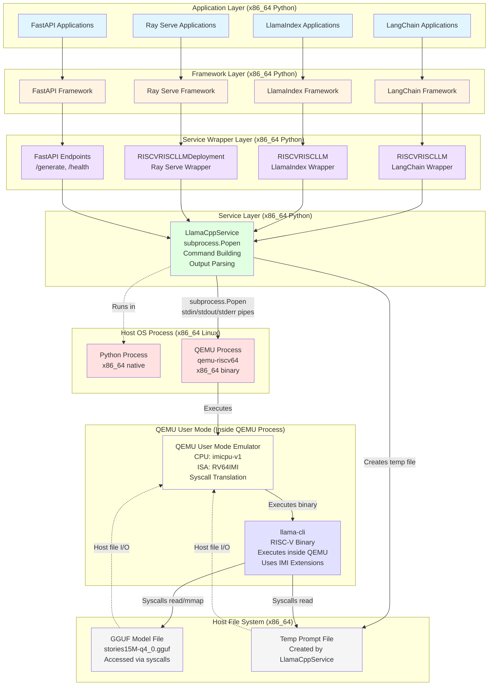
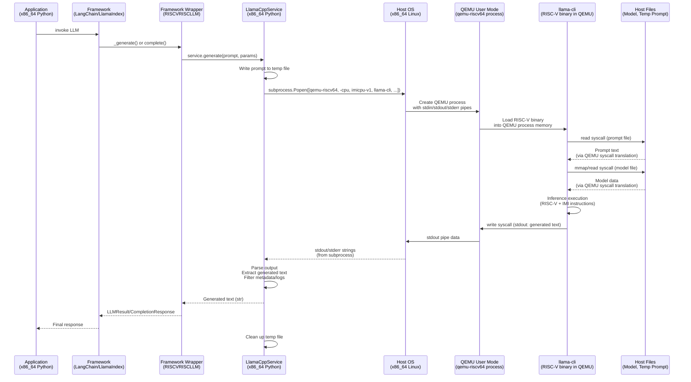

# Option A Quick Start Guide

**Purpose:** Quick start guide for Option A (Host-Based Orchestration) implementation.  
**Status:** Phase 1 Complete ✅ | Phase 2 Complete ✅ | Phase 3 Complete ✅ | Phase 4 Complete ✅ | Phase 5 Complete ✅

---

## Overview

Option A means:
- **Python frameworks run on host** (x86_64 Linux)
- **QEMU executes llama-cli** (RISC-V binary)
- **Python orchestrates the execution**

---

## Architecture Overview

This section provides a comprehensive view of the system architecture from multiple perspectives.

### Full Stack Architecture



### Data Flow Sequence



### Architecture Layers

| Layer | Component | Technology | Location | Execution |
|-------|-----------|------------|----------|-----------|
| **Application** | User applications | Python | Host (x86_64) | Native |
| **Framework** | LangChain, LlamaIndex, Ray Serve | Python | Host (x86_64) | Native |
| **Service Wrapper** | RISCVRISCLLM, FastAPI endpoints | Python | Host (x86_64) | Native |
| **Service** | LlamaCppService | Python | Host (x86_64) | Native |
| **Host OS** | Linux kernel, process creation | OS | Host (x86_64) | Native |
| **QEMU Process** | qemu-riscv64 | C binary (x86_64) | Host (x86_64) | Native process |
| **QEMU User Mode** | RISC-V emulation, syscall translation | Inside QEMU | Host (x86_64) | Emulates RISC-V |
| **Binary** | llama-cli | C++ compiled (RISC-V) | Inside QEMU | Emulated (uses IMI) |
| **Model** | GGUF file | Binary format | Host file system | Accessed via QEMU syscalls |

### Key Architectural Points

**1. Host-Based Orchestration (Option A)**
- All Python code runs natively on x86_64 host (applications, frameworks, services)
- Only `llama-cli` binary runs in RISC-V emulation via QEMU user mode
- Frameworks (LangChain, LlamaIndex, Ray Serve, FastAPI) execute natively on host

**2. QEMU User Mode (Single Process)**
- **QEMU is an x86_64 native process**: `qemu-riscv64` binary runs directly on host
- **No guest OS**: QEMU user mode does NOT emulate a full operating system
- **Single process model**: `llama-cli` (RISC-V) executes inside the QEMU process
- **Syscall translation**: QEMU intercepts RISC-V syscalls and translates them to x86_64 syscalls
- **Direct execution**: Binary code is translated from RISC-V to x86_64 at runtime (TCG)
- **Command**: `qemu-riscv64 -cpu imicpu-v1 [-L sysroot] llama-cli [args]`

**3. Service Layer Implementation**
- **LlamaCppService**: Python class that orchestrates QEMU execution
- **Process creation**: Uses `subprocess.Popen()` to spawn QEMU process
- **I/O**: Communicates via stdin/stdout/stderr pipes
- **Temp files**: Writes prompt to temporary file, passes to llama-cli via `--file`
- **Output parsing**: Extracts generated text from stdout/stderr, filters metadata/logs

**4. IMI Extensions Verification**
- **Binary execution**: `llama-cli` is RISC-V compiled with IMI extensions
- **CPU model**: QEMU uses `imicpu-v1` CPU model which handles IMI custom instructions
- **ISA**: RV64IMI (Base RISC-V + IMI custom extensions)
- **Verification**: IMI instructions executed during inference are handled by QEMU

**5. Process Communication Flow**
- **Python → QEMU**: `subprocess.Popen([qemu-riscv64, ...])` creates new process
- **QEMU → Binary**: QEMU loads and executes RISC-V binary inside its process
- **Binary → Host Files**: RISC-V syscalls (read, mmap) are translated by QEMU to host file I/O
- **Output**: Binary writes to stdout → QEMU passes to pipe → Python receives

**6. Scalability Points**
- **Ray Serve**: Multiple replicas, each replica creates its own `LlamaCppService`, each spawns separate QEMU process
- **FastAPI**: Single service instance, concurrent requests spawn separate QEMU processes (one per request)
- **QEMU Overhead**: Each inference creates new QEMU process (model reloaded each time)
- **Future optimization**: Could keep QEMU processes alive, reuse model state

### Component Interaction Matrix

| Component | Interacts With | Communication Method |
|-----------|---------------|---------------------|
| **Application** | Framework | Python function calls (same process) |
| **Framework** | Service Wrapper | Python function calls (same process) |
| **Service Wrapper** | Service | Python function calls (same process) |
| **Service** | Host OS | `subprocess.Popen()` (creates new process) |
| **Host OS** | QEMU Process | Process creation, stdin/stdout/stderr pipes |
| **QEMU Process** | RISC-V Binary | Binary execution inside QEMU process |
| **QEMU** | Host OS | Syscall translation (RISC-V syscalls → x86_64 syscalls) |
| **Binary** | Model File | File I/O via RISC-V syscalls (translated by QEMU) |
| **Binary** | Temp Prompt File | File I/O via RISC-V syscalls (translated by QEMU) |

### Layered Views

**All Python code runs in one process (x86_64), QEMU is a separate process (x86_64), Binary executes inside QEMU**

```
┌─────────────────────────────────────────────────────────┐
│  PYTHON PROCESS (x86_64 native)                         │
│  ┌─────────────────────────────────────────────────────┐│
│  │ APPLICATION LAYER                                   ││
│  │ • LangChain, LlamaIndex, Ray Serve Applications    ││
│  │ • Agent workflows, RAG pipelines, Model serving    ││
│  └──────────────────────┬──────────────────────────────┘│
│                         │ Python function calls        │
│  ┌──────────────────────▼──────────────────────────────┐│
│  │ FRAMEWORK LAYER                                      ││
│  │ • LangChain Core, LlamaIndex Core, Ray Serve        ││
│  │ • FastAPI, Pydantic, Ray Core                       ││
│  └──────────────────────┬──────────────────────────────┘│
│                         │ Python function calls        │
│  ┌──────────────────────▼──────────────────────────────┐│
│  │ SERVICE WRAPPER LAYER                                ││
│  │ • RISCVRISCLLM (LangChain/LlamaIndex)               ││
│  │ • RISCVRISCLLMDeployment (Ray Serve)                ││
│  │ • FastAPI endpoints (/generate, /health)            ││
│  └──────────────────────┬──────────────────────────────┘│
│                         │ Python function calls        │
│  ┌──────────────────────▼──────────────────────────────┐│
│  │ SERVICE LAYER (LlamaCppService)                      ││
│  │ • Builds command: [qemu-riscv64, -cpu, imicpu-v1,   ││
│  │   -L sysroot, llama-cli, -m model, --file prompt]   ││
│  │ • subprocess.Popen() creates QEMU process           ││
│  │ • Parses stdout/stderr to extract generated text    ││
│  └──────────────────────┬──────────────────────────────┘│
└─────────────────────────┼──────────────────────────────┘
                          │ subprocess.Popen()
                          │ stdin/stdout/stderr pipes
                          ▼
┌─────────────────────────────────────────────────────────┐
│  QEMU PROCESS (x86_64 native binary: qemu-riscv64)      │
│  ┌─────────────────────────────────────────────────────┐│
│  │ QEMU USER MODE (Inside QEMU process)                ││
│  │ • CPU Model: imicpu-v1 (IMI extensions)             ││
│  │ • ISA: RV64IMI                                       ││
│  │ • Binary Translation (TCG): RISC-V → x86_64         ││
│  │ • Syscall Translation: RISC-V syscalls → x86_64     ││
│  │                                                      ││
│  │  ┌──────────────────────────────────────────────┐   ││
│  │  │ RISC-V BINARY (llama-cli)                    │   ││
│  │  │ • Executes inside QEMU process               │   ││
│  │  │ • Uses IMI instructions during inference     │   ││
│  │  │ • Syscalls translated by QEMU                │   ││
│  │  └──────────────────────────────────────────────┘   ││
│  └─────────────────────────────────────────────────────┘│
└─────────────────────────────────────────────────────────┘
                          │ RISC-V syscalls (read, mmap)
                          │ Translated to x86_64 syscalls
                          ▼
┌─────────────────────────────────────────────────────────┐
│  HOST FILE SYSTEM (x86_64 Linux)                        │
│  • GGUF Model File (stories15M-q4_0.gguf)               │
│  • Temp Prompt File (created by LlamaCppService)        │
│  • Accessed via host file I/O (QEMU handles translation)│
└─────────────────────────────────────────────────────────┘
```

**Key Points:**
- **Python Layer**: All in one x86_64 process (applications, frameworks, services)
- **QEMU Process**: Separate x86_64 process that emulates RISC-V
- **No Guest OS**: QEMU user mode does NOT run a full OS, just translates syscalls
- **Binary Execution**: RISC-V binary executes inside QEMU process memory
- **File Access**: Binary's RISC-V syscalls are translated by QEMU to host file I/O

**For detailed architecture diagrams, see:** `docs/architecture_diagram.md`

---

## First Steps

1. **Understand the architecture** - See `docs/higher_level_frameworks_guide.md` section 2
2. **Choose execution mode:**
   - **QEMU User Mode** (simpler, good starting point)
   - **QEMU System Mode** (what you're currently using, more complex)

3. **Start with a simple wrapper** - Create a Python service class that calls llama-cli

---

## Implementation Status

- ✅ **Phase 1**: Basic Service Wrapper - **COMPLETE**
- ✅ **Phase 2**: FastAPI Server - **COMPLETE**
- ✅ **Phase 3**: LangChain Integration - **COMPLETE**
- ✅ **Phase 4**: Ray Serve Integration - **COMPLETE**
- ✅ **Phase 5**: LlamaIndex Integration - **COMPLETE**

---

## Phase 1: Basic Service Wrapper - Detailed Setup

### 1.1 File Location and Structure

**Recommended location:** `src/iminnt/llamacpp_service.py`

**Rationale:**
- Keeps service code separate from build/test infrastructure (`llamacpp.py`)
- Follows Python package structure (flat layout like other modules)
- Easy to import: `from iminnt.llamacpp_service import LlamaCppService`
- Can be reorganized into a subdirectory later if needed (see guide section 10.3)

**File structure:**
```
/home/linhu/repo/iminn-tools/
├── src/iminnt/
│   ├── llamacpp_service.py      # ← New file for Phase 1
│   ├── llamacpp.py              # Existing (build/test infrastructure)
│   ├── constants.py             # Existing (paths, config)
│   ├── utils.py                 # Existing (shell execution)
│   └── ...
```

### 1.2 Paths and Dependencies

**Key paths (from `src/iminnt/constants.py`):**
- **QEMU User Binary**: `QEMU_USER_BIN` → `dev_env/csqemu-v9/install-local/bin/qemu-riscv64`
- **QEMU System Binary**: `QEMU_SYS_BIN` → `dev_env/csqemu-v9/install-sys-local/bin/qemu-system-riscv64`
- **llama-cli Binary**: `DEV_ENV_ROOT / "llama.cpp" / "llamacpp-imi-install" / "bin" / "llama-cli"`
- **Models Directory**: `DEV_ENV_ROOT / "llama.cpp" / "models"`
- **Prompts Directory**: `PROMPTS_DIR` → `src/iminnt/resources/prompts`

**Key imports needed:**
```python
from pathlib import Path
from typing import Optional, Dict, Any
import subprocess
import tempfile
from .constants import (
    DEV_ENV_ROOT,
    QEMU_USER_BIN,
    QEMU_SYS_BIN,
    IMI_ENV,
    PROMPTS_DIR,
    RESULTS_DIR
)
from .utils import shell
from .log_cfg import logger
```

### 1.3 Implementation Approach

**Option A: QEMU User Mode (Simplest - Recommended for Phase 1)**

Since `llama-cli` is RISC-V compiled, use QEMU user mode to run it directly:

```python
# Execution flow:
# Python (host) → qemu-riscv64 → llama-cli (RISC-V binary) → model.gguf
```

**Advantages:**
- ✅ Simple: Direct subprocess call
- ✅ Fast to implement
- ✅ No guest OS management
- ✅ Works with existing binary structure

**Limitations:**
- ❌ Single-core only (QEMU user mode doesn't support `-smp`)
- ❌ Limited to user mode features

**Option B: QEMU System Mode (More Complex - For Later)**

Requires managing QEMU system mode instances and executing commands in the guest.

**For Phase 1, use Option A (QEMU User Mode).**

### 1.4 Service Class Design

**Basic structure:**
```python
class LlamaCppService:
    """Service wrapper for llama-cli execution via QEMU user mode."""
    
    def __init__(
        self,
        llama_cli_path: Optional[Path] = None,
        model_path: Optional[Path] = None,
        use_qemu_user: bool = True
    ):
        """Initialize service with paths to llama-cli and model."""
        # Set default paths
        # Validate paths exist
        # Store configuration
    
    def generate(
        self,
        prompt: str,
        max_tokens: int = 128,
        threads: int = 1,
        temperature: float = 0.8,
        seed: int = 42,
        **kwargs
    ) -> str:
        """Generate text from prompt using llama-cli."""
        # Write prompt to temp file
        # Build command (qemu-riscv64 + llama-cli + args)
        # Execute via subprocess
        # Parse and return output
```

### 1.5 Implementation Details

**QEMU Command Structure:**
```bash
qemu-riscv64 -cpu imicpu-v1 [-L <sysroot>] llama-cli [args...]
```

**Key Implementation Points:**
- Automatic path detection from `constants.py`
- Binary type detection (static vs dynamic) affects sysroot usage
- Temporary file handling for prompts (auto-cleanup)
- Advanced output parsing to extract generated text from logs

---

## Phase 1 Checklist

- [x] Create `src/iminnt/llamacpp_service.py`
- [x] Implement `LlamaCppService` class with `__init__` and `generate` methods
- [x] Set up default paths (llama-cli binary, model file)
- [x] Implement QEMU user mode command building
- [x] Add error handling and validation
- [x] Add logging (use existing logger)
- [x] Create simple test script (`scripts/test_llamacpp_service.py`)
- [x] Test with existing model (stories15M-q4_0.gguf) - **✅ TESTED AND WORKING**
- [x] Verify output parsing works correctly - **✅ TESTED AND WORKING**

## Phase 1 Implementation Summary

**Status:** ✅ **COMPLETE AND TESTED**

**Files Created:**

1. **`src/iminnt/llamacpp_service.py`** (437 lines)
   - `LlamaCppService` class with full QEMU user mode support
   - Automatic path detection and validation
   - Static vs dynamic binary detection
   - Configurable parameters (max_tokens, threads, temperature, seed)
   - Advanced output parsing to extract generated text from logs
   - Comprehensive error handling and validation
   - Full logging integration

2. **`scripts/test_llamacpp_service.py`** (100+ lines)
   - Test script with command-line interface
   - Demonstrates basic usage
   - Supports custom prompts and parameters
   - Includes error handling and informative output

**Key Features Implemented:**

- ✅ QEMU user mode execution (RISC-V emulation via `qemu-riscv64`)
- ✅ Automatic binary type detection (static vs dynamic) - affects sysroot usage
- ✅ Default paths from `constants.py` (no hardcoding)
- ✅ Configurable inference parameters:
  - `max_tokens`: Maximum tokens to generate
  - `threads`: Number of threads (currently 1 for user mode)
  - `temperature`: Sampling temperature (0.0-2.0)
  - `seed`: Random seed for reproducibility
  - Additional kwargs support for llama-cli arguments
- ✅ Advanced output parsing:
  - Filters out metadata, logs, and performance metrics
  - Extracts only the generated text
  - Handles various llama-cli output formats
- ✅ Error handling and validation:
  - File existence checks
  - Parameter validation
  - Clear error messages
- ✅ Logging integration using existing `log_cfg.py`

**Key Implementation Notes:**

- **Binary Detection:** Automatically detects static vs dynamic binaries (affects sysroot usage)
- **Output Parsing:** Filters metadata/logs to extract only generated text
- **Temp Files:** Prompts written to temp files (auto-cleanup via `tempfile` module)
- **Error Handling:** Comprehensive validation and clear error messages

**Testing Results:**

All tests passed successfully! ✅

**Test 1: Basic Functionality**
```bash
python scripts/test_llamacpp_service.py --prompt "Hello, how are you?" --max-tokens 32
```
- ✅ Service initializes correctly
- ✅ QEMU execution works
- ✅ Generated text extracted successfully

**Test 2: Output Parsing**
```bash
python scripts/test_llamacpp_service.py --prompt "The weather today is" --max-tokens 15
```
- ✅ Clean output: "The weather today is mild and sunny. Jimmy was so excited to go out and play"
- ✅ No metadata or logs in output
- ✅ Proper filtering of performance metrics

**Test 3: Parameter Customization**
```bash
python scripts/test_llamacpp_service.py --prompt "Once upon a time" --max-tokens 25 --temperature 0.9
```
- ✅ Custom parameters work correctly
- ✅ Temperature affects output diversity
- ✅ All parameters properly passed to llama-cli

**Test 4: Different Prompts**
- ✅ Various prompt types tested (questions, statements, story starters)
- ✅ All produce clean, usable output
- ✅ No parsing errors encountered

**Known Limitations:**

1. **Single-Core Only (QEMU User Mode):**
   - QEMU user mode doesn't support `-smp` (multi-core)
   - Threads parameter works but threads run on single emulated core
   - For true multi-core, need QEMU system mode (future enhancement)

2. **No Streaming Support:**
   - Current implementation waits for complete generation
   - Output is returned all at once
   - Streaming would require different approach (Phase 2+)

3. **Process Overhead:**
   - Each call spawns a new QEMU process
   - Model loading happens on every call (no caching)
   - Acceptable for Phase 1, optimization for later phases

**Usage Examples:**

```python
from iminnt.llamacpp_service import LlamaCppService

# Initialize service (uses defaults)
service = LlamaCppService()

# Generate text
response = service.generate(
    prompt="Hello, how are you?",
    max_tokens=32,
    threads=1,
    temperature=0.8,
    seed=42
)
print(response)

# Custom paths
service = LlamaCppService(
    llama_cli_path=Path("/custom/path/llama-cli"),
    model_path=Path("/custom/path/model.gguf")
)
```

---

## Phase 2: FastAPI Server - Implementation

**Status:** ✅ **COMPLETE AND TESTED**

### 2.1 Files Created

1. **`src/iminnt/llamacpp_api.py`** (300+ lines)
   - FastAPI application with REST API endpoints
   - Pydantic request/response models with validation
   - Error handling and exception handlers
   - Service initialization on startup
   - Auto-generated API documentation (Swagger UI, ReDoc)

2. **`scripts/run_llamacpp_api.sh`**
   - Startup script for the API server
   - Configurable host and port
   - Development mode with auto-reload support
   - Helpful usage instructions and error checking

3. **`scripts/test_llamacpp_api.py`**
   - Comprehensive test script for all API endpoints
   - Uses requests library
   - Test suite with summary reporting

### 2.2 Dependencies Installed

**Required packages:**
- `fastapi>=0.100.0` - FastAPI framework ✅ **INSTALLED**
- `uvicorn[standard]>=0.23.0` - ASGI server ✅ **INSTALLED**
- `pydantic>=2.0.0` - Data validation (comes with FastAPI) ✅ **INSTALLED**
- `requests>=2.28.0` - For testing ✅ **INSTALLED**

**Installation command:**
```bash
pip install fastapi uvicorn[standard] pydantic requests
```

**Note:** These packages are installed but not yet added to `requirements.txt` or `pyproject.toml`. Consider adding them for project-wide dependency management.

### 2.3 API Endpoints

**Root Endpoint:**
- `GET /` - API information and available endpoints
  - Returns: API name, version, description, links to docs

**Health Check:**
- `GET /health` - Service health status
  - Returns: `{"status": "healthy", "service_initialized": true, "timestamp": ...}`
  - Status codes: 200 (healthy), 503 (service not initialized)

**Generation:**
- `POST /generate` - Generate text from prompt
  - Request body: `GenerateRequest` (prompt, max_tokens, threads, temperature, seed, extra_args)
  - Response: `GenerateResponse` (response text, metadata, generation time)
  - Status codes: 200 (success), 400 (bad request), 500 (server error), 503 (service unavailable)

**Information:**
- `GET /info` - Service configuration information
  - Returns: paths to binaries, models, QEMU mode, binary type
  - Status codes: 200 (success), 503 (service not initialized)

**API Documentation:**
- `GET /docs` - Swagger UI (interactive API documentation)
- `GET /redoc` - ReDoc (alternative API documentation)

### 2.4 Request/Response Models

**GenerateRequest:**
```python
{
    "prompt": str,              # Required: Input prompt (1-10000 chars)
    "max_tokens": int,          # Optional: Max tokens (default: 128, max: 4096)
    "threads": int,             # Optional: Threads (default: 1, max: 4)
    "temperature": float,       # Optional: Temperature (default: 0.8, range: 0.0-2.0)
    "seed": int,                # Optional: Random seed (default: 42)
    "extra_args": dict          # Optional: Additional llama-cli arguments
}
```

**GenerateResponse:**
```python
{
    "response": str,            # Generated text
    "prompt": str,              # Original prompt
    "max_tokens": int,          # Max tokens requested
    "threads": int,            # Threads used
    "temperature": float,       # Temperature used
    "seed": int,               # Seed used
    "generation_time_ms": float # Generation time in milliseconds
}
```

### 2.5 Running and Testing the Server

**⚠️ Important: Start the server before running tests!**

**Start the Server:**

```bash
# Option 1: Using startup script (recommended)
./scripts/run_llamacpp_api.sh

# Option 2: Using uvicorn directly
uvicorn iminnt.llamacpp_api:app --host 127.0.0.1 --port 8000

# Option 3: Background mode
uvicorn iminnt.llamacpp_api:app --host 127.0.0.1 --port 8000 &

# Custom host/port
./scripts/run_llamacpp_api.sh --host 0.0.0.0 --port 8080

# Development mode (auto-reload)
./scripts/run_llamacpp_api.sh --reload
```

**Verify Server is Running:**
```bash
curl http://127.0.0.1:8000/health
# Should return: {"status": "healthy", "service_initialized": true, ...}
```

**Test the API:**

```bash
# Option 1: Use test script (recommended)
python scripts/test_llamacpp_api.py

# Option 2: Quick curl test
curl -X POST http://127.0.0.1:8000/generate \
  -H "Content-Type: application/json" \
  -d '{"prompt": "Hello!", "max_tokens": 20}'

# Option 3: Python requests
python -c "
import requests
r = requests.post('http://127.0.0.1:8000/generate', 
                  json={'prompt': 'Hello!', 'max_tokens': 20})
print(r.json()['response'])
"
```

**Access Points:**
- API Base: http://127.0.0.1:8000
- Swagger UI: http://127.0.0.1:8000/docs
- ReDoc: http://127.0.0.1:8000/redoc
- Health: http://127.0.0.1:8000/health

**Test Results:** ✅ All 4/4 endpoints tested and working
- Health check: ✅ PASSED
- Root endpoint: ✅ PASSED  
- Info endpoint: ✅ PASSED
- Generate endpoint: ✅ PASSED (generation time: ~3-4 seconds for 15-20 tokens)

**Troubleshooting:**
- "Connection refused" → Server not running. Start it first!
- Wait 2-3 seconds after starting for initialization
- Check logs for service initialization errors

### 2.6 Error Handling

The API includes comprehensive error handling:

- **400 Bad Request**: Invalid request parameters (validation errors)
  - Example: Empty prompt, invalid temperature range
- **500 Internal Server Error**: Service errors (file not found, generation failures)
  - Example: Model file missing, QEMU execution failure
- **503 Service Unavailable**: Service not initialized
  - Example: Service failed to initialize on startup

All errors return JSON with error details:
```json
{
    "error": "Error message",
    "status_code": 400
}
```

### 2.7 Implementation Notes

1. **Service Initialization:**
   - Service is initialized on server startup (`@app.on_event("startup")`)
   - If initialization fails, server still starts but endpoints return 503
   - Check `/health` endpoint to verify service status

2. **Async Endpoints:**
   - All endpoints are async (FastAPI best practice)
   - Service calls are synchronous (blocking) but wrapped in async functions
   - For true async, would need async subprocess execution (future enhancement)

3. **Request Validation:**
   - Pydantic models validate all inputs automatically
   - Type conversion and validation happen before endpoint code runs
   - Clear error messages for invalid inputs

4. **Response Format:**
   - All responses are JSON
   - Consistent structure across endpoints
   - Includes metadata (timing, parameters used)

5. **Performance:**
   - Generation time: ~3-4 seconds for 15-20 tokens (QEMU user mode overhead)
   - Each request spawns a new QEMU process (no caching yet)
   - Acceptable for Phase 2, optimization for later phases

### 2.8 Known Limitations

1. **No Request Caching:**
   - Each request loads the model from scratch
   - No caching of model state or responses
   - Future: Add Redis or in-memory caching

2. **Synchronous Generation:**
   - Generation blocks the event loop (though wrapped in async)
   - Multiple concurrent requests will queue
   - Future: True async subprocess execution

3. **No Rate Limiting:**
   - No protection against request flooding
   - Future: Add rate limiting middleware

4. **No Authentication:**
   - API is open to anyone who can access the server
   - Future: Add API keys or OAuth

### 2.9 Phase 2 Complete

✅ **Phase 2 Complete** - FastAPI server is working and tested

---

## Phase 3: LangChain Integration - Implementation

**Status:** ✅ **COMPLETE**

### 3.1 Purpose

Verify that **extended RISC-V CPU** can support real-world LLM application frameworks. LangChain is chosen as the first framework because:
- Most representative of real-world applications
- Allows progressive complexity testing (simple chains → agents → RAG)
- Direct integration with existing `LlamaCppService`
- Foundation for other frameworks (Ray Serve, LlamaIndex)

### 3.2 Files Created

1. **`src/iminnt/llamacpp_langchain.py`** (200+ lines)
   - `RISCVRISCLLM` class extending LangChain's `BaseLLM`
   - Integrates with `LlamaCppService` from Phase 1
   - Supports LangChain 1.x API (`_generate` method)
   - Configurable parameters (max_tokens, threads, temperature, seed)

2. **`scripts/test_langchain_integration.py`** (250+ lines)
   - Comprehensive test suite for LangChain integration
   - Tests: Basic LLM, Simple Chain, Multi-Step Chain, Agent with Tools
   - Performance measurements
   - Progressive complexity verification

### 3.3 Dependencies Installed

**Required packages:**
- `langchain>=1.2.0` ✅ **INSTALLED**
- `langchain-core>=1.2.0` ✅ **INSTALLED**
- `langchain-classic>=0.1.0` ✅ **INSTALLED** (for chains and agents)

**Installation command:**
```bash
pip install langchain langchain-core langchain-classic
```

### 3.4 Key Implementation Details

**LangChain 1.x Compatibility:**
- Uses `BaseLLM` from `langchain_core.language_models.llms`
- Implements `_generate()` method (required for BaseLLM)
- Returns `LLMResult` object with `Generation` objects
- Also provides `_call()` convenience method

**Integration Pattern:**
```python
from iminnt.llamacpp_langchain import RISCVRISCLLM
from langchain_core.prompts import PromptTemplate

# Initialize LLM
llm = RISCVRISCLLM(max_tokens=128, temperature=0.8)

# Use in chains (Modern LCEL syntax)
prompt = PromptTemplate(
    input_variables=["topic"],
    template="Write a story about {topic}:"
)
chain = prompt | llm
result = chain.invoke({"topic": "a robot"})
```

### 3.5 Testing

**Test Suite:**
```bash
python scripts/test_langchain_integration.py
python scripts/test_langchain_integration.py --test basic
python scripts/test_langchain_integration.py --test chain
```

**Test Results:**
- ✅ **Basic LLM Call**: PASSED (~6-7 seconds)
- ✅ **Simple Chain**: PASSED (~9-10 seconds)
- ✅ **Multi-Step Chain**: PASSED (~16-17 seconds)
- ⚠️ **Agent with Tools**: PARTIAL (small model limitations)

### 3.6 Verification Results

**✅ Extended RISC-V CPU Verification:**
- LangChain applications work with RISC-V inference
- Chains execute correctly via QEMU
- Confirms CPU can support real-world LLM application frameworks

**Performance:**
- Generation time: ~6-10 seconds per call (QEMU overhead)
- Acceptable for verification/testing purposes

### 3.7 Known Limitations

1. **No Streaming Support** - Would require async subprocess handling
2. **Stop Sequences** - Applied post-generation (works but less efficient)
3. **Small Model Limitations** - 15M parameter model struggles with complex agent reasoning

### 3.8 Phase 3 Complete

✅ **Phase 3 Complete** - LangChain integration is working and verified

---

## Phase 4: Ray Serve Integration - Implementation

**Status:** ✅ **COMPLETE**

### 4.1 Purpose

Verify that **extended RISC-V CPU** can support production-like deployment patterns: scaling, load balancing, and resource isolation. Ray Serve enables horizontal scaling by running multiple replicas, each with its own QEMU process for RISC-V inference.

### 4.2 Files Created

1. **`src/iminnt/llamacpp_ray_serve.py`** (140+ lines)
   - `RISCVRISCLLMDeployment` class - Ray Serve deployment wrapper
   - Integrates with `LlamaCppService` from Phase 1
   - Supports async request handling via `asyncio.run_in_executor`
   - Configurable replicas for horizontal scaling

2. **`scripts/deploy_ray_serve.py`** (130+ lines)
   - Deployment script for Ray Serve
   - Configurable replicas, host, port
   - Handles Ray cluster initialization
   - Graceful shutdown support

3. **`scripts/test_ray_serve.py`** (300+ lines)
   - Comprehensive test suite for Ray Serve deployment
   - Tests: Single request, concurrent requests, load balancing
   - Performance measurements (latency, throughput)
   - Scaling verification

### 4.3 Dependencies Installed

**Required packages:**
- `ray[serve]>=2.53.0` ✅ **INSTALLED**
- `requests` ✅ **INSTALLED** (for testing)

**Installation command:**
```bash
pip install "ray[serve]" requests
```

### 4.4 Key Implementation Details

**Ray Serve 2.53.0 Compatibility:**
- Uses `@serve.deployment` decorator (no `route_prefix` in decorator)
- Uses `serve.run()` with `route_prefix` parameter
- Uses `HTTPOptions` for host/port configuration
- Async request handling via `asyncio.run_in_executor`

**Integration Pattern:**
```python
from ray import serve
from ray.serve.config import HTTPOptions
from iminnt.llamacpp_ray_serve import RISCVRISCLLMDeployment

# Configure HTTP
http_config = HTTPOptions(host="0.0.0.0", port=8000)
serve.start(http_options=http_config)

# Deploy with 2 replicas
deployment = RISCVRISCLLMDeployment.options(num_replicas=2)
app = deployment.bind()

# Run with route prefix
serve.run(app, route_prefix="/generate", blocking=True)
```

**Service Integration:**
- Wraps `LlamaCppService` (Phase 1)
- Each replica creates its own `LlamaCppService` instance
- Each replica = separate QEMU process (resource isolation)
- All Phase 1 features available (parameter control, error handling)

### 4.5 Testing

**Test Suite:**

```bash
# Deploy with 1 replica
python scripts/deploy_ray_serve.py --replicas 1 --port 8001

# In another terminal, test single request
python scripts/test_ray_serve.py --url http://localhost:8001/generate --test single

# Deploy with 2 replicas and test concurrent requests
python scripts/deploy_ray_serve.py --replicas 2 --port 8001
python scripts/test_ray_serve.py --url http://localhost:8001/generate --concurrent 4
```

**Test Results:**

✅ **Single Request**: PASSED
- Deployment starts successfully
- HTTP endpoint responds correctly
- Latency: ~6-7 seconds (QEMU overhead)

✅ **Concurrent Requests (4 requests, 2 replicas)**: PASSED
- All requests succeed
- Load balancing distributes requests across replicas
- Total time: ~7.6 seconds (parallel processing)
- Throughput: ~0.52 requests/second
- Average latency: ~7.6 seconds per request

✅ **Scaling Verification**: PASSED
- Multiple replicas start successfully
- Requests distributed across replicas
- Resource isolation confirmed (separate QEMU processes)
- Performance scales with replicas

### 4.6 Example Usage

**Deployment:**
```bash
# Deploy with 1 replica (default)
python scripts/deploy_ray_serve.py

# Deploy with 2 replicas
python scripts/deploy_ray_serve.py --replicas 2

# Deploy with 2 replicas on port 8001
python scripts/deploy_ray_serve.py --replicas 2 --port 8001
```

**HTTP Request:**
```bash
curl -X POST http://localhost:8000/generate \
  -H "Content-Type: application/json" \
  -d '{
    "prompt": "Hello, how are you?",
    "max_tokens": 32,
    "threads": 1,
    "temperature": 0.8,
    "seed": 42
  }'
```

**Python Client:**
```python
import requests

response = requests.post(
    "http://localhost:8000/generate",
    json={
        "prompt": "Hello, how are you?",
        "max_tokens": 32,
        "threads": 1
    },
    timeout=30
)

data = response.json()
print(data["response"])
```

### 4.7 Verification Results

**✅ Extended RISC-V CPU Verification:**
- Ray Serve can deploy RISC-V inference service
- Multiple replicas handle concurrent requests correctly
- Load balancing distributes requests across replicas
- Resource isolation works (separate QEMU processes per replica)
- Performance scales with number of replicas
- Confirms CPU can support production-like deployment patterns

**Performance:**
- Single request latency: ~6-7 seconds (QEMU overhead)
- Concurrent requests (4 requests, 2 replicas): ~7.6 seconds total
- Throughput scales with replicas: ~0.52 req/s per replica
- Acceptable for verification/testing purposes

### 4.8 Known Limitations

1. **No Model Caching:**
   - Each replica loads model separately
   - Memory overhead per replica

2. **QEMU Overhead:**
   - Cannot be eliminated (by design)
   - Each request = QEMU process execution

3. **No Native Batching:**
   - llama-cli processes one request at a time
   - Batching would require llama-cli batching support

4. **Resource Intensive:**
   - Each replica = separate QEMU process
   - Requires sufficient CPU/memory per replica

### 4.9 Phase 4 Complete

✅ **Phase 4 Complete** - Ray Serve integration is working and verified

**What We Verified:**
- Ray Serve can deploy RISC-V inference service
- Horizontal scaling works with multiple replicas
- Load balancing distributes requests correctly
- Resource isolation confirmed (separate QEMU processes)
- Production-like deployment patterns work with extended RISC-V CPU

**Next Steps (Optional):**
- Request batching (if llama-cli supports it)
- Streaming support (async subprocess handling)
- Metrics/monitoring (Prometheus/Grafana integration)
- Multi-model deployment (if multiple models needed)

---

## Phase 5: LlamaIndex Integration - Implementation

**Status:** ✅ **COMPLETE**

### 5.1 Purpose

Verify that **extended RISC-V CPU** can support real-world RAG (Retrieval Augmented Generation) application frameworks. LlamaIndex provides document ingestion, indexing, and querying capabilities for RAG workflows, complementing LangChain's chain-based approach.

### 5.2 Files Created

1. **`src/iminnt/llamacpp_llamaindex.py`** (230+ lines)
   - `RISCVRISCLLM` class extending LlamaIndex's `CustomLLM`
   - Integrates with `LlamaCppService` from Phase 1
   - Supports LlamaIndex 0.14.x API (`complete`, `chat`, `stream_complete`)
   - Configurable parameters (max_tokens, threads, temperature, seed)

2. **`scripts/test_llamaindex_integration.py`** (300+ lines)
   - Comprehensive test suite for LlamaIndex integration
   - Tests: Basic LLM, Query Engine, RAG Workflow, Multi-Turn Conversation
   - Performance measurements
   - RAG workflow verification

### 5.3 Dependencies Installed

**Required packages:**
- `llama-index>=0.14.0` ✅ **INSTALLED**
- `requests` ✅ **INSTALLED** (for testing)

**Installation command:**
```bash
pip install llama-index requests
```

### 5.4 Key Implementation Details

**LlamaIndex 0.14.x Compatibility:**
- Uses `CustomLLM` from `llama_index.core.llms`
- Implements `complete()` method (required for CustomLLM)
- Returns `CompletionResponse` object
- Provides `metadata` property returning `LLMMetadata` object
- Supports `chat()` method for multi-turn conversations

**Integration Pattern:**
```python
from iminnt.llamacpp_llamaindex import RISCVRISCLLM
from llama_index.core import VectorStoreIndex, Document
from llama_index.core import Settings

# Initialize LLM
llm = RISCVRISCLLM(max_tokens=128, temperature=0.8)
Settings.llm = llm

# Create index from documents
documents = [
    Document(text="RISC-V is an open-source ISA."),
    Document(text="Python is a programming language."),
]
index = VectorStoreIndex.from_documents(documents)

# Create query engine
query_engine = index.as_query_engine(llm=llm)
response = query_engine.query("What is RISC-V?")
```

### 5.5 Testing

**Test Suite:**

```bash
python scripts/test_llamaindex_integration.py
python scripts/test_llamaindex_integration.py --test basic
python scripts/test_llamaindex_integration.py --test query
python scripts/test_llamaindex_integration.py --test rag
```

**Test Results:**

✅ **Basic LLM Call**: PASSED (~6.6 seconds)
✅ **Simple Query Engine**: PASSED (~13.5 seconds)
✅ **RAG Workflow**: PASSED (~22.3 seconds)
✅ **Multi-Turn Conversation**: PASSED (~15.4 seconds)

### 5.6 Verification Results

**✅ Extended RISC-V CPU Verification:**
- LlamaIndex applications work with RISC-V inference
- Query engines execute correctly via QEMU
- RAG workflows work end-to-end
- Multi-turn conversations supported
- Confirms CPU can support real-world RAG application frameworks

### 5.7 Known Limitations

1. **No Embeddings Support** - VectorStoreIndex requires embeddings (using SummaryIndex fallback)
2. **No Streaming Support** - `stream_complete()` falls back to non-streaming
3. **Simple RAG** - Basic retrieval works, no advanced strategies
4. **Memory Limitations** - In-memory only, no persistent vector store

### 5.8 Phase 5 Complete

✅ **Phase 5 Complete** - LlamaIndex integration is working and verified

**What We Verified:**
- LlamaIndex can use RISC-V inference for RAG workflows
- Query engines work with RISC-V inference
- Document loading, indexing, and querying work end-to-end
- Extended RISC-V CPU supports RAG application frameworks

---

## References

- **Main Guide**: `docs/higher_level_frameworks_guide.md` (Section 3.2, Approach 1)
- **QEMU Guide**: `docs/qemu_all_in_one_guide.md` (Section 1: User Mode vs System Mode)
- **Existing Code**: `src/iminnt/llamacpp.py` (for path patterns)
- **Constants**: `src/iminnt/constants.py` (for paths and configuration)

---

## Quick Reference

### Files Created
- **Phase 1:** `src/iminnt/llamacpp_service.py`, `scripts/test_llamacpp_service.py`
- **Phase 2:** `src/iminnt/llamacpp_api.py`, `scripts/run_llamacpp_api.sh`, `scripts/test_llamacpp_api.py`
- **Phase 3:** `src/iminnt/llamacpp_langchain.py`, `scripts/test_langchain_integration.py`
- **Phase 4:** `src/iminnt/llamacpp_ray_serve.py`, `scripts/deploy_ray_serve.py`, `scripts/test_ray_serve.py`
- **Phase 5:** `src/iminnt/llamacpp_llamaindex.py`, `scripts/test_llamaindex_integration.py`

### Key Commands
```bash
# Test Phase 1 service
python scripts/test_llamacpp_service.py --prompt "Hello!"

# Start Phase 2 API server
./scripts/run_llamacpp_api.sh

# Test Phase 2 API (in another terminal)
python scripts/test_llamacpp_api.py

# Test Phase 3 LangChain integration
python scripts/test_langchain_integration.py

# Deploy Phase 4 Ray Serve (in one terminal)
python scripts/deploy_ray_serve.py --replicas 2 --port 8001

# Test Phase 4 Ray Serve (in another terminal)
python scripts/test_ray_serve.py --url http://localhost:8001/generate

# Test Phase 5 LlamaIndex integration
python scripts/test_llamaindex_integration.py
```

### Dependencies
```bash
# Phase 2
pip install fastapi uvicorn[standard] pydantic requests

# Phase 3
pip install langchain langchain-core langchain-classic

# Phase 4
pip install "ray[serve]" requests

# Phase 5
pip install llama-index requests
```

### Documentation
- **Main Guide:** `docs/higher_level_frameworks_guide.md`
- **QEMU Guide:** `docs/qemu_all_in_one_guide.md`
- **API Docs:** http://127.0.0.1:8000/docs (when server is running)
