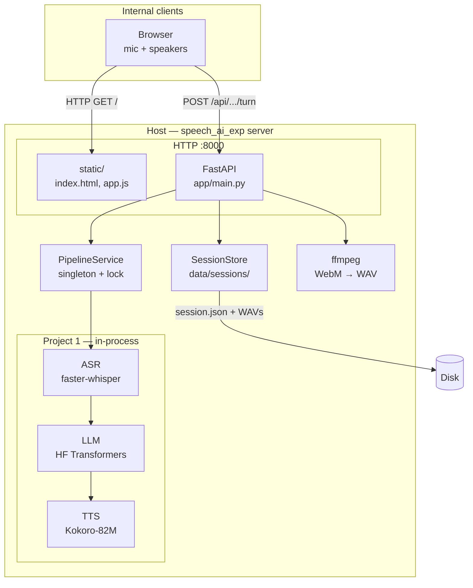
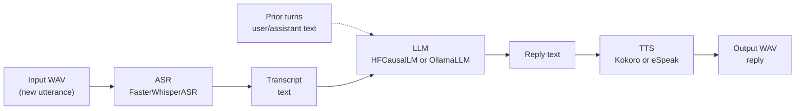
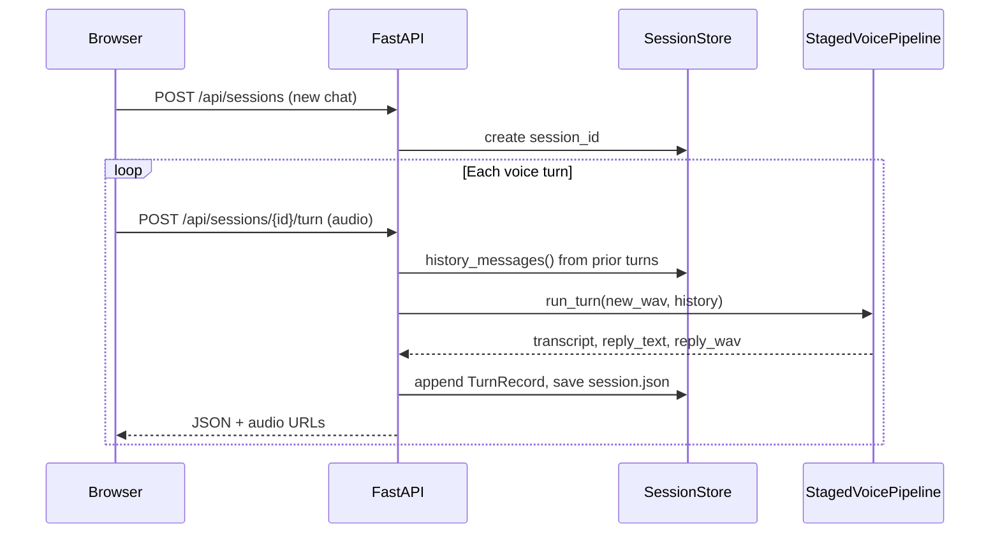

# Voice chat server & Project 1 architecture

Architecture reference for the **FastAPI voice chatbot** (`server/`) and the **staged pipeline** in **Project 1** (`project/`). This document is the main technical overview for operators and developers.

**Last updated:** June 2026

---

## 1. What this system is

### Staged voice assistant (Project 1)

Project 1 implements a **Lego / staged** voice assistant:

```
User speech (WAV) → ASR → text → LLM → reply text → TTS → reply speech (WAV)
```

Each stage is a **separate component** with explicit text between steps. That is different from **true voice-to-voice** (Project 2), where one model maps audio → audio without separate ASR/LLM/TTS in the hot path.

| Term | Meaning in this repo |
|------|----------------------|
| **Staged pipeline** | Project 1: ASR → LLM → TTS |
| **Voice chatbot (server)** | Web UI + REST API wrapping Project 1 with **multi-turn** sessions |
| **Voice-to-voice (omni)** | Project 2 only (`project2/`) — not used by this server |

The server delivers **turn-based voice conversation**: the user records one utterance per turn; the assistant replies with synthesized speech. Prior turns are passed to the LLM as **text history** (not as re-transcribed audio).

---

## 2. Repository context

```
speech_ai_exp/
├── project/          # Project 1 — staged-voice package (ASR → LLM → TTS)
├── server/           # FastAPI chatbot (uses Project 1 only)
├── project2/         # Project 2 — omni voice-to-voice (separate; not in server)
├── compare/          # JSON profile comparison (no runtime coupling)
└── docs/             # Architecture, research, plans
```

| Path | Role |
|------|------|
| [`project/`](../project/) | Core pipeline library (`staged-voice`), CLI, demos, YAML configs |
| [`server/`](../server/) | Browser chat, sessions, HTTP API |
| [`project2/`](../project2/) | Mini-Omni / Moshi experiments (benchmark sibling) |

**Design rule:** Do not merge Project 2 into the chat server. P1 remains the reference staged stack for MVP and benchmarking.

---

## 3. System architecture (deployment view)

How the MVP runs on a single host (e.g. `imu-thor` at `172.16.1.103`).



### Network access

| Audience | URL (example) |
|----------|----------------|
| Same machine | http://127.0.0.1:8000/ |
| LAN / VPN | http://172.16.1.103:8000/ |
| Health | http://172.16.1.103:8000/health |

### Runtime characteristics

| Property | Behavior |
|----------|----------|
| **Inference location** | All models run **on the host** (local); first run may download weights from Hugging Face |
| **Concurrency** | **One pipeline turn at a time** (global lock in `PipelineService`) |
| **Startup** | Models loaded once in FastAPI `lifespan` (1–3+ minutes cold start) |
| **Persistence** | Sessions on disk under `server/data/sessions/{id}/` |
| **Auth** | None in v1 (trusted internal LAN MVP) |

### System dependencies

| Tool | Purpose |
|------|---------|
| Python 3.10+ venv | `project/.venv` — staged-voice + server |
| `espeak-ng` | Kokoro phonemization; eSpeak TTS if configured |
| `ffmpeg` | Browser WebM → mono WAV for ASR |

### Optional process management

| Method | Use |
|--------|-----|
| `tmux new -s voice_ai_server` | Manual long-running `uvicorn` |
| `server/deploy/speech-chat.service` | systemd start/stop (`chatctl`) |

---

## 4. Project 1 architecture (staged pipeline)

### Package: `staged-voice`

| Item | Location |
|------|----------|
| Package root | [`project/src/staged_voice/`](../project/src/staged_voice/) |
| CLI | `staged-voice-run` → [`cli.py`](../project/src/staged_voice/cli.py) |
| Orchestrator | [`pipeline.py`](../project/src/staged_voice/pipeline.py) — `StagedVoicePipeline.run_turn()` |
| Config | [`config.py`](../project/src/staged_voice/config.py) + YAML overlay |

### Stage diagram



### Backends (pluggable per stage)

| Stage | Backend ID | Implementation | Default (chatbot YAML) |
|-------|--------------|----------------|-------------------------|
| **ASR** | `faster_whisper` | [`asr_faster_whisper.py`](../project/src/staged_voice/backends/asr_faster_whisper.py) | `small`, CPU, `int8` |
| **LLM** | `hf` | [`llm_hf_causal.py`](../project/src/staged_voice/backends/llm_hf_causal.py) | [Qwen/Qwen2.5-1.5B-Instruct](https://huggingface.co/Qwen/Qwen2.5-1.5B-Instruct) |
| **LLM** | `ollama` | [`llm_ollama.py`](../project/src/staged_voice/backends/llm_ollama.py) | Optional (separate Ollama daemon) |
| **TTS** | `kokoro` | [`tts_kokoro.py`](../project/src/staged_voice/backends/tts_kokoro.py) | [hexgrad/Kokoro-82M](https://huggingface.co/hexgrad/Kokoro-82M), voice `af_heart` |
| **TTS** | `espeak` | [`tts_espeak.py`](../project/src/staged_voice/backends/tts_espeak.py) | Fast baseline (not default for server) |

Factory: [`tts_factory.py`](../project/src/staged_voice/backends/tts_factory.py) selects TTS from `RunConfig`.

### One turn inside `run_turn()`

1. **ASR** — transcribe **only** the new user WAV.
2. **LLM** — build messages: `system_prompt` + `history` (prior user/assistant **text**) + new user message (this transcript). Stream tokens via `iter_chat_messages()`.
3. **TTS** — synthesize full reply text to `out_wav_path`.
4. **Profile** — return `StageProfile` (timings, transcript, reply text, paths).

Multi-turn memory for the LLM is **text-only** from earlier turns; old user audio is not re-fed to ASR.

### Default chatbot preset

[`project/configs/demo_staged_kokoro.yaml`](../project/configs/demo_staged_kokoro.yaml):

```yaml
asr:
  model_size: small
  device: cpu
  compute_type: int8
llm:
  backend: hf
  hf_model: Qwen/Qwen2.5-1.5B-Instruct
tts:
  backend: kokoro
  kokoro_voice: af_heart
```

Override via environment variable `STAGED_CONFIG`.

**The chatbot does not use Ollama by default** — it uses `llm.backend: hf` (see below). Ollama is an optional swap via YAML.

### LLM backend: Hugging Face (default) vs Ollama (optional)

Project 1 supports two LLM backends. The server uses the same `PipelineService` wiring for both; only the YAML `llm.backend` field changes.

| | **`hf` (default)** | **`ollama` (optional)** |
|---|-------------------|-------------------------|
| **Used by MVP chatbot?** | **Yes** — `demo_staged_kokoro.yaml` | No, unless you point `STAGED_CONFIG` at an Ollama preset |
| **How it runs** | [Qwen/Qwen2.5-1.5B-Instruct](https://huggingface.co/Qwen/Qwen2.5-1.5B-Instruct) loaded **inside** the uvicorn process (`HFCausalLM`) | HTTP streaming chat to a **separate** [Ollama](https://ollama.com/) daemon |
| **Implementation** | [`llm_hf_causal.py`](../project/src/staged_voice/backends/llm_hf_causal.py) | [`llm_ollama.py`](../project/src/staged_voice/backends/llm_ollama.py) |
| **Multi-turn** | Same: `system_prompt` + prior user/assistant text + new transcript | Same message list via Ollama `/api/chat` |
| **Typical pros** | Self-contained server process; no extra service | Easier model swaps (`ollama pull`); can offload GPU RAM from the FastAPI process |
| **Typical cons** | HF weights loaded with ASR/TTS in one Python process | Requires Ollama installed, running, and reachable at `ollama_host` |

```mermaid
flowchart TB
  subgraph default["Default — llm.backend: hf"]
    uv1["uvicorn process"]
    uv1 --> qwen["Qwen2.5-1.5B\nTransformers in-process"]
  end

  subgraph ollama_opt["Optional — llm.backend: ollama"]
    uv2["uvicorn process"]
    daemon["Ollama daemon\n:11434"]
    uv2 -->|"HTTP POST /api/chat"| daemon
    daemon --> model["e.g. llama3.2,\nqwen2.5, mistral…"]
  end
```

#### Confirm which backend is active

```bash
curl -s http://127.0.0.1:8000/health | python3 -m json.tool
```

- Open the `config` path and check `llm.backend`.
- On startup, logs show: `Pipeline ready (llm=hf, …)` or `Pipeline ready (llm=ollama, …)`.

#### Switch the chat server to Ollama

1. **Install and start Ollama** on the same host (or a machine reachable from the server).

   ```bash
   # Example: pull a model once
   ollama pull llama3.2
   ollama serve   # often already running as a system service
   ```

2. **Use an Ollama YAML preset** — start from [`project/configs/example_ollama.yaml`](../project/configs/example_ollama.yaml) or the chatbot-oriented preset below (Kokoro TTS + Ollama LLM).

3. **Point the server at that file and restart:**

   ```bash
   export STAGED_CONFIG=/home/linhu/projects/speech_ai_exp/project/configs/demo_staged_ollama_kokoro.yaml
   uvicorn app.main:app --host 0.0.0.0 --port 8000
   ```

   ASR and TTS stages are unchanged; only the LLM stage talks to Ollama.

**Example Ollama + Kokoro preset** ([`demo_staged_ollama_kokoro.yaml`](../project/configs/demo_staged_ollama_kokoro.yaml)):

```yaml
asr:
  model_size: small
  device: cpu
  compute_type: int8

llm:
  backend: ollama
  ollama_host: http://127.0.0.1:11434
  ollama_model: llama3.2          # must match a model you pulled in Ollama
  max_tokens: 256
  temperature: 0.3
  system_prompt: "You are a concise voice assistant in a multi-turn conversation. Answer in one or two short sentences suitable for text-to-speech."

tts:
  backend: kokoro
  kokoro_lang_code: a
  kokoro_voice: af_heart
  kokoro_speed: 1.0
```

| YAML key (Ollama) | Meaning |
|-------------------|---------|
| `ollama_host` | Base URL of the Ollama API (default in code: `http://127.0.0.1:11434`) |
| `ollama_model` | Model name as shown by `ollama list` |
| `max_tokens` | Cap on generated tokens (`num_predict` in Ollama options) |

**CLI without the server** (same Ollama backend):

```bash
staged-voice-run --audio path/to.wav --config configs/example_ollama.yaml \
  --llm-backend ollama --ollama-model llama3.2
```

### Where models execute

| Component | Execution |
|-----------|-----------|
| Whisper (ASR) | In-process (CTranslate2 / faster-whisper) |
| **LLM (`hf`)** | In-process — Hugging Face `AutoModelForCausalLM` (default Qwen2.5-1.5B-Instruct) |
| **LLM (`ollama`)** | **Out-of-process** — Ollama HTTP API on `ollama_host`; not loaded inside uvicorn |
| Kokoro (TTS) | In-process (`kokoro` + PyTorch); uses `espeak-ng` for phonemes |

No cloud inference API is required for the default stack. Ollama is still **local** on your network when `ollama_host` points to your machine or LAN.

### Other Project 1 entry points (no web UI)

| Tool | Port | Purpose |
|------|------|---------|
| `demo_staged_pipeline.py --serve` | 8765 | One-shot 3-stage demo |
| `run_demo_inputs_batch.py` + gallery | 8767 | Batch clip verification |
| `staged-voice-run` | — | CLI / JSON profiles |

---

## 5. Server architecture (FastAPI chatbot)

### Layout

```
server/
├── app/
│   ├── main.py              # Routes, lifespan, static mount
│   ├── config.py            # ServerConfig, STAGED_CONFIG
│   ├── pipeline_service.py  # Load pipeline once; inference lock
│   ├── session_store.py     # Sessions in memory + JSON on disk
│   └── audio_util.py        # WebM → WAV (ffmpeg)
├── static/
│   ├── index.html, app.js, styles.css
│   └── assets/imachines-logo.png
├── data/sessions/             # Per-session WAVs + session.json
├── deploy/                    # systemd unit, chatctl
└── pyproject.toml
```

### Component responsibilities

| Component | Responsibility |
|-----------|----------------|
| **`main.py`** | HTTP API, multipart upload, mounts UI at `/` |
| **`PipelineService`** | Builds `StagedVoicePipeline` at startup; `run_turn(wav, history, out_wav)` under a lock |
| **`SessionStore`** | CRUD sessions; `history_messages()` for LLM context |
| **`audio_util`** | Normalize browser audio to mono WAV for Whisper |
| **Browser (`static/`)** | Record WebM, POST turn, show transcripts + audio players |

### Multi-turn conversation model



**Session disk layout:**

```
data/sessions/{session_id}/
  session.json
  turn_001_user.wav
  turn_001_reply.wav
  turn_002_user.wav
  ...
```

### HTTP API

| Method | Path | Description |
|--------|------|-------------|
| `GET` | `/` | Chat UI (static) |
| `GET` | `/health` | `pipeline_ready`, config path |
| `GET` | `/api/sessions` | List sessions (newest first) |
| `POST` | `/api/sessions` | Create session |
| `GET` | `/api/sessions/{id}` | Full turn history |
| `DELETE` | `/api/sessions/{id}` | Delete session |
| `POST` | `/api/sessions/{id}/turn` | Multipart field **`audio`** → run pipeline |
| `GET` | `/api/sessions/{id}/audio/{filename}` | Play stored WAV |

Turn response includes: `transcript`, `reply_text`, `reply_audio_url`, `timings`, `context_messages`, `turn_count`.

### Configuration (server)

| Variable | Default |
|----------|---------|
| `STAGED_CONFIG` | `project/configs/demo_staged_kokoro.yaml` (HF LLM) |
| | Alternative: `project/configs/demo_staged_ollama_kokoro.yaml` (Ollama LLM) |
| `SESSIONS_DIR` | `server/data/sessions` |
| `CHAT_HOST` / `CHAT_PORT` | `0.0.0.0` / `8000` |

---

## 6. End-to-end data flow (one voice turn)

```
Browser mic (WebM)
    → POST /api/sessions/{id}/turn
    → ffmpeg → turn_NNN_user.wav
    → Faster-Whisper → transcript
    → LLM (+ prior session text) → reply_text
       (default: HF Qwen2.5-1.5B in-process; optional: Ollama via HTTP)
    → Kokoro-82M → turn_NNN_reply.wav
    → JSON response + GET audio URLs
    → Browser displays text + plays reply (auto-play when allowed)
```

**Latency (typical on edge CPU):** tens of seconds per turn (ASR + LLM + TTS sequential). Second concurrent user waits on the global lock.

---

## 7. Project 1 vs Project 2 (scope boundary)

| | Project 1 + server | Project 2 |
|---|-------------------|-----------|
| Architecture | Staged ASR → LLM → TTS | Omni audio → audio |
| Web MVP | **Yes** (`server/`) | Separate demo (port 8766) |
| Interpretability | Per-stage text + timings | End-to-end; optional sidecar ASR for demos |
| Use in compare | `profiles/*.json` | `profiles/*.json` |

See [`PROJECT2_SEMANTIC_RELEVANCE.md`](PROJECT2_SEMANTIC_RELEVANCE.md) and [`PLAN_PROJECT2_VOICE_TO_VOICE.md`](PLAN_PROJECT2_VOICE_TO_VOICE.md).

---

## 8. Operations quick reference

### Install

```bash
cd /home/linhu/projects/speech_ai_exp/project
source .venv/bin/activate
pip install -e ".[asr-whisper,llm-hf,tts-kokoro,experiment]"
cd ../server && pip install -e .
sudo apt install -y espeak-ng ffmpeg
```

### Run

```bash
cd /home/linhu/projects/speech_ai_exp/server
source ../project/.venv/bin/activate
export STAGED_CONFIG=/home/linhu/projects/speech_ai_exp/project/configs/demo_staged_kokoro.yaml
uvicorn app.main:app --host 0.0.0.0 --port 8000
```

### Verify

```bash
curl -s http://127.0.0.1:8000/health
# expect: "pipeline_ready": true
```

### Admin (systemd, if installed)

```bash
server/deploy/chatctl start|stop|status|health
```

**Important:** Only one process may listen on port **8000** (manual `uvicorn` *or* `speech-chat.service`, not both).

---

## 9. Limitations (v1)

| Area | v1 behavior |
|------|-------------|
| Turn mode | Turn-based HTTP (no streaming ASR, no duplex WebSocket) |
| Auth / HTTPS | Not included — internal LAN MVP |
| History cap | No token budget trim yet — long chats grow LLM prompt |
| Identity | Sessions are browser `localStorage` ids, not per-user accounts |
| Throughput | Single inference lock — queue under load |

---

## 10. Related documents

| Document | Topic |
|----------|--------|
| [`RESEARCH_KOKORO_82M.md`](RESEARCH_KOKORO_82M.md) | Kokoro TTS integration |
| [`project/configs/example_ollama.yaml`](../project/configs/example_ollama.yaml) | Minimal Ollama + eSpeak CLI preset |
| [`project/configs/demo_staged_ollama_kokoro.yaml`](../project/configs/demo_staged_ollama_kokoro.yaml) | Ollama LLM + Kokoro for the chat server |
| [`PLAN_PROJECT2_VOICE_TO_VOICE.md`](PLAN_PROJECT2_VOICE_TO_VOICE.md) | Omni / Project 2 plan |
| [`PROJECT2_SEMANTIC_RELEVANCE.md`](PROJECT2_SEMANTIC_RELEVANCE.md) | When to use P1 vs P2 |
| [`server/README.md`](../server/README.md) | Operator quick start (if present) |
| [`project/README.md`](../project/README.md) | CLI, demos, batch inputs |

---

## 11. Glossary

| Term | Definition |
|------|------------|
| **Turn** | One user recording → one assistant reply |
| **Session** | Ordered list of turns + stored WAVs |
| **History** | Prior user/assistant **text** passed to the LLM |
| **Stage profile** | JSON timings and metadata from `run_turn()` |
| **Staged** | Explicit ASR, LLM, and TTS steps (Project 1) |
| **Ollama backend** | LLM stage calls a local Ollama daemon instead of in-process Hugging Face |
