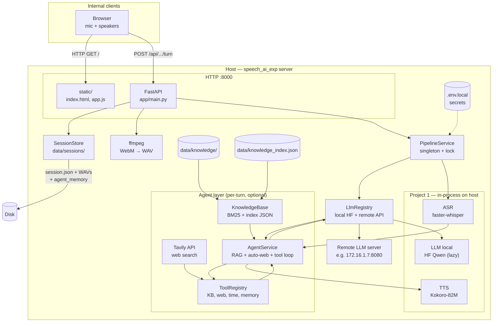
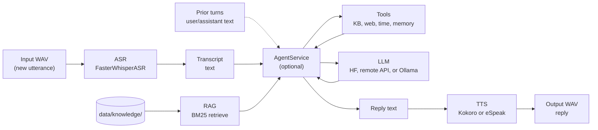
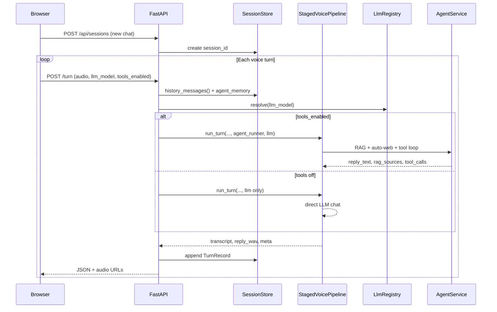
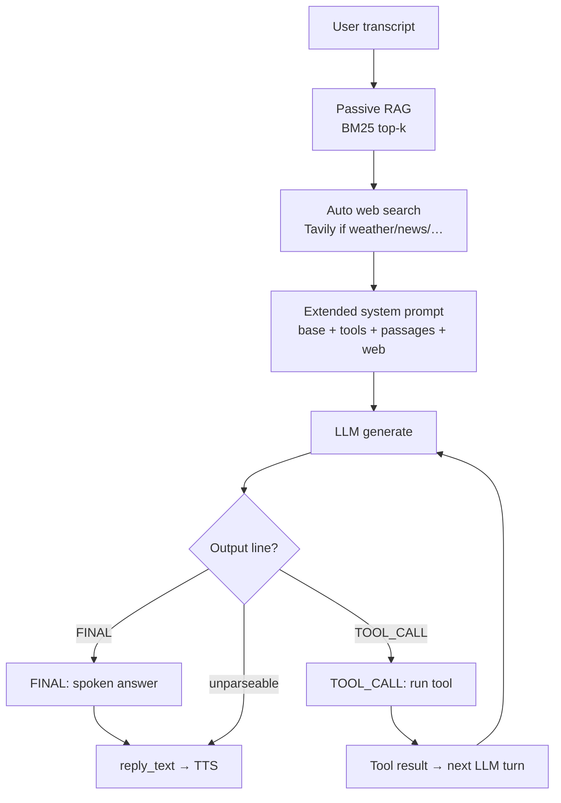

# Voice chat server & Project 1 architecture

Architecture reference for the **FastAPI voice chatbot** (`server/`) and the **staged pipeline** in **Project 1** (`project/`). This document is the main technical overview for operators and developers.

**Last updated:** June 2026

---

## 1. What this system is

### Staged voice assistant (Project 1)

Project 1 implements a **Lego / staged** voice assistant:

```
User speech (WAV) → ASR → text → [Agent: RAG + tools + LLM] → reply text → TTS → reply speech (WAV)
```

When the **agent layer** is enabled (default chatbot preset), the LLM step is wrapped by `AgentService`: it retrieves knowledge passages, may call tools, then produces a short spoken answer. With agent disabled, the pipeline is plain ASR → LLM → TTS.

Each stage is a **separate component** with explicit text between steps. That is different from **true voice-to-voice** (Project 2), where one model maps audio → audio without separate ASR/LLM/TTS in the hot path.

| Term | Meaning in this repo |
|------|----------------------|
| **Staged pipeline** | Project 1: ASR → LLM → TTS |
| **Voice chatbot (server)** | Web UI + REST API wrapping Project 1 with **multi-turn** sessions |
| **Agent layer** | Optional RAG + tool loop between transcript and TTS (no LangChain); can be bypassed per turn via UI |
| **RAG** | BM25 keyword retrieval over local knowledge files in `server/data/knowledge/` |
| **Web search** | Optional Tavily API for public/live information (`search_web` tool) |
| **Runtime LLM** | UI-selectable local HF (imu-thor) or remote HTTP LLM — no server restart |
| **Voice-to-voice (omni)** | Project 2 only (`project2/`) — not used by this server |

The server delivers **turn-based voice conversation**: the user records one utterance per turn; the assistant replies with synthesized speech. Prior turns are passed to the LLM as **text history** (not as re-transcribed audio).

---

## 2. Repository context

```
speech_ai_exp/
├── project/          # Project 1 — staged-voice package (ASR → LLM → TTS)
├── server/           # FastAPI chatbot (uses Project 1 only)
├── project2/         # Project 2 — omni voice-to-voice (separate; not in server)
├── compare/          # JSON profile comparison (no runtime coupling)
└── docs/             # Architecture, research, plans
```

| Path | Role |
|------|------|
| [`project/`](../project/) | Core pipeline library (`staged-voice`), CLI, demos, YAML configs |
| [`server/`](../server/) | Browser chat, sessions, HTTP API |
| [`project2/`](../project2/) | Mini-Omni / Moshi experiments (benchmark sibling) |

**Design rule:** Do not merge Project 2 into the chat server. P1 remains the reference staged stack for MVP and benchmarking.

---

## 3. System architecture (deployment view)

How the MVP runs on a single host (e.g. `imu-thor` at `172.16.1.103`).



### Network access

| Audience | URL (example) |
|----------|----------------|
| Same machine | http://127.0.0.1:8000/ |
| LAN / VPN | http://172.16.1.103:8000/ |
| Laptop via SSH tunnel | `ssh -N -L 18080:127.0.0.1:8000 user@172.16.1.103` → http://127.0.0.1:18080/ |
| Health | http://172.16.1.103:8000/health |

### Runtime characteristics

| Property | Behavior |
|----------|----------|
| **Inference location** | ASR + TTS on host; LLM **local (HF)** or **remote (HTTP)** per UI/API selection |
| **Concurrency** | **One pipeline turn at a time** (global lock in `PipelineService`) |
| **Startup** | ASR + TTS + remote LLM client at load (~10 s); local HF **lazy-loaded** on first local turn |
| **Persistence** | Sessions on disk under `server/data/sessions/{id}/`; knowledge index at `server/data/knowledge_index.json` |
| **Secrets** | `server/.env.local` (git-ignored) — Tavily key, optional overrides; auto-loaded at startup |
| **Auth** | None in v1 (trusted internal LAN MVP) |
| **Default preset** | [`demo_staged_kokoro_agent_dual.yaml`](../project/configs/demo_staged_kokoro_agent_dual.yaml) — dual LLM + agent + tools |

### System dependencies

| Tool | Purpose |
|------|---------|
| Python 3.10+ venv | `project/.venv` — staged-voice + server |
| `espeak-ng` | Kokoro phonemization; eSpeak TTS if configured |
| `ffmpeg` | Browser WebM → mono WAV for ASR |

### Optional process management

| Method | Use |
|--------|-----|
| `tmux new -s voice_ai_server` | Manual long-running `uvicorn` |
| `server/deploy/speech-chat.service` | systemd start/stop (`chatctl`) |

---

## 4. Project 1 architecture (staged pipeline)

### Package: `staged-voice`

| Item | Location |
|------|----------|
| Package root | [`project/src/staged_voice/`](../project/src/staged_voice/) |
| CLI | `staged-voice-run` → [`cli.py`](../project/src/staged_voice/cli.py) |
| Orchestrator | [`pipeline.py`](../project/src/staged_voice/pipeline.py) — `StagedVoicePipeline.run_turn()` |
| Config | [`config.py`](../project/src/staged_voice/config.py) + YAML overlay |

### Stage diagram



When `agent_runner` is **not** wired, or **`tools_enabled=false`** for that turn, the path is `txt → llm → reply` directly — no RAG, tools, or web search.

### LLM backends (pluggable per stage)

| Stage | Backend ID | Implementation | Default (chatbot YAML) |
|-------|--------------|----------------|-------------------------|
| **ASR** | `faster_whisper` | [`asr_faster_whisper.py`](../project/src/staged_voice/backends/asr_faster_whisper.py) | `small`, CPU, `int8` |
| **LLM** | `hf` | [`llm_hf_causal.py`](../project/src/staged_voice/backends/llm_hf_causal.py) | Qwen2.5-1.5B on imu-thor (lazy load) |
| **LLM** | `remote` | [`llm_remote_chat.py`](../project/src/staged_voice/backends/llm_remote_chat.py) | HTTP `/v1/chat/completions` on remote host |
| **LLM** | `ollama` | [`llm_ollama.py`](../project/src/staged_voice/backends/llm_ollama.py) | Optional (separate Ollama daemon) |
| **TTS** | `kokoro` | [`tts_kokoro.py`](../project/src/staged_voice/backends/tts_kokoro.py) | [hexgrad/Kokoro-82M](https://huggingface.co/hexgrad/Kokoro-82M), voice `af_heart` |
| **TTS** | `espeak` | [`tts_espeak.py`](../project/src/staged_voice/backends/tts_espeak.py) | Fast baseline (not default for server) |

Factory: [`tts_factory.py`](../project/src/staged_voice/backends/tts_factory.py) selects TTS from `RunConfig`.

### One turn inside `run_turn()`

1. **ASR** — transcribe **only** the new user WAV.
2. **Agent (optional, per turn)** — if `tools_enabled` and `agent_runner` is set:
   - Passive RAG: BM25 top-k on transcript → inject into system prompt.
   - **Auto web search** (if Tavily configured): weather/news/current queries → Tavily results injected before LLM.
   - Tool loop (up to `max_tool_steps`): LLM may emit `TOOL_CALL` or `FINAL`.
   - Return `reply_text` plus `rag_sources`, `tool_calls`.
3. **LLM (tools off)** — selected backend only: `system_prompt` + `history` + transcript → `iter_chat_messages()`.
4. **TTS** — synthesize full reply text to `out_wav_path`.
5. **Profile** — return `StageProfile` (timings, transcript, reply text, agent meta, paths).

Hook in [`pipeline.py`](../project/src/staged_voice/pipeline.py): `agent_runner(transcript, history, llm, cfg) → (reply_text, meta)`.

Multi-turn memory for the LLM is **text-only** from earlier turns; old user audio is not re-fed to ASR. Session-scoped **agent memory** (`remember` / `recall` tools) is stored separately in `session.json`.

### Default chatbot presets

| Preset | Agent | LLM | Use |
|--------|-------|-----|-----|
| [`demo_staged_kokoro_agent_dual.yaml`](../project/configs/demo_staged_kokoro_agent_dual.yaml) | **On** | **Both** (UI pick) | **Default** — local + remote LLM, RAG, tools, web search |
| [`demo_staged_kokoro_agent.yaml`](../project/configs/demo_staged_kokoro_agent.yaml) | On | Local HF only | Single in-process Qwen |
| [`demo_staged_kokoro_agent_remote.yaml`](../project/configs/demo_staged_kokoro_agent_remote.yaml) | On | Remote only | Fixed remote LLM |
| [`demo_staged_kokoro.yaml`](../project/configs/demo_staged_kokoro.yaml) | Off | Local HF | Plain multi-turn Q&A |

[`project/configs/demo_staged_kokoro.yaml`](../project/configs/demo_staged_kokoro.yaml) (plain chat, no agent):

```yaml
asr:
  model_size: small
  device: cpu
  compute_type: int8
llm:
  backend: hf
  hf_model: Qwen/Qwen2.5-1.5B-Instruct
tts:
  backend: kokoro
  kokoro_voice: af_heart
```

Agent preset adds an `agent:` block — see [§5 Agent layer](#agent-layer-rag--tools-no-langchain). Dual preset adds `llm_models:` — see [§4 Runtime LLM selection](#runtime-llm-selection-dual-preset).

Override via `STAGED_CONFIG` or default in [`server/app/config.py`](../server/app/config.py).

### Runtime LLM selection (dual preset)

One server process registers **multiple LLM backends** via [`LlmRegistry`](../server/app/llm_registry.py). The browser (or API) picks the model **per turn** — no restart.

```yaml
# demo_staged_kokoro_agent_dual.yaml
llm_models:
  default: remote_model_on_remote_sim_im_cpu
  models:
    local_model_on_thor_machine:
      label: Qwen2.5-1B LLM on NVIDIA Thor Machine with ARM64 CPU
      backend: hf
      hf_model: Qwen/Qwen2.5-1.5B-Instruct
    local_gemma3_model_on_thor_machine:
      label: Gemma3-1B LLM on NVIDIA Thor Machine with ARM64 CPU
      backend: hf
      hf_model: google/gemma-3-1b-it
    remote_model_on_remote_sim_im_cpu:
      label: Gemma3-1B LLM on Intelligent Machine IMI-RISCV Qemu CPU Emulator
      backend: remote
      remote_base_url: http://172.16.1.7:8080
      remote_model: local-model
      remote_api_key: abcdefg
```

| Model ID | Where LLM runs | Load behavior |
|----------|----------------|---------------|
| `local_model_on_thor_machine` | imu-thor (HF Qwen) | **Lazy** — first turn loads weights |
| `local_gemma3_model_on_thor_machine` | imu-thor (HF Gemma3-1B) — requires `HF_TOKEN` | **Lazy** — first turn loads weights |
| `remote_model_on_remote_sim_im_cpu` | Remote IMI-RISCV Qemu HTTP API | **Eager** — client only at startup |

API: `GET /api/llm-models` · Turn form field: `llm_model=<id>` · Health: `llm_models`, `llm_default`.

Implementation: [`llm_factory.py`](../project/src/staged_voice/backends/llm_factory.py), [`llm_remote_chat.py`](../project/src/staged_voice/backends/llm_remote_chat.py).

Run guide: [RUN_VOICE_PIPELINE.md](RUN_VOICE_PIPELINE.md).

### LLM backend: Hugging Face vs remote API vs Ollama

Project 1 supports three LLM backends. The **dual preset** exposes **hf** and **remote** in the UI; Ollama remains an optional YAML-only swap.

| | **`hf` (local)** | **`remote` (default in dual)** | **`ollama` (optional)** |
|---|-------------------|-------------------------------|-------------------------|
| **How it runs** | Qwen in-process on imu-thor | HTTP streaming to remote `/v1/chat/completions` | Ollama daemon on LAN |
| **Implementation** | [`llm_hf_causal.py`](../project/src/staged_voice/backends/llm_hf_causal.py) | [`llm_remote_chat.py`](../project/src/staged_voice/backends/llm_remote_chat.py) | [`llm_ollama.py`](../project/src/staged_voice/backends/llm_ollama.py) |
| **Typical pros** | Self-contained; works offline for LLM | Fast startup; larger models on remote host | Easy `ollama pull` model swaps |
| **Typical cons** | Slow first turn; RAM on imu-thor | Network latency; remote must be reachable | Separate daemon to operate |

```mermaid
flowchart TB
  subgraph default["Default — llm.backend: hf"]
    uv1["uvicorn process"]
    uv1 --> qwen["Qwen2.5-1.5B\nTransformers in-process"]
  end

  subgraph ollama_opt["Optional — llm.backend: ollama"]
    uv2["uvicorn process"]
    daemon["Ollama daemon\n:11434"]
    uv2 -->|"HTTP POST /api/chat"| daemon
    daemon --> model["e.g. llama3.2,\nqwen2.5, mistral…"]
  end
```

#### Confirm which backend is active

```bash
curl -s http://127.0.0.1:8000/health | python3 -m json.tool
```

- **Dual preset (default):** check `llm_models` (list of selectable backends) and `llm_default`; per-turn choice is in the turn response (`llm_model`, `llm_model_label`).
- **Single-backend YAML:** open the `config` path and check `llm.backend`.
- On startup, logs show registered backends, e.g. `Pipeline ready (llm=remote, …)`.

#### Switch the chat server to Ollama

1. **Install and start Ollama** on the same host (or a machine reachable from the server).

   ```bash
   # Example: pull a model once
   ollama pull llama3.2
   ollama serve   # often already running as a system service
   ```

2. **Use an Ollama YAML preset** — start from [`project/configs/example_ollama.yaml`](../project/configs/example_ollama.yaml) or the chatbot-oriented preset below (Kokoro TTS + Ollama LLM).

3. **Point the server at that file and restart:**

   ```bash
   export STAGED_CONFIG=/home/linhu/projects/speech_ai_exp/project/configs/demo_staged_ollama_kokoro.yaml
   uvicorn app.main:app --host 0.0.0.0 --port 8000
   ```

   ASR and TTS stages are unchanged; only the LLM stage talks to Ollama.

**Example Ollama + Kokoro preset** ([`demo_staged_ollama_kokoro.yaml`](../project/configs/demo_staged_ollama_kokoro.yaml)):

```yaml
asr:
  model_size: small
  device: cpu
  compute_type: int8

llm:
  backend: ollama
  ollama_host: http://127.0.0.1:11434
  ollama_model: llama3.2          # must match a model you pulled in Ollama
  max_tokens: 256
  temperature: 0.3
  system_prompt: "You are a concise voice assistant in a multi-turn conversation. Answer in one or two short sentences suitable for text-to-speech."

tts:
  backend: kokoro
  kokoro_lang_code: a
  kokoro_voice: af_heart
  kokoro_speed: 1.0
```

| YAML key (Ollama) | Meaning |
|-------------------|---------|
| `ollama_host` | Base URL of the Ollama API (default in code: `http://127.0.0.1:11434`) |
| `ollama_model` | Model name as shown by `ollama list` |
| `max_tokens` | Cap on generated tokens (`num_predict` in Ollama options) |

**CLI without the server** (same Ollama backend):

```bash
staged-voice-run --audio path/to.wav --config configs/example_ollama.yaml \
  --llm-backend ollama --ollama-model llama3.2
```

### Where models execute

| Component | Execution |
|-----------|-----------|
| Whisper (ASR) | In-process (CTranslate2 / faster-whisper) |
| **LLM (`hf`)** | In-process on imu-thor — Hugging Face Qwen2.5-1.5B-Instruct |
| **LLM (`remote`)** | **Out-of-process** — remote server HTTP API (e.g. `172.16.1.7:8080`) |
| **LLM (`ollama`)** | **Out-of-process** — Ollama HTTP API on `ollama_host` |
| **Web search (Tavily)** | **Out-of-process** — Tavily Search API (internet) |
| Kokoro (TTS) | In-process (`kokoro` + PyTorch); uses `espeak-ng` for phonemes |

No cloud inference API is required for the default stack. Ollama is still **local** on your network when `ollama_host` points to your machine or LAN.

### Other Project 1 entry points (no web UI)

| Tool | Port | Purpose |
|------|------|---------|
| `demo_staged_pipeline.py --serve` | 8765 | One-shot 3-stage demo |
| `run_demo_inputs_batch.py` + gallery | 8767 | Batch clip verification |
| `staged-voice-run` | — | CLI / JSON profiles |

---

## 5. Server architecture (FastAPI chatbot)

### Layout

```
server/
├── app/
│   ├── main.py              # Routes, lifespan, static mount
│   ├── config.py            # ServerConfig; loads .env.local
│   ├── env_file.py          # .env.local loader
│   ├── llm_registry.py      # Runtime multi-LLM registry
│   ├── pipeline_service.py  # Pipeline + agent + per-turn LLM/tools routing
│   ├── session_store.py     # Sessions in memory + JSON on disk
│   ├── audio_util.py        # WebM → WAV (ffmpeg)
│   └── agent/               # RAG + tools (no LangChain)
│       ├── service.py       # Agent loop (RAG, auto-web, TOOL_CALL / FINAL)
│       ├── rag.py           # Chunking, BM25 search, JSON index load
│       ├── tools.py         # Tool registry
│       └── web_search.py    # Tavily client + auto-search heuristics
├── scripts/
│   ├── build_knowledge_index.py
│   └── chat_completions_stream.py   # Remote LLM smoke test
├── .env.local.example       # Template for secrets (copy → .env.local)
├── data/
│   ├── knowledge/
│   ├── knowledge_index.json
│   └── sessions/
└── static/
    ├── index.html           # LLM + tools dropdowns
    └── app.js
```

### Component responsibilities

| Component | Responsibility |
|-----------|----------------|
| **`main.py`** | HTTP API, multipart upload, mounts UI at `/` |
| **`PipelineService`** | Loads ASR/TTS once; **`LlmRegistry`** for per-turn LLM; **`AgentService`** when tools on |
| **`LlmRegistry`** | Registers local HF + remote API; lazy-load local, eager-load remote |
| **`SessionStore`** | CRUD sessions; `history_messages()`; **`agent_memory`** for remember/recall |
| **`env_file`** | Loads git-ignored `server/.env.local` (e.g. `TAVILY_API_KEY`) at startup |
| **Browser (`static/`)** | Mic/upload UI; **LLM model** and **Agent tools** dropdowns; POST turn |

### Multi-turn conversation model



**Session disk layout:**

```
data/sessions/{session_id}/
  session.json          # turns + agent_memory {key: value}
  turn_001_user.wav
  turn_001_reply.wav
  turn_002_user.wav
  ...
```

Each `TurnRecord` may include an `agent` object: `rag_sources`, `tool_calls`, `agent_steps`, `agent_s`.

### HTTP API

| Method | Path | Description |
|--------|------|-------------|
| `GET` | `/` | Chat UI (static) |
| `GET` | `/health` | `pipeline_ready`, `agent`, **`llm_models`**, **`llm_default`** |
| `GET` | `/api/llm-models` | List selectable LLM backends for UI |
| `GET` | `/api/sessions` | List sessions (newest first) |
| `POST` | `/api/sessions` | Create session |
| `GET` | `/api/sessions/{id}` | Full turn history |
| `DELETE` | `/api/sessions/{id}` | Delete session |
| `POST` | `/api/sessions/{id}/turn` | Multipart: **`audio`**, optional **`llm_model`**, **`tools_enabled`** |
| `GET` | `/api/sessions/{id}/audio/{filename}` | Play stored WAV |

Turn response includes: `transcript`, `reply_text`, `reply_audio_url`, `timings`, `rag_sources`, `tool_calls`, `agent_enabled`, **`llm_model`**, **`llm_model_label`**, **`tools_enabled`**.

### Runtime UI controls

The chat UI ([`static/index.html`](../server/static/index.html)) exposes two per-turn options (persisted in browser `localStorage`):

| Control | Form field | Values |
|---------|------------|--------|
| **LLM model** | `llm_model` | `local_model_on_thor_machine`, `remote_model_on_remote_sim_im_cpu`, … |
| **Agent tools** | `tools_enabled` | `true` — RAG + web search + tools; `false` — plain LLM only |

**Tools on:** full agent path (RAG, Tavily auto-search, tool loop).  
**Tools off:** skip `AgentService`; ASR → selected LLM → TTS with conversation history only.

No server restart needed to switch modes between turns.

### Agent layer (RAG + tools, no LangChain)

When `agent.enabled: true` in YAML **and** `tools_enabled=true` for the turn, the LLM step runs through **`AgentService.run()`** using the **selected** LLM backend from `LlmRegistry`.

#### High-level flow



#### Knowledge base (RAG sources)

| Item | Location / rule |
|------|-----------------|
| **Source files** | `server/data/knowledge/` (`.md`, `.txt`, `.rst` only) |
| **Not indexed** | `.docx`, PDF, etc. — convert to `.txt` or `.md` first |
| **Chunking** | ~600 characters per chunk, paragraph-aware split |
| **Retrieval** | BM25 keyword scoring (no embeddings, no vector DB) |
| **Persisted index** | `server/data/knowledge_index.json` (built offline) |

Example layout:

```
server/data/knowledge/
  alex_ecommerce_rag_context.txt   # e-commerce CS RAG corpus (Alex Morgan / Horizon Store)
server/data/knowledge_index.json   # generated; load at startup
```

Archived I Machines docs (if any) live under `server/data/knowledge_archive/` and are **not** indexed.

#### Index build workflow

Chunking runs **once per index build**, not on every voice turn. At startup the server loads the JSON index if it matches current source file mtimes/sizes; otherwise it re-chunks from disk.

```bash
cd /home/linhu/projects/speech_ai_exp/server
python scripts/build_knowledge_index.py
# restart uvicorn
```

Script options: `--knowledge-dir`, `--output`, `--chunk-chars` (default 600).

Verify after restart:

```bash
curl -s http://127.0.0.1:8000/health | python3 -m json.tool
# expect: "knowledge_chunks": N, "index_loaded": true
```

| Health field | Meaning |
|--------------|---------|
| `agent.enabled` | Agent layer active |
| `knowledge_dir` | Absolute path to source documents |
| `knowledge_index` | Path to `knowledge_index.json` |
| `knowledge_chunks` | Number of indexed chunks |
| `index_loaded` | `true` if server loaded pre-built JSON (not live re-chunk) |
| `agent.web_search_enabled` | Tavily configured and active |
| `rag_top_k` | Passages retrieved per query (default 3) |

#### Two RAG modes

| Mode | When | How |
|------|------|-----|
| **Passive inject** | Every turn (`inject_rag: true`) | BM25 on user transcript → top-k chunks appended to system prompt as “Knowledge passages” |
| **Active search** | LLM chooses tool | `search_knowledge_base` or `search_web` with custom `query` |
| **Auto web search** | Query matches weather/news/current heuristics | Tavily runs **before** LLM; results injected as “Web search results”; recorded in `tool_calls` with `"auto": true` |

Passive RAG alone is sufficient for many internal questions. Small models often skip explicit `TOOL_CALL` lines; **auto web search** compensates for weather and live-data queries.

#### Web search (Tavily)

Public web search uses the [Tavily](https://tavily.com/) Search API.

| Item | Detail |
|------|--------|
| **Tool name** | `search_web` |
| **API key** | `TAVILY_API_KEY` in `server/.env.local` (recommended) or YAML |
| **Implementation** | [`web_search.py`](../server/app/agent/web_search.py) |
| **When to use** | Weather, news, public facts **not** in internal knowledge base |
| **Auto search** | `auto_search: true` — runs Tavily for heuristic matches (weather, today, latest, …) |

```yaml
agent:
  web_search:
    enabled: true
    provider: tavily
    max_results: 5
    search_depth: basic
    auto_search: true
```

Setup: copy [`server/.env.local.example`](../server/.env.local.example) → `.env.local`, set `TAVILY_API_KEY=tvly-...`. Health → `agent.web_search_enabled: true`.

#### Tool protocol

No OpenAI function-calling API — the model is prompted to output **exactly one line**:

```
TOOL_CALL: {"name": "search_knowledge_base", "arguments": {"query": "support hours"}}
```

or

```
FINAL: Our support hours are nine to five on business days.
```

Loop (max `agent.max_tool_steps`, default 3):

1. LLM generates text.
2. Parse `FINAL:` → done; text becomes TTS input.
3. Parse `TOOL_CALL:` → execute tool, append result as a user message, loop.
4. Neither → use raw output as fallback.

Implementation: [`server/app/agent/service.py`](../server/app/agent/service.py).

#### Built-in tools

| Tool | Purpose | Storage |
|------|---------|---------|
| `search_knowledge_base` | BM25 over internal docs | `knowledge_index.json` / `data/knowledge/` |
| `search_web` | Tavily public web search | Tavily API (internet) |
| `get_current_time` | Current UTC date/time | Ephemeral |
| `remember` | Store `key` → `value` for this session | `session.json` → `agent_memory` |
| `recall` | Read back a stored key | `session.json` → `agent_memory` |

Register more tools in [`server/app/agent/tools.py`](../server/app/agent/tools.py) via `ToolRegistry.register()`.

#### Agent YAML config

```yaml
agent:
  enabled: true
  knowledge_dir: data/knowledge
  knowledge_index: data/knowledge_index.json
  rag_top_k: 3
  max_tool_steps: 3
  inject_rag: true
  web_search:
    enabled: true
    provider: tavily
    max_results: 5
    search_depth: basic
    auto_search: true
```

| Key / env | Default | Purpose |
|-----------|---------|---------|
| `agent.enabled` / `AGENT_ENABLED` | `true` | Agent layer available |
| `agent.knowledge_dir` / `AGENT_KNOWLEDGE_DIR` | `data/knowledge` | Source document folder |
| `agent.knowledge_index` / `AGENT_KNOWLEDGE_INDEX` | `data/knowledge_index.json` | Pre-built chunk index |
| `agent.rag_top_k` | `3` | Chunks retrieved per search |
| `agent.max_tool_steps` | `3` | Max tool rounds per turn |
| `agent.inject_rag` | `true` | Auto-inject passages into system prompt |
| `agent.web_search.enabled` / `WEB_SEARCH_ENABLED` | `false` without key | Enable Tavily |
| `TAVILY_API_KEY` | — | Tavily API key (in `.env.local`) |
| Turn form `tools_enabled` | `true` | UI/API bypass of agent per turn |
| Turn form `llm_model` | registry default | UI/API LLM selection per turn |

#### Turn API fields (RAG / tools observability)

`POST /api/sessions/{id}/turn` response:

| Field | Meaning |
|-------|---------|
| `rag_sources` | Source filenames retrieved this turn (e.g. `Intelligent_Machines_Company_Overview.txt`) |
| `tool_calls` | Tool invocations (`search_web`, `search_knowledge_base`, …); auto web entries have `"auto": true` |
| `tools_enabled` | Whether agent ran for this turn |
| `llm_model` / `llm_model_label` | Which LLM backend was used |

Disable agent for a turn: UI **Agent tools → Off**, or `tools_enabled=false`. Disable agent globally: `AGENT_ENABLED=false`.

Further notes: [PLAN_AGENTIC_VOICE.md](PLAN_AGENTIC_VOICE.md) · Run guide: [RUN_VOICE_PIPELINE.md](RUN_VOICE_PIPELINE.md)

### Secrets (`.env.local`)

Git-ignored file loaded automatically at startup ([`env_file.py`](../server/app/env_file.py)):

```bash
cd server && cp .env.local.example .env.local
# TAVILY_API_KEY=tvly-...
# WEB_SEARCH_ENABLED=true
```

### Configuration (server)

| Variable | Default |
|----------|---------|
| `STAGED_CONFIG` | `demo_staged_kokoro_agent_dual.yaml` |
| `TAVILY_API_KEY` | — (set in `.env.local`) |
| `REMOTE_LLM_BASE_URL` / `REMOTE_LLM_API_KEY` | Override remote LLM from YAML |
| `HF_TOKEN` | Hugging Face token for gated models (e.g. `google/gemma-3-1b-it`) |
| `REMOTE_LLM_TIMEOUT_SEC` | Default **3600** (1 h) for slow IMI-RISCV simulator |
| `AGENT_KNOWLEDGE_DIR` / `AGENT_KNOWLEDGE_INDEX` | Knowledge paths |
| `SESSIONS_DIR` | `server/data/sessions` |
| `CHAT_HOST` / `CHAT_PORT` | `0.0.0.0` / `8000` |

---

## 6. End-to-end data flow (one voice turn)

```
Browser mic (WebM) + UI choices (llm_model, tools_enabled)
    → POST /api/sessions/{id}/turn
    → ffmpeg → turn_NNN_user.wav
    → Faster-Whisper → transcript
    → LlmRegistry.resolve(llm_model) → local HF or remote API
    → If tools_enabled:
         AgentService: passive RAG + auto Tavily (if applicable) + tool loop
         → reply_text, rag_sources, tool_calls
       Else:
         direct LLM chat (history + transcript)
    → Kokoro-82M → turn_NNN_reply.wav
    → JSON response + audio URLs
```

**Latency (typical on edge CPU):** tens of seconds per turn (ASR + LLM + TTS sequential). Second concurrent user waits on the global lock.

---

## 7. Project 1 vs Project 2 (scope boundary)

| | Project 1 + server | Project 2 |
|---|-------------------|-----------|
| Architecture | Staged ASR → LLM → TTS | Omni audio → audio |
| Web MVP | **Yes** (`server/`) | Separate demo (port 8766) |
| Interpretability | Per-stage text + timings | End-to-end; optional sidecar ASR for demos |
| Use in compare | `profiles/*.json` | `profiles/*.json` |

See [`PROJECT2_SEMANTIC_RELEVANCE.md`](PROJECT2_SEMANTIC_RELEVANCE.md) and [`PLAN_PROJECT2_VOICE_TO_VOICE.md`](PLAN_PROJECT2_VOICE_TO_VOICE.md).

---

## 8. Operations quick reference

### Install

```bash
cd /home/linhu/projects/speech_ai_exp/project
source .venv/bin/activate
pip install -e ".[asr-whisper,llm-hf,tts-kokoro,experiment]"
cd ../server && pip install -e .
sudo apt install -y espeak-ng ffmpeg
```

### Run

```bash
cd /home/linhu/projects/speech_ai_exp/server
source ../project/.venv/bin/activate
export STAGED_CONFIG=/home/linhu/projects/speech_ai_exp/project/configs/demo_staged_kokoro_agent_dual.yaml
# ensure server/.env.local exists with TAVILY_API_KEY if using web search
uvicorn app.main:app --host 0.0.0.0 --port 8000
```

### Knowledge index (after editing RAG documents)

```bash
cd /home/linhu/projects/speech_ai_exp/server
python scripts/build_knowledge_index.py
# restart uvicorn
```

### Verify

```bash
curl -s http://127.0.0.1:8000/health | python3 -m json.tool
# expect: "pipeline_ready": true, "agent": {"enabled": true, "knowledge_chunks": N, "index_loaded": true}
```

**Web search smoke test (API):**

```bash
# tools_enabled=true (default); use remote LLM for best tool behavior
curl -s -X POST "http://127.0.0.1:8000/api/sessions/${SESSION}/turn" \
  -F "audio=@/tmp/weather_test.wav" -F "tools_enabled=true" -F "llm_model=remote_model_on_remote_sim_im_cpu" \
  | python3 -c "import sys,json; d=json.load(sys.stdin); print('tool_calls:', d.get('tool_calls')); print('reply:', d.get('reply_text')[:200])"
```

**RAG smoke test (API):**

```bash
SESSION=$(curl -s -X POST http://127.0.0.1:8000/api/sessions | python3 -c "import sys,json; print(json.load(sys.stdin)['session_id'])")
espeak-ng -w /tmp/rag_test.wav "What are the support hours?"
curl -s -X POST "http://127.0.0.1:8000/api/sessions/${SESSION}/turn" -F "audio=@/tmp/rag_test.wav" \
  | python3 -c "import sys,json; d=json.load(sys.stdin); print('rag_sources:', d.get('rag_sources')); print('reply:', d.get('reply_text')[:200])"
```

### Admin (systemd, if installed)

```bash
server/deploy/chatctl start|stop|status|health
```

**Important:** Only one process may listen on port **8000** (manual `uvicorn` *or* `speech-chat.service`, not both).

---

## 9. Limitations (v1)

| Area | v1 behavior |
|------|-------------|
| Turn mode | Turn-based HTTP (no streaming ASR, no duplex WebSocket) |
| Auth / HTTPS | Not included — internal LAN MVP |
| RAG | BM25 keyword search only — no embeddings / semantic search |
| Web search | Requires Tavily API key + outbound internet; auto-search uses heuristics |
| Tool calling | Prompt-based `TOOL_CALL` / `FINAL`; mitigated by auto Tavily for weather/news |
| Tools toggle | Per-turn UI bypass — no hot reload of YAML |
| LLM selection | Per-turn UI; local HF first turn slow (model load) |
| Knowledge reload | Rebuild index + restart server (no hot reload API) |
| History cap | No token budget trim yet — long chats grow LLM prompt |
| Identity | Sessions are browser `localStorage` ids, not per-user accounts |
| Throughput | Single inference lock — queue under load |

---

## 10. Related documents

| Document | Topic |
|----------|--------|
| [`RUN_VOICE_PIPELINE.md`](RUN_VOICE_PIPELINE.md) | **How to run** — local LLM vs remote LLM server |
| [`DEMO_VOICE_QUERIES.md`](DEMO_VOICE_QUERIES.md) | **Demo utterances** — RAG, multi-turn, tools |
| [`PLAN_AGENTIC_VOICE.md`](PLAN_AGENTIC_VOICE.md) | RAG + tools agent layer (no LangChain) |
| [`project/configs/example_ollama.yaml`](../project/configs/example_ollama.yaml) | Minimal Ollama + eSpeak CLI preset |
| [`project/configs/demo_staged_ollama_kokoro.yaml`](../project/configs/demo_staged_ollama_kokoro.yaml) | Ollama LLM + Kokoro for the chat server |
| [`PLAN_PROJECT2_VOICE_TO_VOICE.md`](PLAN_PROJECT2_VOICE_TO_VOICE.md) | Omni / Project 2 plan |
| [`PROJECT2_SEMANTIC_RELEVANCE.md`](PROJECT2_SEMANTIC_RELEVANCE.md) | When to use P1 vs P2 |
| [`server/README.md`](../server/README.md) | Operator quick start (if present) |
| [`project/README.md`](../project/README.md) | CLI, demos, batch inputs |

---

## 11. Glossary

| Term | Definition |
|------|------------|
| **Turn** | One user recording → one assistant reply |
| **Session** | Ordered list of turns + stored WAVs |
| **History** | Prior user/assistant **text** passed to the LLM |
| **Stage profile** | JSON timings and metadata from `run_turn()` |
| **Staged** | Explicit ASR, LLM, and TTS steps (Project 1) |
| **Agent layer** | RAG + tool loop wrapping the LLM between ASR and TTS |
| **RAG** | Retrieval-augmented generation — here, BM25 over local markdown/text files |
| **Knowledge index** | Pre-built JSON chunk file (`knowledge_index.json`) for fast startup |
| **Passive RAG** | Auto-inject retrieved passages into the system prompt each turn |
| **Tool call** | LLM-emitted `TOOL_CALL: {"name": ..., "arguments": ...}` line executed by `ToolRegistry` |
| **Remote LLM** | HTTP chat-completions on another host (e.g. sim IM CPU) |
| **LlmRegistry** | Runtime registry of named LLM backends; UI selects per turn |
| **Tools enabled** | Per-turn flag: full agent vs plain LLM |
| **Auto web search** | Tavily invoked automatically for weather/news/current queries |
| **Tavily** | Third-party search API used by `search_web` tool |
| **`.env.local`** | Git-ignored secrets file auto-loaded at server startup |
| **Ollama backend** | LLM stage calls a local Ollama daemon instead of in-process Hugging Face |
