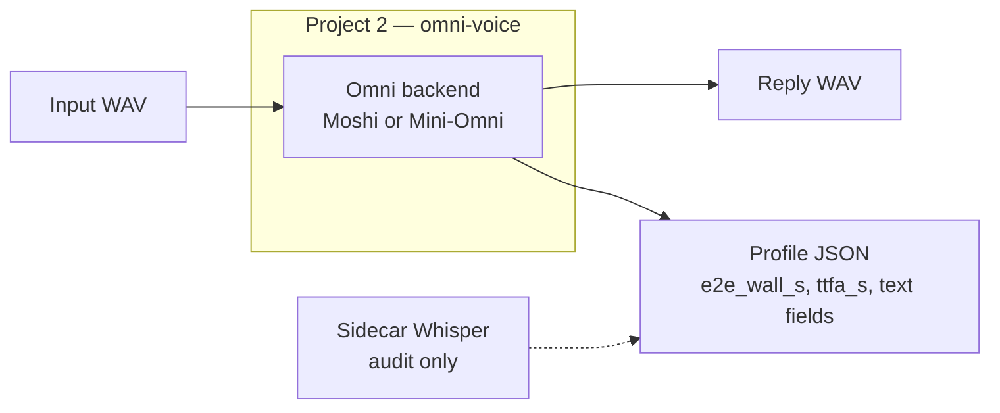
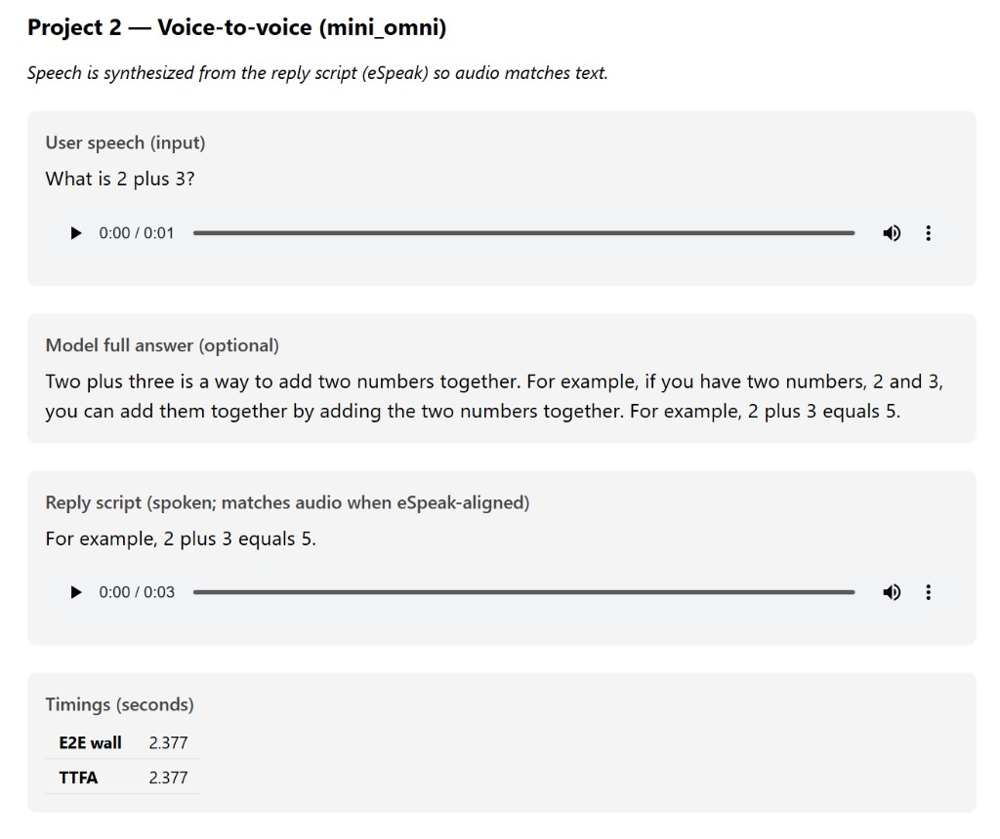

# Project 2 — Voice-to-voice (Omni)

End-to-end **speech in → speech out** using **Omni-style** models: a single model stack (or tightly coupled stack) produces reply audio without a separate ASR → LLM → TTS pipeline in the hot path.

This project is a **sibling** of [Project 1](../project/) (staged Lego pipeline). It uses its **own** Python package (`omni-voice`), **venv**, and dependencies so Project 1 stays unchanged.

| Doc | Purpose |
|-----|---------|
| [PLAN_PROJECT2_VOICE_TO_VOICE.md](../docs/PLAN_PROJECT2_VOICE_TO_VOICE.md) | Plan, phases, comparison harness |
| [PROJECT2_SEMANTIC_RELEVANCE.md](../docs/PROJECT2_SEMANTIC_RELEVANCE.md) | When Moshi vs Mini-Omni vs Project 1 makes sense |
| [CEO_ENGLISH_VOICE_TO_VOICE_LANDSCAPE.md](../docs/CEO_ENGLISH_VOICE_TO_VOICE_LANDSCAPE.md) | CEO model landscape |
| [SYSTEM_ARCHITECTURE.md](../docs/SYSTEM_ARCHITECTURE.md) | **System architecture diagrams** (P1 vs P2) |

---

## What this project is

**Goal:** Run and profile **voice-to-voice** turns locally (batch mode: one input WAV → one reply WAV + JSON profile), for comparison with Project 1 on the **same test audio**.

**Not in scope (v1):** Full duplex / barge-in, telephony, production agents.



### Backends

| Backend | Role | Best for |
|---------|------|----------|
| **`mini_omni`** (recommended for Q&A demos) | Mini-Omni understands speech (**A1_T2**), then speaks a **short answer** with **eSpeak** so **audio matches the script** (`speech_align: espeak`, default). | “What is 2+3?”-style clips where you need **relevant text + aligned speech** |
| **`moshi`** | Kyutai **Moshiko** batch turn: Mimi encode → Moshi `LMGen` → Mimi decode. | Duplex / conversational architecture demos, latency experiments |
| **`mini_omni` + `speech_align: model`** | Uses Mini-Omni **T1_A2** for neural speech. | Experimental; speech often **does not** match displayed text |

### Project 1 vs Project 2 (quick guide)

| You need | Use |
|----------|-----|
| Correct factual answers + clear transcript/reply text | **Project 1** — `staged-voice-run` |
| Omni voice-to-voice + **script matches audio** (Q&A) | **Project 2** — `omni-voice-run --backend mini_omni` |
| Full-duplex / “human-like” chitchat (not math tutoring) | **Project 2** — `--backend moshi` |

Moshi on “What is 2 plus 3?” often replies with greetings (“Hey, how was your day?”) — that is **expected** for a duplex chat model, not a bug in this repo.

---

## Repository layout

```
project2/
├── src/omni_voice/          # Package: cli, pipeline, backends, profiling
├── configs/                 # example_moshi.yaml, example_mini_omni.yaml
├── data/sample_in/          # Symlinks to Project 1 test WAVs
├── audio/out/               # Generated reply WAVs
├── profiles/                # JSON run profiles (gitignored)
├── experiments/
│   └── demo_review.py       # Terminal + browser demo (port 8766)
├── docs/screenshots/        # README verification captures
├── third_party/mini-omni/   # Optional clone — see third_party/README.md
└── pyproject.toml           # `omni-voice-run` entry point
```

---

## Requirements

- **Python 3.10+**
- **GPU recommended** for Moshi and Mini-Omni (CUDA on this machine: NVIDIA Thor works)
- **eSpeak NG** on PATH (`espeak-ng` or `espeak`) — required for Mini-Omni aligned speech and useful for troubleshooting
- **Disk:** separate `.venv` plus model downloads (Moshi ~GB; Mini-Omni checkpoint ~2GB+ under `third_party/mini-omni/checkpoint/`)

---

## Install

Use a **separate** virtualenv — do **not** reuse `project/.venv`.

```bash
cd /home/linhu/projects/speech_ai_exp/project2
python3 -m venv .venv
source .venv/bin/activate
pip install -U pip setuptools wheel
pip install -e ".[experiment,sidecar]"
```

### Moshi (Kyutai)

On **x86 Linux** with GPU:

```bash
pip install -e ".[moshi]"
```

On **aarch64 / Jetson**, `sphn` often fails to build; the batch API works without it:

```bash
pip install torch torchaudio huggingface-hub safetensors einops sentencepiece aiohttp tqdm
pip install "moshi==0.2.13" --no-deps
```

First Moshi run downloads `kyutai/moshiko-pytorch-bf16` from Hugging Face.

### Mini-Omni (recommended for aligned Q&A)

```bash
# Clone once
mkdir -p third_party && cd third_party
git clone --depth 1 https://github.com/gpt-omni/mini-omni.git
cd ../..

pip install litgpt==0.4.3 snac openai-whisper lightning
```

First Mini-Omni run downloads `gpt-omni/mini-omni` into `third_party/mini-omni/checkpoint/`.  
Details: [third_party/README.md](third_party/README.md). `ffmpeg` is optional (we load WAV via `soundfile`).

---

## How to run

Always activate the venv and run from `project2/`:

```bash
cd /home/linhu/projects/speech_ai_exp/project2
source .venv/bin/activate
```

### Recommended: Mini-Omni (Q&A, audio matches script)

```bash
omni-voice-run \
  --backend mini_omni \
  --config configs/example_mini_omni.yaml \
  --audio data/sample_in/test_voice.wav \
  --profile-json profiles/mini_omni_run.json \
  --moshi-device cuda
```

**Outputs:**

- `audio/out/test_voice_omni_reply.wav` — speech for the **short reply line** (eSpeak)
- `profiles/mini_omni_run.json` — timings, `transcript` (input Whisper), `reply_text` / `inner_text` (spoken script)

### Moshi (voice-to-voice / duplex demo)

```bash
omni-voice-run \
  --backend moshi \
  --config configs/example_moshi.yaml \
  --audio data/sample_in/test_voice.wav \
  --profile-json profiles/moshi_run.json \
  --moshi-device cuda
```

Sidecar Whisper is **on by default** (use `--no-sidecar-whisper` to disable).

### CLI reference

| Flag | Description |
|------|-------------|
| `--audio` | Input WAV (required) |
| `--profile-json` | Output profile path (default `profiles/latest.json`) |
| `--config` | YAML config overlay |
| `--backend` | `mini_omni` or `moshi` |
| `--moshi-device` | `auto`, `cuda`, or `cpu` |
| `--moshi-max-frames` | Cap **input** frames (quick tests) |
| `--moshi-hf-repo` | Moshi Hugging Face repo |
| `--audio-out-dir` | Reply WAV directory (default `audio/out/`) |
| `--sidecar-whisper` / `--no-sidecar-whisper` | Run Whisper on input (and output when applicable) for demo transcripts |

### Config files

**Mini-Omni (aligned speech):** `configs/example_mini_omni.yaml`

```yaml
omni:
  backend: mini_omni
mini_omni:
  mode: a1t2_t1a2
  speech_align: espeak    # espeak | model
  tts_voice: en-us
  tts_rate_wpm: 165
sidecar:
  whisper: true
```

**Moshi:** `configs/example_moshi.yaml` — `input_silence_s`, `response_s`, temperature, etc.

---

## Demo (transcripts + playback)

After a successful `omni-voice-run`:

```bash
python3 experiments/demo_review.py \
  --profile profiles/mini_omni_run.json \
  --play-all \
  --serve
```

- **Terminal:** prints input transcript, reply script, timings  
- **Browser:** `http://127.0.0.1:8766/` (Project 1 demo uses **8765**)  
- **Playback:** tries `pw-play`, `paplay`, `aplay`, `ffplay` (Jetson: `pw-play` often works)

The page shows:

1. **User speech** + Whisper transcript  
2. **Model full answer** (optional long Mini-Omni text)  
3. **Reply script** + audio player (aligned when `speech_align: espeak`)

---

## Test and verification

Example browser demo after a successful Mini-Omni run on `test_voice.wav` (“What is 2 plus 3?”):



| UI section | What to check |
|------------|----------------|
| **User speech** | Sidecar Whisper transcript matches the recording (e.g. “What is 2 plus 3?”). |
| **Model full answer** | Mini-Omni **A1_T2** text (may be longer than what is spoken). |
| **Reply script** | Short line spoken by eSpeak — **should match the reply audio** when `speech_align: espeak`. |
| **Timings** | `e2e_wall_s` / `ttfa_s` from the profile JSON for benchmarking. |

Reproduce this view:

```bash
omni-voice-run --backend mini_omni \
  --config configs/example_mini_omni.yaml \
  --audio data/sample_in/test_voice.wav \
  --profile-json profiles/mini_omni_run.json \
  --moshi-device cuda

python3 experiments/demo_review.py \
  --profile profiles/mini_omni_run.json --serve
```

Then open `http://127.0.0.1:8766/` (or the path printed for `demo/latest/index.html`).

---

## Profile JSON

Each run writes an `OmniTurnProfile`, for example:

| Field | Meaning |
|-------|---------|
| `stack` | `voice_to_voice` |
| `backend` | `mini_omni` or `moshi` |
| `e2e_wall_s` | Total wall time for the turn |
| `ttfa_s` | Time to first reply audio (backend-dependent) |
| `transcript` | Sidecar Whisper on **input** |
| `reply_text` | Text shown as the reply (Mini-Omni: spoken script) |
| `inner_text` | Model text channel / reply script |
| `output_wav_path` | Reply WAV path |
| `meta.speech_source` | e.g. `espeak_aligned`, `mini_omni_t1_a2` |
| `meta.mini_omni_answer_text_full` | Full A1_T2 answer before shortening for TTS |

---

## Compare with Project 1

From the repo root (reads JSON only — no Python coupling):

```bash
python3 compare/run_compare.py \
  --staged project/profiles/demo.json \
  --omni project2/profiles/mini_omni_run.json \
  --out compare/reports/vs_staged_mini_omni.md
```

---

## Test audio

`data/sample_in/test_voice.wav` and `test.wav` symlink to [Project 1](../project/data/sample_in/) so both projects use the **same** inputs.

---

## Troubleshooting

| Issue | What to do |
|-------|------------|
| `omni-voice-run: command not found` | `source .venv/bin/activate` and `pip install -e .` |
| Moshi install fails on `sphn` | Use `pip install moshi --no-deps` (see Install above) |
| CUDA OOM (Moshi) | `--moshi-max-frames 30` or more VRAM |
| Input not 24 kHz | Install `torchaudio` (auto-resample) |
| Mini-Omni not found | Clone under `third_party/mini-omni` |
| `espeak-ng not found` | `sudo apt install espeak-ng` |
| Reply text OK but voice wrong | Use `--backend mini_omni` with `speech_align: espeak` in config (not `model`) |
| Moshi irrelevant to question | Expected for Q&A — use Mini-Omni or Project 1 |
| No sound in demo | `pw-play audio/out/test_voice_omni_reply.wav` |

---

## Package entry point

Installed script: **`omni-voice-run`** → `omni_voice.cli:main`

Optional extras in `pyproject.toml`: `moshi`, `sidecar` (`faster-whisper`), `experiment` (`pyyaml`).
